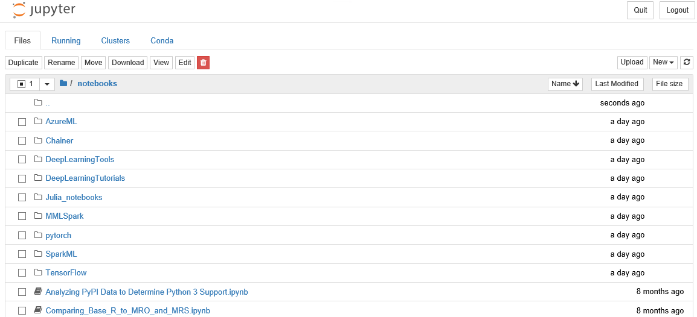

The DSVM provides a wide selection of languages, development, machine learning, and data visualization tools, and data platforms that enable you to accomplish most data science tasks. Some examples of those tasks are as follows:

| Task | Provided tools |
|------|----------------|
| Find, load, and preprocess data. | Use the preinstalled data platform and ingestion tools, such as Azure Blob Storage, Azure Data Lake, Azure HDInsight Hadoop, Azure Cosmos DB, Azure SQL Data Warehouse, and databases. |
| Train and test models. | Use Jupyter Notebook, Microsoft Visual Studio, and Visual Studio Code as development tools. Select your preferred language (R or Python) to leverage the powerful tools included in the Microsoft Machine Learning Server (for example, Microsoft R Server as you saw in the earlier section). |
| Operationalize the model. | Use R and Python Azure Machine Learning to deploy your model. Then client applications can access your models using a simple web service interface. |
| Train deep learning models. | Use deep learning platforms such as PyTorch, scikit-learn, and TensorFlow, which supports GPU computation to accelerate the model training. |
| Visualize data. | Use the Microsoft Power BI desktop to build reports and dashboards, and use the one-click feature to publish to the cloud. |
| Share files and code. | Create Azure file storage as a mountable drive on your DSVM to share large-scale datasets/code with your team. Use Git clients such as Git Bash and Git GUI to access your repository and share code with your team. |
| Perform cloud administration. | Use the Azure portal or PowerShell to manage your Azure resources. Options include restarting or stopping your VM, dynamically scaling your DSVM to meet your project needs, or extending your storage space. |

## Learn with preloaded Jupyter Notebooks

The DSVM has preloaded notebooks for learning purposes. The preloaded notebooks are designed to teach you how to use various Azure services, such as the Azure Machine Learning service, SQL Server with Machine Learning Services, and Cognitive Services. To access the notebooks, launch the Jupyter Notebook and open the Notebooks folder. Subject areas are in separate subfolders. 

> [!NOTE] 
> The SQL Server Developer Edition is installed with Machine Learning Server, and both data and code are loaded into the local database instance.