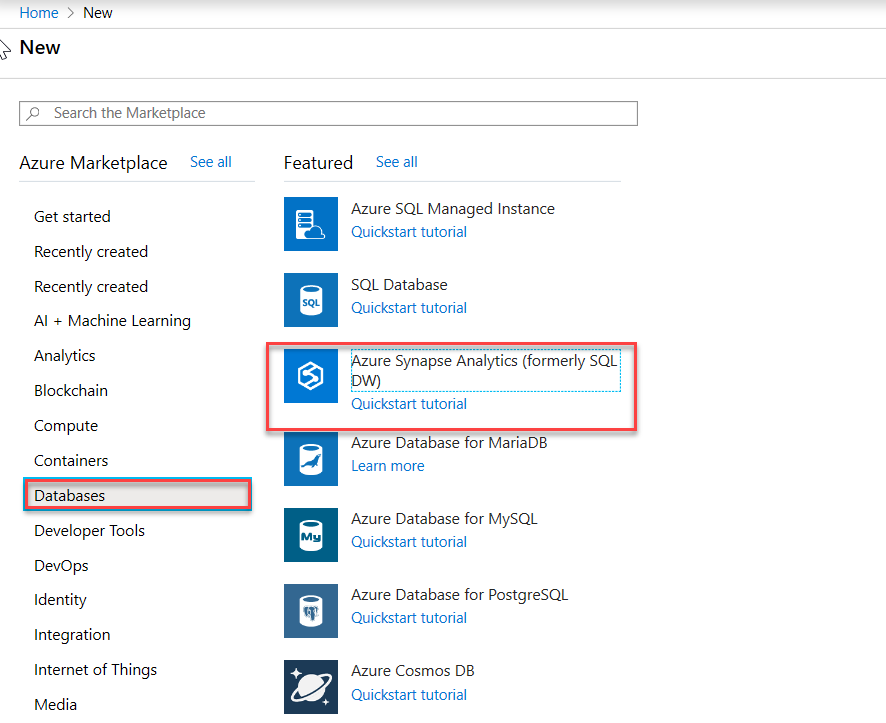
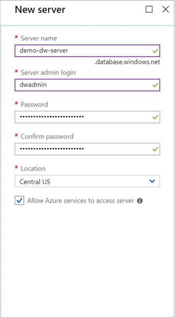
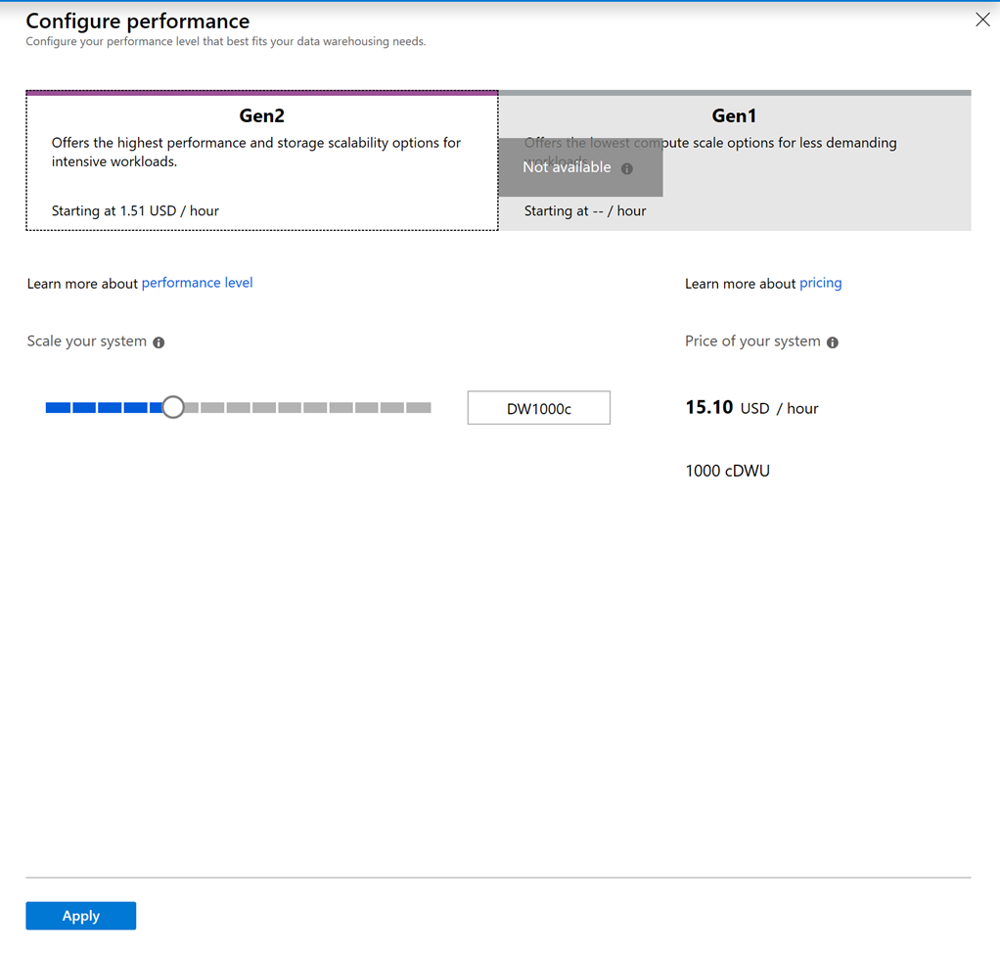
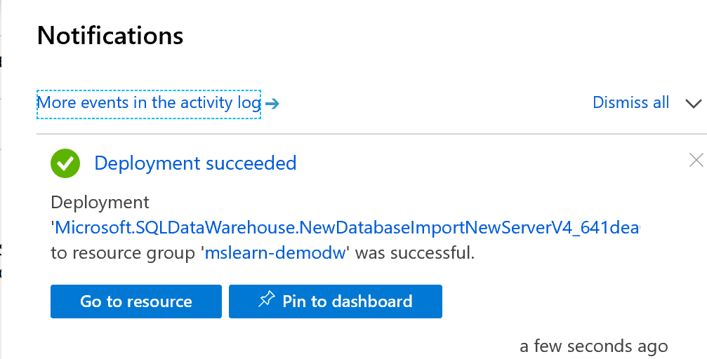
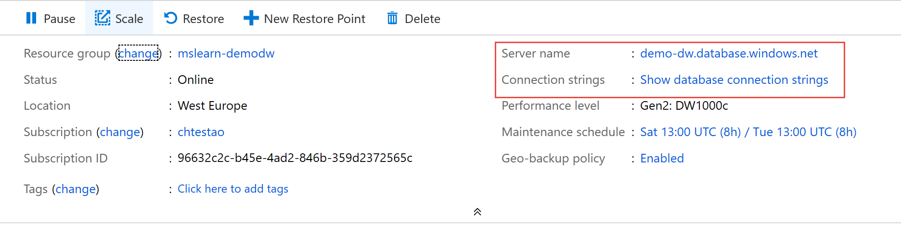

Let's create a sample data warehouse in Azure with sample data. You need an Azure account to do this exercise.

> [!NOTE]
> This exercise is optional. If you don't have an Azure account, or prefer not to do the exercise in your account, read the instructions to understand how to create a new Azure SQL data warehouse.

1. Sign in to the [Azure portal](https://portal.azure.com?azure-port=true).

1. Select **Create a resource** from the left sidebar.
1. Select **Databases** > **SQL Data Warehouse** to start the creation process.

    

1. Give the database a name, such as **demodW**. 

1. Select a subscription to own the database. Ideally, select one with available Azure credit to avoid any cost to your account.

1. Create a new resource group named **mslearn-demodw**. Use this name so that you can clean up everything at the end of this module.

1. Under **Select source**, select **Sample**. 
1. Under **Select sample**, select **AdventureWorksDW**. 

    - These two options create the Azure service to deploy the traditional *AdventureWorksDW* sample database to the Azure SQL Data Warehouse server.

1. Select the **Server** box to open the server configuration blade. You create a new server here. In a production system, you might select an existing database server to share the physical resources.
1. Select **Create a new server** to open the **New server** blade if it's not visible already.
    
    a. Provide a valid **Server name**. Use **demo-dw-server**, which makes the full name of the server `demo-dw-server.database.windows.net`.

1. Enter a valid username and password in **Server admin login**.

1. Under **Location**, select the data center where the hardware is located. You often want the location to be close to the primary users of the database.

1. Make sure the **Allow Azure services to access server** check box is selected.

    

1. Click **Select** to continue.

1. Select the **Performance level** entry to open the **Configure performance** blade. The default performance level is **DW1000c**, under **Gen 2**. Move the slider to the left end. The performance level of the server is downgraded to **DW100c**. This level reduces the cost per hour. 

    

1. Select **Apply** to continue.

1. Select **Create** to start the deployment process.

Deployment takes a few minutes while Azure:

- Provisions a server in a data center.
- Creates a new database.
- Loads the AdventureWorks data into the database.

Select the **Notification** icon on the toolbar to see the progress of the creation. After it deploys, you get a popup notification. Use it to go to the new resource or pin the resource to your dashboard.

Select **Go to resource** to open the **Overview** page for your new database.

## View the new database details

Explore the database details on the **Overview** page. To get to this page, use the global search feature or your Azure dashboard.

Here, you can see the traffic that's processing. You also can access various features and configuration options and do common tasks, such as backup or restore on the database.

As an example, the **Server name** and **Connection strings** are two useful items of information you can access on this view.

