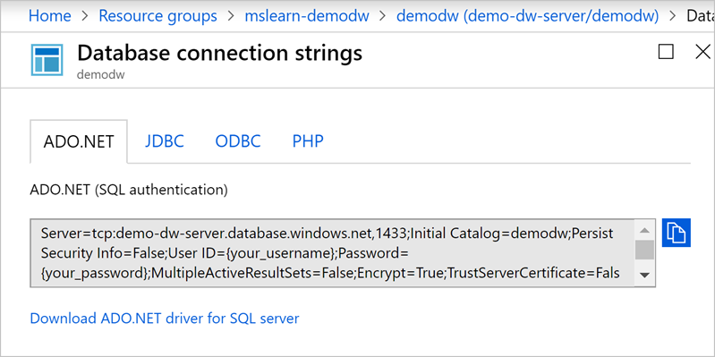
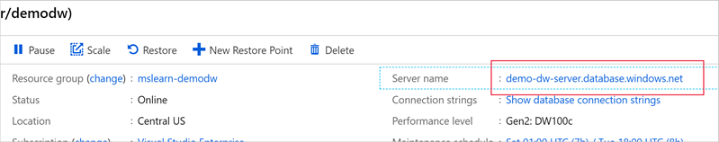
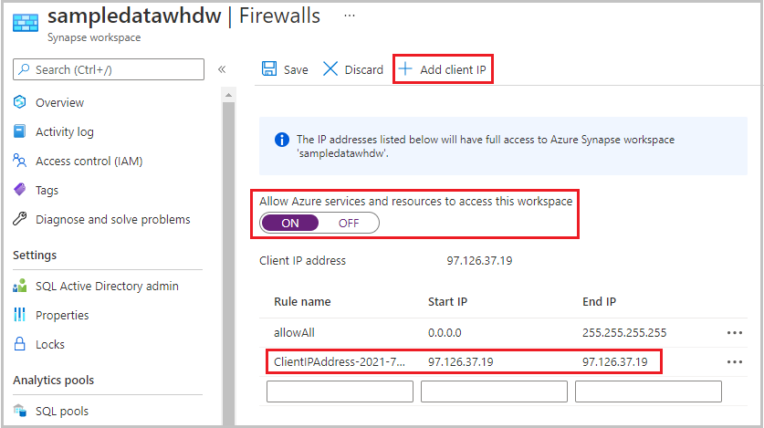
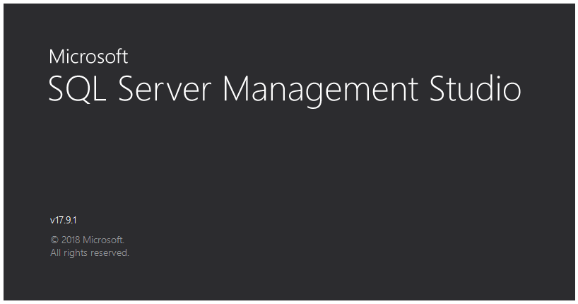
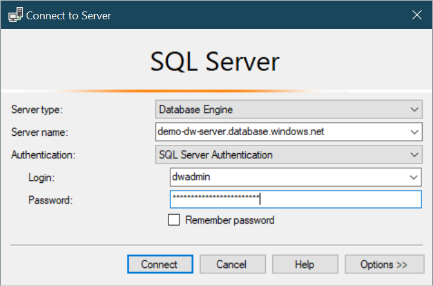
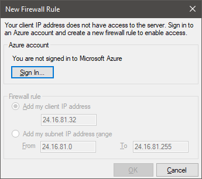
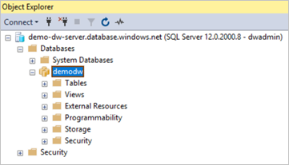

There are many applications you can use as a client for the Azure SQL Data Warehouse server. 

- Data engineers often use SQL Server Management Studio to access Microsoft database products, such as Azure SQL Database, Azure SQL Data Warehouse, and on-premises SQL Server instances. 
- Data analysts usually use Excel or Power BI as their client application to query the database. 
- Developers use Visual Studio to write all kinds of third-party applications to query the database.

SQL Server Management Studio is a common tool, so let's see how to use it to query the data warehouse. To connect to the database, create a _connection string_.

## Configure SQL Server Management Studio to communicate with a database

A database connection string identifies the protocol, URL, port, and security options that are used to communicate with the database. The client uses this information to establish a network connection to the database. Select **Show database connection** on the **Overview** page to get the connection string in a variety of framework formats:

- ADO.NET
- JDBC
- ODBC
- PHP

For example, here's the connection string for ADO.NET.

Notice that the connection string identifies the protocol as TCP/IP, includes the URL, and uses the port 1433, which is the default in this case.

TCP:1433 is a well-known and public port. After your SQL Data Warehouse server's name is made public, it might invite denial-of-service (DoS) attacks. To protect the server from such attacks, configure the Azure firewall to restrict network access to specific IP addresses.

## Configure the firewall

To configure the firewall rules, go back to the **Overview** page.

1. Select the **Server name** link on the **SQL Data Warehouse** information page to go to the underlying Azure SQL database.

    

1. Select the **Show firewall settings** link.

    

1. From here, you can add a single IP address, an address segment, or a virtual network configuration to connect it securely to specific Azure regions or your on-premises networks. 
    - For convenience, the portal lists the IP address of your computer. 
    - Select **Add client IP** to add the client IP address as a rule. You also can add a set of known IP addresses or segments in the rules section.

    

## Download SQL Server Management Studio

After you have the connection string information, you can connect to the database with a client application. For this exercise, we use SQL Server Management Studio. This free tool runs on Windows. If you don't have it installed on your computer, you can use these [instructions](https://docs.microsoft.com/sql/ssms/download-sql-server-management-studio-ssms?view=sql-server-2017) to download and install it.

> [!TIP]
> SQL Server Management Studio is Microsoft's preferred tool, but you can also use other third-party tools on other platforms. If the tool can connect to a SQL Server database and perform T-SQL queries, it will likely work for the following steps.

## Connect to the database with SQL Server Management Studio

1. Start SQL Server Management Studio.

    

1. In the **Connect to Server** dialog box:
    - Enter the server name as **demo-dw-server.database.windows.net**.
    - Select the **Authentication** type as **SQL Server Authentication**.
    - Enter the sign-in credentials. If you forget the admin credentials, you can get the admin ID from the database overview. You also can reset the password.
    
1. Select **Connect** to establish the network connection.

    

1. Because this is an Azure SQL Server database, you're prompted to sign in to Azure. Sign in by using the same account you used to create the data warehouse.

    

1. The IP address of your computer was added to the firewall, so your connection should be successful. The SQL Data Warehouse server node and its database appear in the Object Explorer panel of SQL Server Management Studio.

    