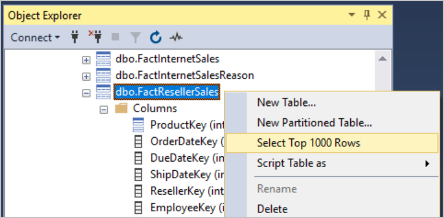
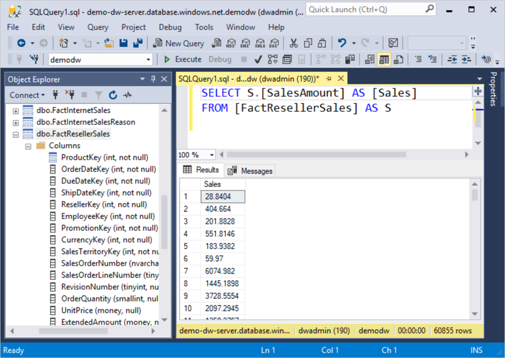
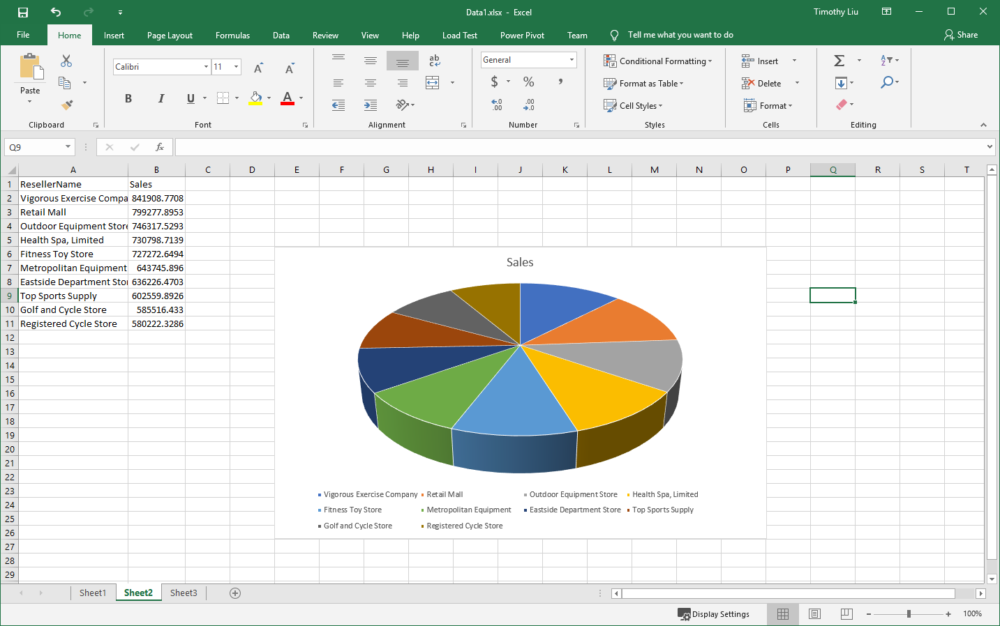
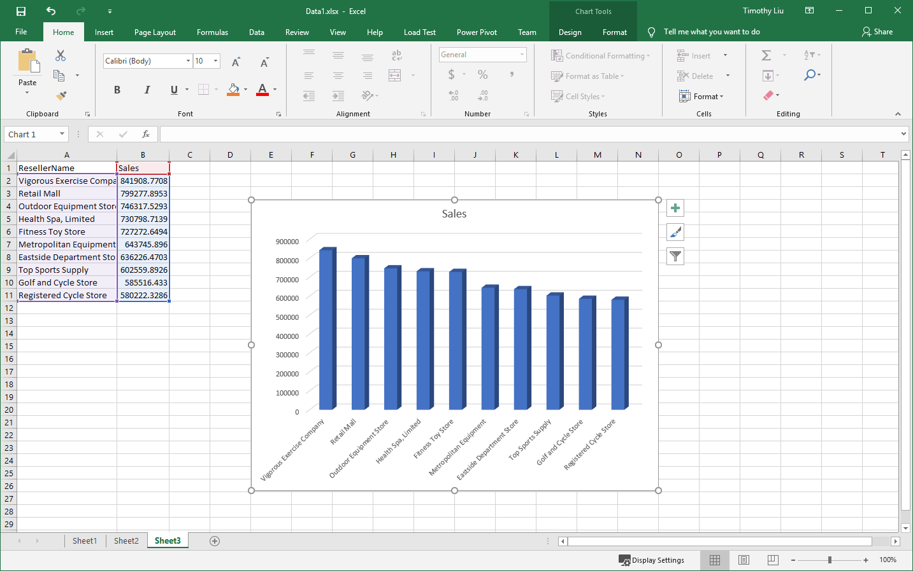

To extract data from the database, we need to form a _database query_. This query is a textual command expressed in one or more SQL statements. Microsoft's variant of SQL is called T-SQL. Although T-SQL is a sophisticated programming language, the most commonly used data queries are straightforward. The pattern of the query to read data is:

```sql
SELECT <column(s)> FROM <fact_table> 
  JOIN <dim_table> ON <condition(s)> 
  WHERE <source_filter_condition> 
  GROUP BY <dim_table_column(s)> 
    HAVING <result_filter_condition> 
  ORDER BY <source_or_result_column(s)>
```

Compose a T-SQL query step by step against the existing fact table **FactResellerSales**.

1. Expand the **demodw** database node in the SQL Server Management Studio Object Explorer. All the tables that are available to you are listed.

1. Find the fact table **FactResellerSales** and the dimension table **DimReseller**. 

1. Expand these two tables to see their columns. 

1. Right-click each of the tables, and select **Select Top 1000 Rows** to view the data in the tables.

    

    > [!TIP]
    > The column view in Object Explorer provides information about the table structure. For example, from here you can see that the column **ResellerKey** in **FactResellerSales** and the column **ResellerKey** of **DimReseller** are the links on which the two tables can join together.

## Create a new query

Now create a custom query. Start by querying the fact table, which holds the central data.

1. With the **FactResellerSales** table selected in the tree, select **New Query** on the toolbar to open a new query editor.
    - You might get a warning about unsupported features, such as transactions. That's okay. Just dismiss the warning.

1. Enter the following SQL into the editor to retrieve the sales information:

    ```sql
    SELECT S.[SalesAmount] AS [Sales]
    FROM [FactResellerSales] AS S
    ```

    Notice the use of aliases in this query. The table `FactResellerSales` is aliased as `S` so that it's easier to reference in other parts of the query. The column `SalesAmount` is aliased as `Sales` to change its name in the output.

1. Select **Execute** on the toolbar, or select <kbd>F5</kbd>. The query is sent to the Azure SQL Data Warehouse server where it runs. The results are sent back and displayed in the bottom pane of the query window.

    

1. Bring the dimension table in by using the shared column. Enter the following query into the editor:

    ```sql
    SELECT S.[SalesAmount] AS [Sales], R.[BusinessType],R.[ResellerName]
    FROM [FactResellerSales] AS S
    JOIN [DimReseller] AS R ON S.[ResellerKey] = R.[ResellerKey]
    ```

    The fact table and dimension table are joined together by the `ResellerKey` columns, which provide the relationship between them.

1. Run the query. Here are the first few rows.

    ```
    Sales      BusinessType          ResellerName
    90.8393    Warehouse             Bike Dealers Association
    173.0424   Warehouse             Retail Mall
    20.1865    Specialty Bike Shop   Professional Containers and Packaging Co.
    151.3989   Warehouse             Real Sporting Goods
    144.202    Value Added Reseller  Commerce Bicycle Specialists
    288.404    Warehouse             Original Bicycle Supply Company
    86.5212    Specialty Bike Shop   Roving Sports
    20.1865    Value Added Reseller  Frugal Bike Shop
    60.5596    Value Added Reseller  Great Bikes
    230.7232   Warehouse             Go-cart and Bike Specialists

    ... remainder omitted for length
    ```
    
    Look at the values in the `BusinessType` column. The resellers fall into three types of businesses: Specialty Bike Shop, Warehouse, and Value Added Reseller. To focus on _warehouse resellers_, add a `WHERE` condition to the source data.

1. Add a `WHERE` clause to the query that looks something like the following:

    ```sql
    SELECT S.[SalesAmount] AS [Sales], R.[BusinessType],R.[ResellerName]
    FROM [FactResellerSales] AS S
    JOIN [DimReseller] AS R ON S.[ResellerKey] = R.[ResellerKey]
    WHERE R.[BusinessType] = 'Warehouse'
    ```

1. Run the query to limit the results. 

1. Because there are only _warehouse resellers_ left, the `BusinessType` column in the query result isn't needed. Go ahead and remove it.

    ```sql
    SELECT S.[SalesAmount] AS [Sales], R.[ResellerName]
    FROM [FactResellerSales] AS S
    JOIN [DimReseller] AS R ON S.[ResellerKey] = R.[ResellerKey]
    WHERE R.[BusinessType] = 'Warehouse'
    ```

## Perform aggregate calculations
    
Most of the data analysis tasks involve aggregation calculations, which include minimum and maximum values, totals, summations, and averaging data.

For example, if you want to know the sales performance of each reseller, calculate the total sales amount for each of the resellers. In T-SQL, use the `GROUP BY` clause and the `SUM` aggregation function. 

1. Enter the following query into the editor:

    ```sql
    SELECT SUM(S.[SalesAmount]) AS [Sales], R.[ResellerName]
    FROM [FactResellerSales] AS S
    JOIN [DimReseller] AS R ON S.[ResellerKey] = R.[ResellerKey]
    WHERE R.[BusinessType] = 'Warehouse'
    GROUP BY R.[ResellerName]
    ```
    
    The following results are returned:

    ```
    Sales          ResellerName
    284876.0711    Bike Boutique
    186217.0681    Excellent Bikes
    8406.4692      Unusual Bicycle Company
    373658.4657    Catalog Store
    17623.2972     Grown-up Bike Store
    1538.172       Good Bicycle Store
    3385.3678      Lots of Bikes Storehouse
    268209.286     Commercial Sporting Goods
    147887.682     Utilitarian Sporting Goods
    2917.9404      Expert Sports Store
    
    ... remainder omitted for length
    ```

## Filter aggregated results

 Based on the aggregated data, you might want to keep only the resellers whose total sales amounts are greater than $700,000. In this case, the `WHERE` clause won't help because it's used to filter only the _source data_. Although the aggregated total sales amount doesn't exist in the source data, it _is_ part of the query result. To filter the query result, add a `HAVING` clause to the query.

1. Adjust the query to include a `HAVING` clause that looks like this:

    ```sql
    SELECT SUM(S.[SalesAmount]) AS [Sales], R.[ResellerName]
    FROM [FactResellerSales] AS S
    JOIN [DimReseller] AS R ON S.[ResellerKey] = R.[ResellerKey]
    WHERE R.[BusinessType] = 'Warehouse'
    GROUP BY R.[ResellerName]
    HAVING SUM(S.[SalesAmount]) > 700000
    ```

    > [!TIP]    
    > Notice that the `SUM(S.[SalesAmount])` aggregation appears twice, both in `SELECT` and `HAVING`. So far, T-SQL doesn't support the use of a column alias in the `HAVING` clause. 

## Sort results

Notice that the results aren't sorted. We need to fix that. 

To sort the query result, use the `ORDER BY` clause. With an optional `ASC` argument, the `ORDER BY` clause sorts the query result in ascending order. In contrast, using `ORDER BY` with the `DESC` argument sorts the query result in descending order. To highlight the high-performance resellers, sort the query result in descending order. 

1. Change the query to look like the following:

    ```sql
    SELECT SUM(S.[SalesAmount]) AS [Sales], R.[ResellerName]
    FROM [FactResellerSales] AS S
    JOIN [DimReseller] AS R ON S.[ResellerKey] = R.[ResellerKey]
    WHERE R.[BusinessType] = 'Warehouse'
    GROUP BY R.[ResellerName]
    HAVING SUM(S.[SalesAmount]) > 700000
    ORDER BY [Sales] DESC
    ```
    
1. Run the query. The descended sorted result appears.

## Select the top section of data

What if you need to find the "Top 10" best resellers? In SQL, use the `TOP` argument of `SELECT`. 

1. Remove the `HAVING` clause, and add `TOP 10` between the `SELECT` keyword and the `SUM` function call. The query should look something like the following:

    ```sql
    SELECT TOP 10 SUM(S.[SalesAmount]) AS [Sales], R.[ResellerName]
    FROM [FactResellerSales] AS S
    JOIN [DimReseller] AS R ON S.[ResellerKey] = R.[ResellerKey]
    WHERE R.[BusinessType] = 'Warehouse'
    GROUP BY R.[ResellerName]
    ORDER BY [Sales] DESC
    ```
    
1. Run the query. The top 10 best warehouse resellers are listed. The `TOP` filtering occurs later than `ORDER BY`, which is why the result is the top 10 best warehouse resellers.

    ```output
    Sales          ResellerName
    841908.7708    Vigorous Exercise Company
    799277.8953    Retail Mall
    746317.5293    Outdoor Equipment Store
    730798.7139    Health Spa, Limited
    727272.6494    Fitness Toy Store
    643745.896     Metropolitan Equipment
    636226.4703    Eastside Department Store
    602559.8926    Top Sports Supply
    585516.433     Golf and Cycle Store
    580222.3286    Registered Cycle Store
    ```

## Export results

You can export results directly from the query window by choosing to:

- Copy as text.
- Copy as text with headers.
- Save results to a file, which is typically comma-delimited.

1. Right-click the data grid of the query result, and select **Select All**.
1. Right-click the data grid again, and select **Copy with Headers**.

Paste these results wherever necessary. For example, you can paste results to an Excel sheet. Then you can visualize the data either with a pie chart or a bar chart to gain business insight. You can even use an Excel PivotTable to go further. This option is beyond the scope of this course.

:::row:::
  :::column:::

  :::column-end:::
  :::column:::

  :::column-end:::
:::row-end:::