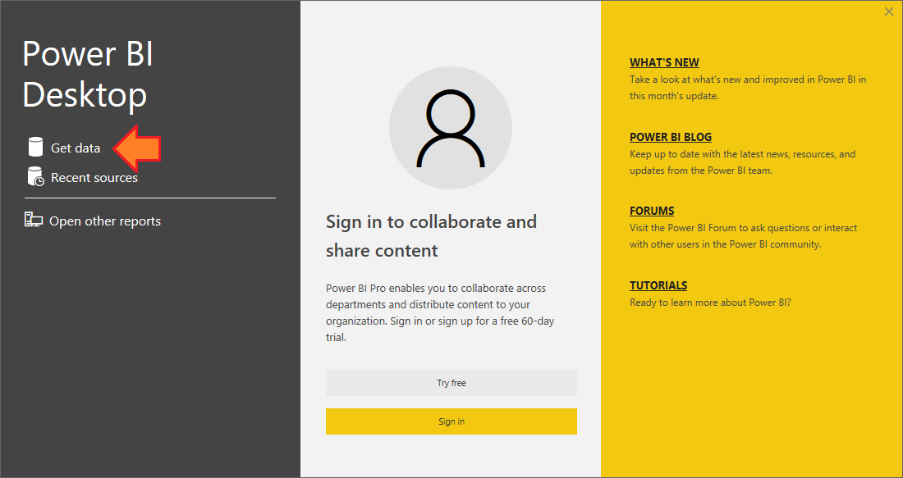
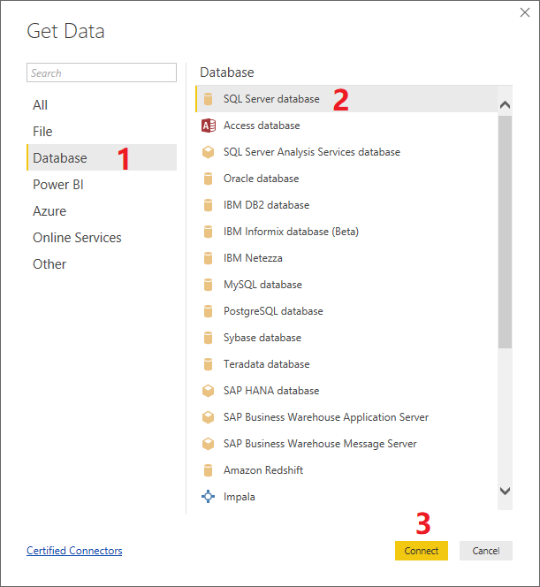
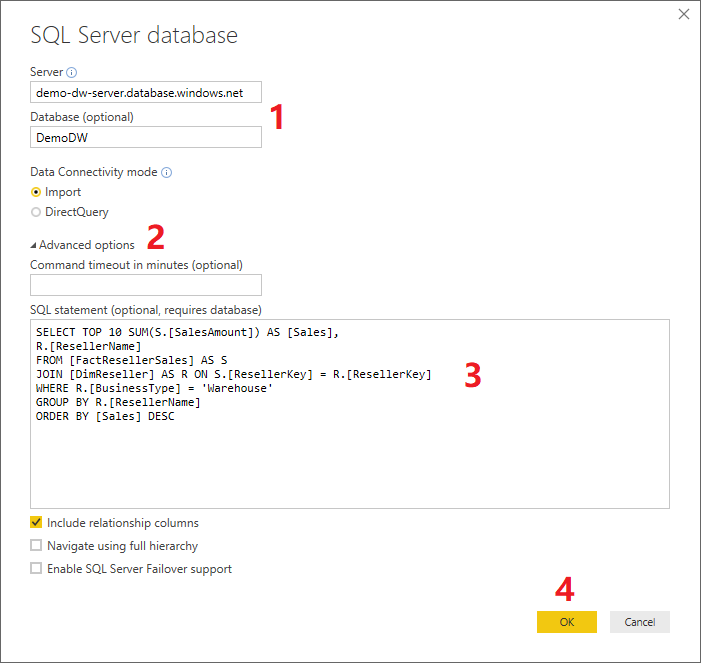
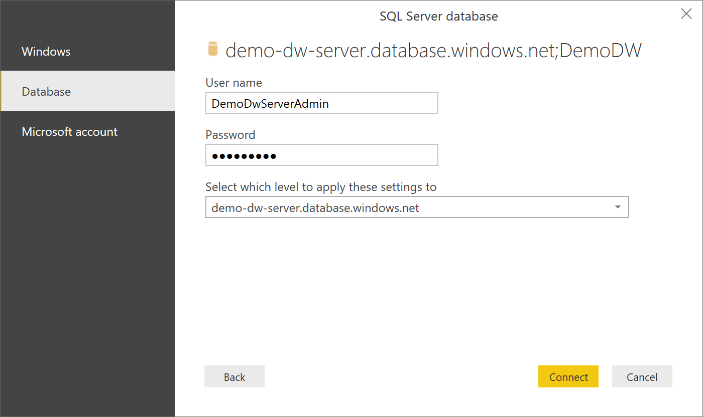
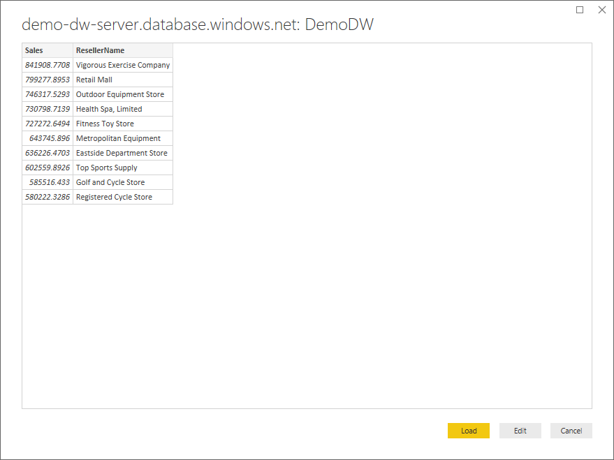
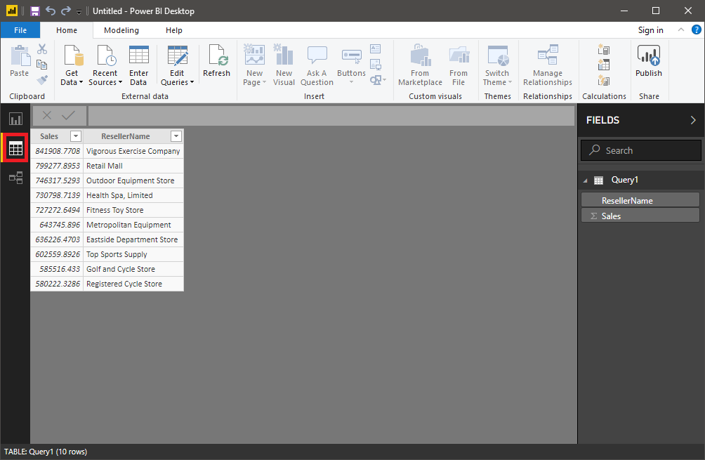
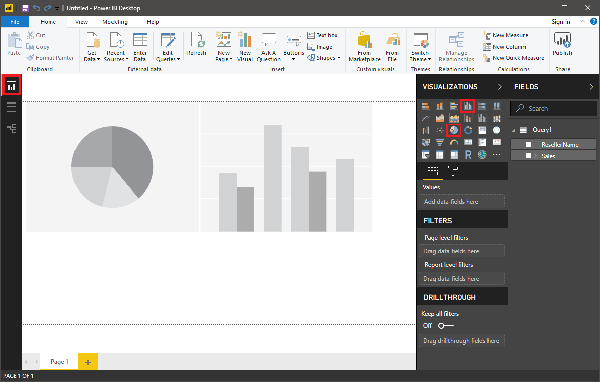
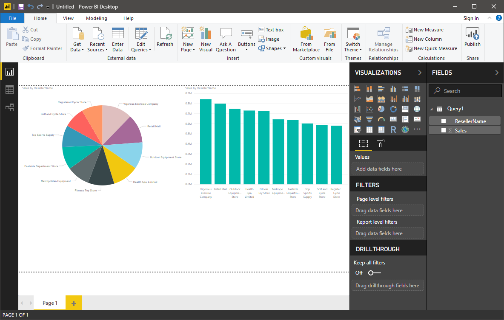

Power BI is a powerful tool dedicated to data modeling, data analysis, and data visualization. As a final exercise, connect to the Azure Synapse Analytics database from Power BI and then query the database to generate a modern dashboard with a few selections.

> [!NOTE]
> If you don't have the Power BI tools for Windows installed, go to [Power BI](https://powerbi.microsoft.com/) to download and install them.

1. Start the Power BI tool. Select **Get data** on the left.

    

1. In the **Get Data** dialog box, select **Database** > **SQL Server database** > **Connect**.

    

1. In the **SQL Server database** dialog box, enter the Azure Synapse Analytics server name and the sample database name. Expand the **Advanced options** node, input the last T-SQL query in the **SQL statement** box, and select **OK**.

    

1. Enter the Azure Synapse Analytics username and password, and select **Connect**.

    

    After the Azure Synapse Analytics database and the SQL query connect, the SQL query runs immediately. The following query result appears.

    

1. Select **Load**. The data of the query result is loaded to the data model maintained by Power BI.

1. After the query result is loaded to the Power BI model, the Power BI data model is generated from the schema of the query result. To review the data model, select **Data** on the left side.

    

1. Select **Report**, and switch back to the dashboard view. Select the **Pie chart** and **Vertical bar chart** icons to insert two empty charts into the dashboard. Adjust the size and position of the empty charts until they look good.

    

1. Select each empty chart, and select the **ResellerName** and **Sales** check boxes in the **FIELDS** pane for the chart.

    

You now have a modern dashboard that visualizes the query result from an Azure Synapse Analytics database.