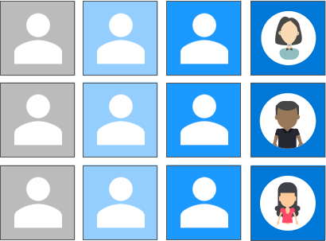
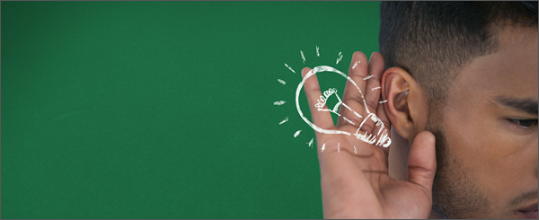
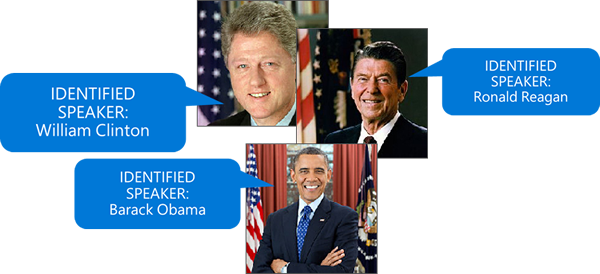

The Speaker Recognition APIs in Azure Cognitive Services use machine learning and artificial intelligence to provide robust services that: 

- Identify individual speakers.
- Use speech for authentication.

You can use any programming language or operating system to integrate these services into your apps and services.

Speaker recognition is divided into two categories:

- **Speaker verification:** Automatically verify and authenticate users by using their voice or speech.
- **Speaker identification:** Automatically identify the person who's speaking in an audio file by comparing the voice to a group of prospective speakers.

## The Speaker Recognition APIs

All life forms seem to have built-in, biologically adapted methods of communication. Whether you're a blue whale, a bumblebee, a cicada, or a human, your individual "voice" is unique. Our planet is filled with over 7.5 billion human voices, each one unique and distinct from the others.

Through simple REST-based service calls, the Speaker Recognition APIs provide algorithms that allow you to:

- Verify and identify human voices.
- Organize voices into manageable profiles.

The methods provided by the Speaker Recognition APIs fall into three categories:

1. **Verification:** Checking the likelihood that two voices belong to the same person.
1. **Identification and recognition:** Determining whether a voice matches another known voice.
1. **Enrollment:** Registering voices to be verified or identified.

The Speaker Recognition APIs allow you to use the power of artificial intelligence to:

- Authenticate users before allowing them to access apps and services.
- Identify speakers in video streams.
- Identify speakers in real-time chat scenarios.
- Improve security for sensitive resources.
- Replace cumbersome legacy authentication.

Speaker recognition is often referred to as "voice recognition." Speaker recognition is the process of identifying a person based on characteristics of that person's voice.

> [!NOTE]
> There's a difference between _speaker recognition_ and _speech recognition_. Speech recognition attempts to determine the _content of spoken words_, and speaker recognition attempts to identify the _speaker of the content_.

## Great acoustics

Speaker recognition evaluates the vital acoustic features of speech that differ between individuals. These acoustic patterns are determined by things like the size and shape of someone's throat and mouth. Everyone also has certain speech patterns, such as speaking style and voice pitch.  

Scientific progress in the field of speaker verification has resulted in speaker recognition now being classified as a "behavioral biometric." Just like the difference between speech recognition and speaker recognition, the acts of speaker *verification* and speaker *identification* also differ:

- **Speaker verification:** An attempt to determine if a speaker has a *certain "claimed" identity*.
- **Speaker identification:** An attempt to determine an *unknown speaker's identity*.

In both cases, existing voices or voice samples must be available for comparison. The process of creating voice samples is referred to as *enrollment*.

## Enrollment

In speaker recognition, enrollment is the process of prerecording a speaker's voice to extract the acoustic and speech patterns that form a _voice print_. A voice print is often referred to as a *voice template* or *voice model*. In typical speaker-verification scenarios, sample speech "utterances" are prerecorded to use later when comparing voice prints.

The process of speaker *identification* is more difficult because many times an utterance is newly introduced to the system. For example, a speaker-recognition system could be trained to identify a famous US president from samples of inauguration speeches. But identifying a president from new content, such as a State of the Union speech, requires comparison of the spoken content against multiple voice prints to determine the best match.

Because the algorithms behind verification and identification are different, the enrollment processes for these services are also separate. Behind the scenes, two types of speaker-recognition systems are in effect: *text-dependent* and *text-independent*.

- **Text-dependent:** Used for enrollment for speaker verification, where prompts are known and common across all speakers.
- **Text-independent:** Used for enrollment for speaker identification, where there's no (needed) cooperation by the speaker.

> [!NOTE]
> For text-independent scenarios, enrollment often happens without a user's knowledge, because speaker-identification systems don't need to compare what was said at enrollment.

The text-dependent system, which is the most controlled of these systems, is at the core of speaker verification.
