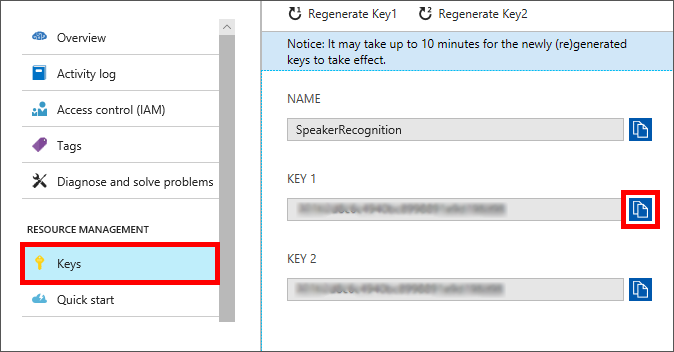

Before you can use the Speaker Recognition APIs, you need to subscribe to the service and get a subscription key.

> [!IMPORTANT]
> The Speaker Recognition APIs are still in preview. Expect changes to some of the functionality before it's finalized.

1. Sign in to the [Azure portal](https://portal.azure.com?azure-portal=true).
1. In the left pane, select **+ Create a resource**.
1. In the **Search the Marketplace** box, enter **speaker recognition**, and then press Enter.
1. In the search results, select **Speaker Recognition**.
1. Select **Create**.
1. Enter a name for your subscription to the Speaker Recognition APIs, such as **SpeakerRecognition**.
1. For **Location**, choose the one nearest you.
1. For **Pricing tier**, select a tier.
1. Create a new resource group named **mslearn-speakerapi** to hold the resources.
1. Review and accept the service notice, then select **Create** to create a subscription to the Speaker Recognition APIs.

After a short delay, your new subscription to the Speaker Recognition APIs will be available, and new subscription keys will be generated for programmatic use.

> [!NOTE]
> The terms *subscription key* and *API key* are often used interchangeably in Cognitive Services documentation.

To view your new Speaker Recognition subscription, select **Resource groups** in the left pane, and then select the **mslearn-speakerapi** resource group.

To access your Speaker Recognition subscription, you'll need two pieces of information you can get from the Azure portal:

- A *subscription key* that allows you to access your subscription. This key must be passed with every web service call you make to the API.
- The *endpoint* that exposes your service on the network.

### Copy the subscription key

Let's start by getting the subscription key from the Azure portal:

1. In the left pane, select **Resource groups**, and then click the resource group you created for the Speaker Recognition API.
1. Select the Speaker Recognition subscription name (such as **SpeakerRecognition**).
1. Under **RESOURCE MANAGEMENT**, select **Keys** to view your new subscription keys.
1. Copy the value of **KEY 1** to the clipboard.

    

> [!TIP]
> You might want to paste this value into a text file for use later in the course.

### Copy the subscription endpoint

Next, let's get the endpoint from the Azure portal:

1. In the left pane, select **Overview**.
1. Find **Endpoint**, and copy its value to the clipboard.

    
