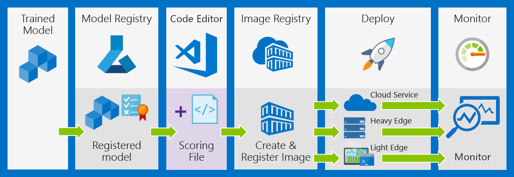

Data scientists often create many different machine learning pipelines and track information about these experiments separate from the model training and deployment process. Managing and tracking machine learning models can be a time-consuming and error-prone process. The Azure Machine Learning service has a model management and tracking feature that can be integrated into your pipelines to automate this task.

Machine learning projects are rarely about training a single model, rather they are about the end-to-end pipelines of continuously developing, managing, and deploying models.

Model management is a tedious process. It involves many trial and error iterations to train a model with good results, and it takes time to manage all of the models, datasets, hyperparameters, and environment settings during different experiments.

Beginner data scientists tend to use simple methods of tracking and managing their models by giving them different names. That isn't effective because it's easy to get lost in a long list of file names.

In this unit, you learn how to use the Azure Machine Learning Service to solve this problem. It helps you manage models and continuously improve them. Using this service involves the following steps.

1. **Register the model** in a Machine Learning Model Registry hosted in Azure Machine Learning Service workspace
1. **Register an image** that pairs a model with an inference script and dependencies required to create a docker container providing the compute environment to run the pipeline. 
1. **Monitor and collect data** about model training, performance, and deployments.

The model registry is a single place to keep track of all the models in your Azure Machine Learning Service workspace. This ensures the models are stored in a structured format that can be queried. Registering a model can be done in a single line of code:

After training the models, it is always important to track the experiments and monitor the evaluation metrics. For example, you might want  to know how accuracy of the new model compares with old models. Other key questions include how many end users are using the new model and what the traffic is at any time. There are three primary goals of monitoring your machine learning models:

- Determine whether the production data drifts
- Make better decisions on when to retrain or optimize your model
- Track model usage statistics

In the Azure Machine Learning service, you can track experiments and monitor metrics with a few lines of code. In this unit, you learn the following.

- how to add logs into your scripts so Azure Machine Learning can track the key metrics
- how to submit the experiments with model monitoring enabled
- how to monitor the progress of running jobs
- how to view the model's results