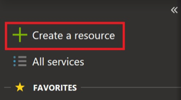
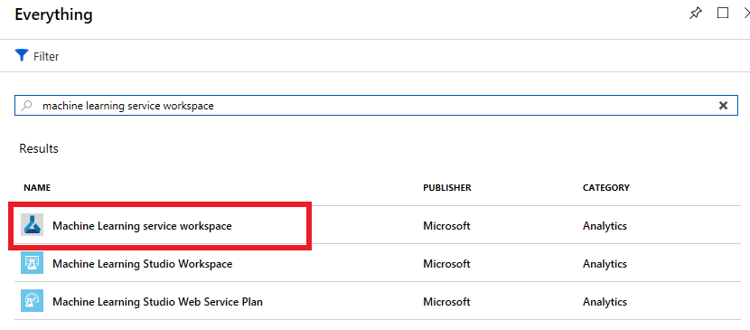
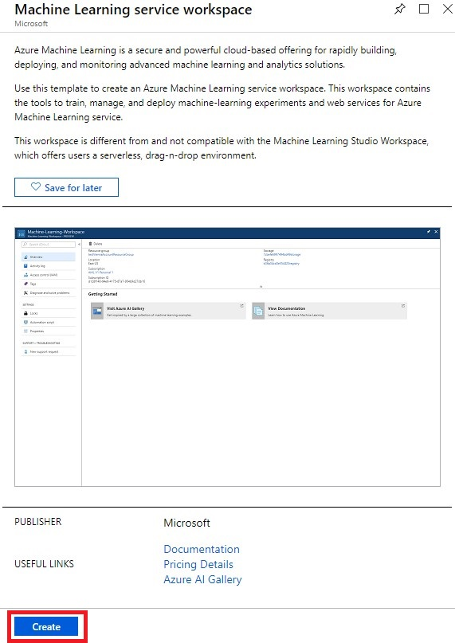

The Azure Machine Learning workspace is the foundational block in the cloud for your machine learning tasks. You can use it to experiment, train, and deploy machine learning models. It provides a centralized place to work with all the artifacts you create when you use Azure Machine Learning service.

The workspace is a resource you create in Azure. The easiest way to create a deployment workspace is through the Azure portal.

If you have already done one of the other Azure Machine Learning service Learning Path modules, you may have already created an Azure Machine Learning workspace.  If so, you can skip this step and just use that workspace. 

1. Sign into the [Azure portal](https://portal.azure.com?azure-portal=true) with your Azure subscription.

1. Select **+ Create a resource** in the left sidebar of the Azure portal.

    

1. Type **machine learning service** in the search bar.

1. Select the **Machine Learning service workspace** in the search results.

    

1. Select the **Create** button to open the ML service workspace creation panel.

    

1. Fill in the details required using the following suggestions.
    - **Workspace name** - enter a workspace name such as _learn-workspace_.
    - **Subscription** - select an Azure subscription to own this resource.
    - **Resource group** - create a new resource group named _mslearn-amls_. We'll delete this resource group when we're done.
    - **Location** - Select a location where the workspace will be created. You will typically want to select a location near where the workspace will be used.

    

1. Select **Create** to create the deployment workspace. It can take a few minutes to create the workspace.