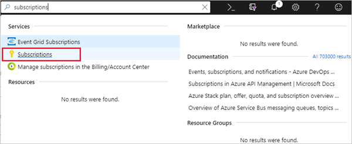

While the Azure portal is an easy method to create a workspace, a more common technique is to create it as part of you tool setup. As an example, we can use the Azure Machine Learning SDK for Python to create a workspace using the Python language.

> [!NOTE]
> You will need to have Python 3.7 or higher installed to complete this exercise.

## Verify Python installation

You can verify you have the proper version of Python installed using a command prompt. 

1. Open a command prompt or terminal window and type `python`.
1. It will respond with a version number if it's installed and wait for another command in an interactive read-eval-print-loop (REPL).

```output
Python 3.7.3 (tags/v3.7.3:ef4ec6ed12, Mar 25 2019, 22:05:12) [MSC v.1916 64 bit (AMD64)] on win32
Type "help", "copyright", "credits" or "license" for more information.
>>>
```

1. Type `exit()` to exit the REPL.

## Install the Azure ML SDK

Once you have Python installed, you can install the Azure Machine Learning SDK. 

1. Open a local command prompt and type the following command to install the SDK.

```python
pip install azureml-sdk
```

This will download and install all the required dependencies and setup the environment so the libraries will be available to your Python programs. It may take a few minutes to complete depending on what you have installed already.

## Verify the install

After the SDK is installed, we can check the installation with a simple Python app.

1. Type `python` to run the interactive REPL environment.

1. Enter the following code into the console.

```python
import azureml.core
print(azureml.core.VERSION)
```

You should see something like:

```output
Python 3.7.3 (tags/v3.7.3:ef4ec6ed12, Mar 25 2019, 22:05:12) [MSC v.1916 64 bit (AMD64)] on win32
Type "help", "copyright", "credits" or "license" for more information.
>>> import azureml.core
>>> print(azureml.core.VERSION)
1.0.23
>>>
```

1. Type `quit()` to exit the REPL.

## Create an Azure ML service workspace with Python

After the SDK is successfully installed, you can create an Azure Machine Learning service workspace. The value you need is the Azure _subscription id_. You can find your subscriptions in the Azure portal through the **Subscriptions** item in the left sidebar, or by typing "Subscriptions" into the global search box.



Locate the subscription you want to use and replace the `{azure-subscription-id}` value below with the subscription id value. The SDK will ask you to sign into your Azure account if you are not already signed in.

> [!IMPORTANT]
> If you didn't create the workspace in the Azure portal, you won't have a resource group named **mslearn-amls**. In that case, make sure to change the value of the `create_resource_group` parameter in the following code to `True` so the SDK creates the resource group for you.

```python
from azureml.core import Workspace
ws = Workspace.create(
            name='learn-workspace-py',
            subscription_id='{azure-subscription-id}', 
            resource_group='mslearn-amls',
            create_resource_group=False,
            location='eastus2'
)
```

> [!IMPORTANT]
> The `Workspace.create` function returns the created `Workspace` object which we will use as we go along. Make sure to keep the Python window open. We are storing it here in the variable `ws`.

This command will display progress for all the created Azure resources as it creates the workspace.

```output
Deploying ContainerRegistry with name learnworacrsvaiolwq.
Deployed ContainerRegistry with name learnworacrsvaiolwq.
Deploying AppInsights with name learnworinsightszhbzswxg.
Deployed AppInsights with name learnworinsightszhbzswxg.
Deploying KeyVault with name learnworkeyvaultqltiyela.
Deploying StorageAccount with name learnworstorageboxtinpk.
Deployed KeyVault with name learnworkeyvaultqltiyela.
Deployed StorageAccount with name learnworstorageboxtinpk.
Deploying Workspace with name learn-workspace-py.
Deployed Workspace with name learn-workspace-py.
```

As with the portal approach, it takes a few minutes to set up the workspace. After the workspace is provisioned, you can view the workspace details, such as the associated Azure Blob Storage account, Docker container registry account, and key vault through the returned `ws` object - try executing the `get_details()` function on it.

```python
ws.get_details()
```
This returns a JSON block with all the created details. It will look something like:

```output
{  
   'id':'/subscriptions/{subscription-id}/resourceGroups/mslearn-amls/providers/Microsoft.MachineLearningServices/workspaces/learn-workspace-py',
   'name':'learn-workspace-py',
   'location':'eastus',
   'type':'Microsoft.MachineLearningServices/workspaces',
   'workspaceid':'3dd46201-f0b2-44d3-90c7-2309fd641615',
   'description':'',
   'friendlyName':'learn-workspace-py',
   'creationTime':'2019-04-09T01:21:33.0508952+00:00',
   'containerRegistry':'/subscriptions/{subscription-id}/resourcegroups/mslearn-amls/providers/microsoft.containerregistry/registries/learnworacrsvaiolwq',
   'keyVault':'/subscriptions/{subscription-id}/resourcegroups/mslearn-amls/providers/microsoft.keyvault/vaults/learnworkeyvaultqltiyela',
   'applicationInsights':'/subscriptions/{subscription-id}/resourcegroups/mslearn-amls/providers/microsoft.insights/components/learnworinsightszhbzswxg',
   'identityPrincipalId':'xyz',
   'identityTenantId':'xyz',
   'identityType':'SystemAssigned',
   'storageAccount':'/subscriptions/{subscription-id}/resourcegroups/mslearn-amls/providers/microsoft.storage/storageaccounts/learnworstorageboxtinpk'
}
```