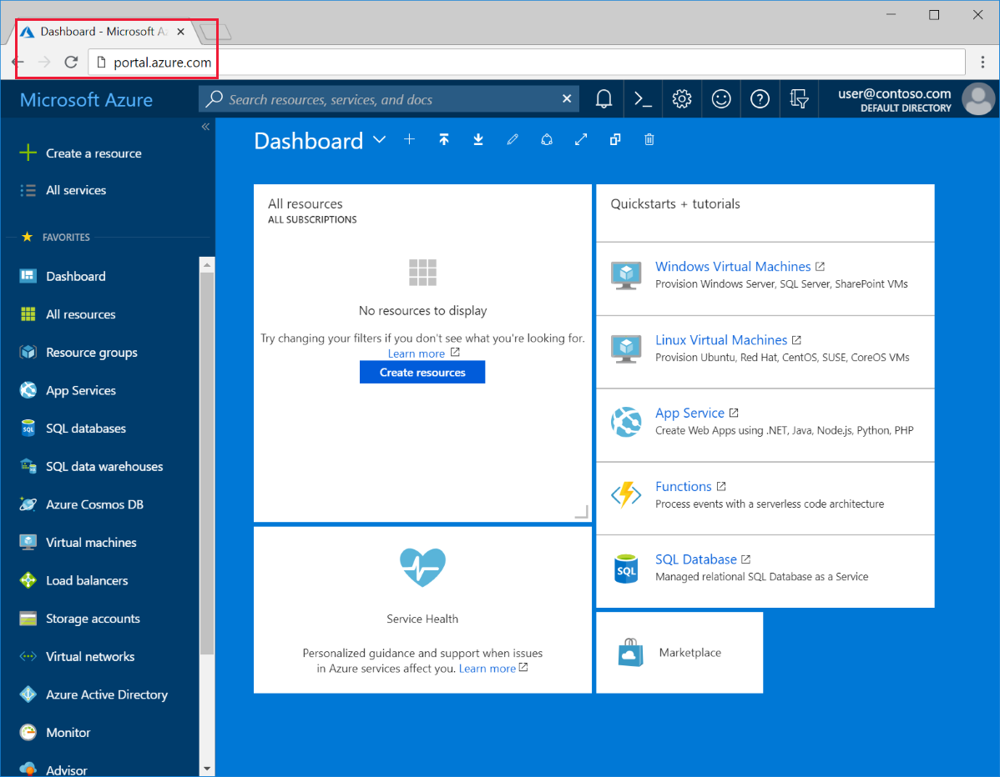
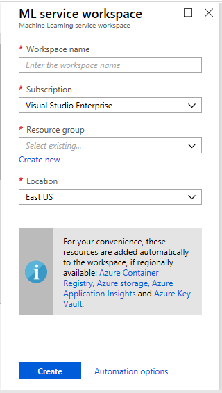

The Azure Machine Learning Workspace is the foundational block in the cloud for your machine learning tasks. You can use it to experiment, train, and deploy machine learning models. The easiest way to create a deployment workspace is through the [Azure portal](https://portal.azure.com/). You can sign into  the Azure portal by using the credentials for the Azure subscription you use.

1. Select **Create a resource** in the upper-left corner of the webpage.

1. You can type **Machine Learning Service** in the search bar. The following results will appear, and you can select the **Machine Learning service workspace** in the search result, and then click "Create".

1. In the **ML service workspace** pane, scroll to the bottom and select **Create** to begin.

1. After that, you can configure the workspace in the **ML service workspace** pane.  Enter **myworkspace** and the workspace name and **myresourcegroup** as the resource group.  You will refer to these later.

1. Select **Create** to create the deployment workspace. It can take a few minutes to create the workspace.