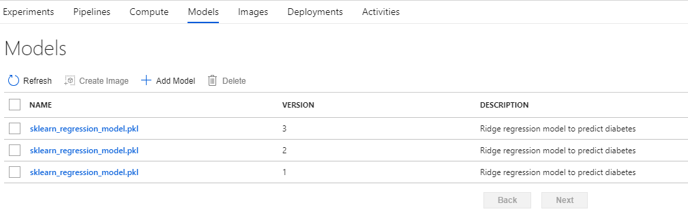
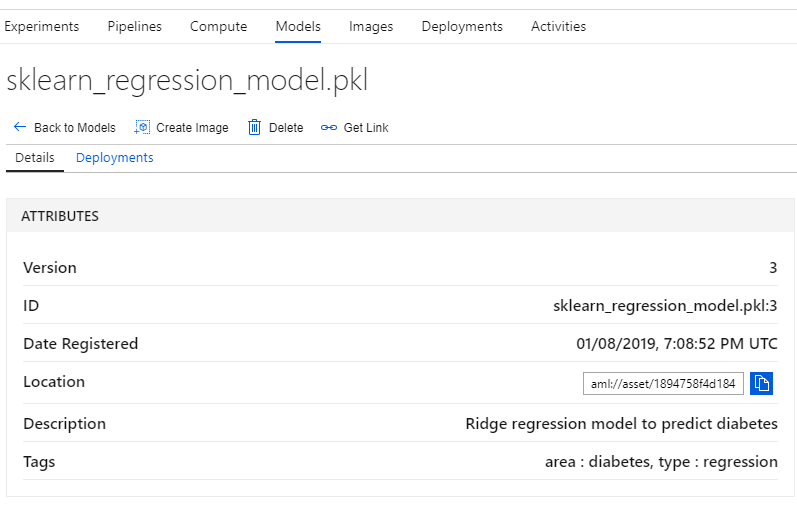

After creating a workspace using the Azure portal or Python, you can register your model in the workspace for further use. Like a container registry, the model registry is a single place to keep track of all the models in your Azure Machine Learning service, to make sure that the models are stored in a structured format.

In the training script we used to train the model, the last step is to save the model as a pickle file.  It is this file you will register for deployment.

To run the code below, you need to train model and save it to a pickle file as explained in the module "Train a local model with Azure Machine Learning service". 

```python
model = run.register_model(model_name='sklearn_mnist_model.pkl',
                           model_path='outputs/sklearn_mnist_model.pkl',
                           tags = {'area': "MNIST", 'type': "sklearn"},
                           description = "identify numbers")

print(model.name, model.id, model.version, sep='\t')
```

In the above code, we have added `tags` and `description` to the model, to make it easily searchable. Using `tags`, you can track useful information such as the purpose for the model, the name, and version of the machine learning library used to train the model, etc. Note that tags must be alphanumeric.

After registering the models, you see the below screen from the Azure portal so that you can see your registered models:



As you can see, models are identified by name and version. Whenever a new model is registered with the same name, the machine learning model registry increments the version automatically. A detailed view of a version of the model is as below:

