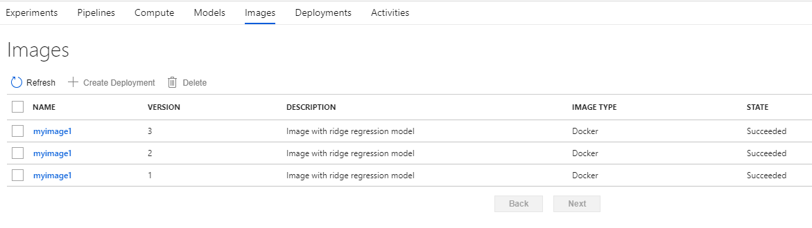
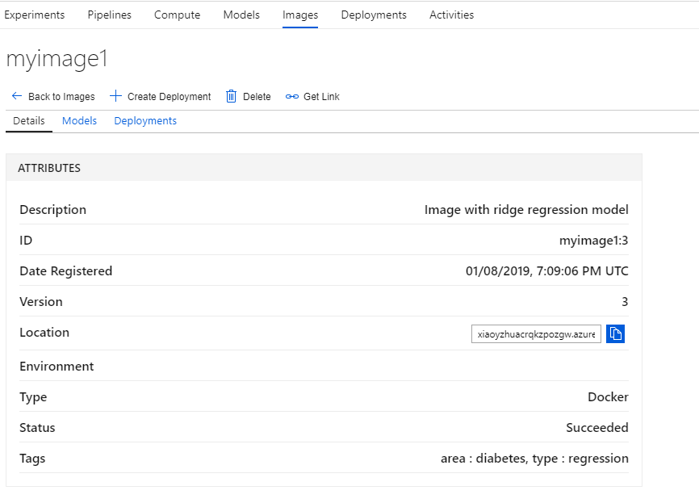

The third step is preparing the container image. The following Python code uses the Azure ML SDK to create the image.

```python
from azureml.core.image import Image, ContainerImage
image_config = ContainerImage.image_configuration(runtime= "python",
                                 execution_script="score.py",
                                 conda_file="myenv.yml",
                                 tags = {'area': "diabetes", 'type': "regression"},
                                 description = "Image with ridge regression model")
image = Image.create(name = "myimage1",
                     # this is the model object 
                     models = [model],
                     image_config = image_config, 
                     workspace = ws)
image.wait_for_creation(show_output = True)
```

After the code is executed, you can view the images in the Azure Machine Learning service portal:



View the detailed image information by clicking into it:



In the next unit, you explore how to monitor the deployed models and collect metrics for the models.