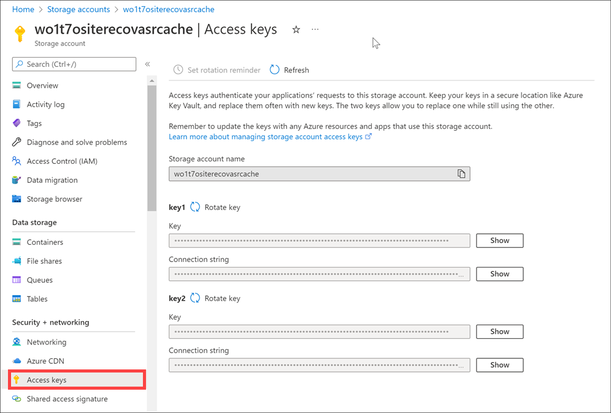

Much of Contoso's data is generated or consumed by custom applications. The applications are written in various languages. 

Azure Storage accounts can create authorized apps in Active Directory to control access to the data in blobs and queues. This authentication approach is the best solution for apps that use Blob storage or Queue storage.

For other storage models, clients can use a _shared key_, or shared secret. This authentication option is one of the easiest to use, and it supports blobs, files, queues, and tables. The client embeds the shared key in the HTTP `Authorization` header of every request, and the Storage account validates the key.

For example, an application can issue a `GET` request against a blob resource:

```
GET http://myaccount.blob.core.windows.net/?restype=service&comp=stats
```

HTTP headers control the version of the REST API, the date, and the encoded shared key:

```
x-ms-version: 2018-03-28  
Date: Wed, 23 Oct 2018 21:00:44 GMT  
Authorization: SharedKey myaccount:CY1OP3O3jGFpYFbTCBimLn0Xov0vt0khH/E5Gy0fXvg=
```

## Storage account keys

In Azure Storage accounts, shared keys are called *storage account keys*. Azure creates two of these keys (primary and secondary) for each storage account you create. The keys give access to _everything_ in the account. 

You'll find the storage account keys in the Azure portal view of the storage account. Just select **Settings** > **Access keys**. 



## Protect shared keys

The storage account has only two keys, and they provide full access to the account. Because these keys are powerful, use them only with trusted in-house applications that you control completely. 

If the keys are compromised, change the key values in the Azure portal. Here are several reasons to regenerate your storage account keys:

- For security reasons, you might regenerate keys periodically.
- If someone hacks into an application and gets the key that was hard-coded or saved in a configuration file, regenerate the key. The compromised key can give the hacker full access to your storage account.
- If your team is using a Storage Explorer application that keeps the storage account key, and one of the team members leaves, regenerate the key. Otherwise, the application will continue to work, giving the former team member access to your storage account.

To refresh keys:

- Change each trusted app to use the secondary key.
- Refresh the primary key in the Azure portal. Consider this as the new secondary key value.

> [!IMPORTANT]
> After you refresh keys, any client that attempts to use the old key value will be refused. Make sure you identify all clients that use the shared key, and update them to keep them operational.