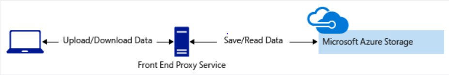
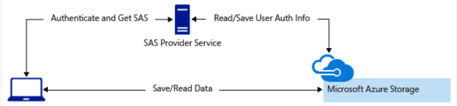

As a best practice, you shouldn't share storage account keys with external third-party applications. If these apps need access to your data, you need to secure their connections without using storage account keys.

For untrusted clients, use a *shared access signature* (SAS). A SAS is a string that contains a security token that can be attached to a URI. You can use a SAS to delegate access to storage objects and specify constraints, such as the permissions and the time range of access.

You can give a customer a SAS token, for example, so they can upload pictures to a file system in Blob storage. Separately, you can give a web app permission to read those pictures. In both cases, you allow only the access that the application needs to do the task.

## Types of shared access signatures

Azure Storage supports three types of shared access signatures.

### User delegation SAS

A *user delegation SAS* is secured with Microsoft Entra credentials rather than a storage account key. This makes it the most secure type of SAS. Microsoft recommends using a user delegation SAS whenever possible, because it ties the SAS to the identity of the user or service principal that created it. A user delegation SAS is supported for Blob Storage (including Data Lake Storage), Queue Storage, Table Storage, and Azure Files.

### Service SAS

A *Service SAS* (formerly called service-level SAS) allows access to a resource in a single Azure Storage service. Use this type of SAS, for example, to allow an app to retrieve a list of files in a file system, or to download a file. A service SAS is signed with the storage account key.

### Account SAS

An *Account SAS* (formerly called account-level SAS) allows access to anything that a Service SAS can allow, plus additional resources and abilities. For example, you can use an Account SAS to allow the ability to create file systems. An Account SAS is also signed with the storage account key.

> [!IMPORTANT]
> For scenarios where a SAS is needed, Microsoft recommends using a user delegation SAS when possible. A user delegation SAS is more secure because it uses Microsoft Entra credentials instead of the account key, which could otherwise be compromised.

You'd typically use a SAS for a service where users read and write their data to your storage account. Accounts that store user data have two typical designs:

- Clients upload and download data through a front-end proxy service, which performs authentication. This front-end proxy service has the advantage of allowing validation of business rules. But, if the service must handle large amounts of data or high-volume transactions, you might find it complicated or expensive to scale this service to match demand.

    

- A lightweight service authenticates the client, as needed. Next, it generates a SAS. After receiving the SAS, the client can access storage account resources directly. The SAS defines the client's permissions and access interval. It reduces the need to route all data through the front-end proxy service.

    