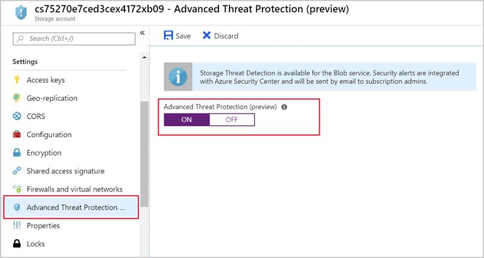

Detecting threats to your data is an important part of security. You can check an audit trail for all activity against a storage account. But that will often only show you that an intrusion _has already occurred_. What you really want is a way to be notified when suspicious activity is happening. That's where the Advanced Threat Protection feature in Azure Storage can help.

Advanced Threat Protection, now in public preview, detects anomalies in account activity. It then notifies you of potentially harmful attempts to access your account. You don't have to be a security expert or manage security monitoring systems to take advantage of this layer of threat protection. 

Currently, Advanced Threat Protection for Azure Storage is available for the Blob service. Security alerts are integrated with Azure Security Center. The alerts are sent by email to subscription admins.

In the Azure portal, you can turn on threat protection on the configuration page of the Azure Storage account.

1. On the **Settings** page, select **Advanced Threat Protection**.
1. Turn **ON** Advanced Threat Protection.
1. Select **Save** to save the Advanced Threat Protection policy.

