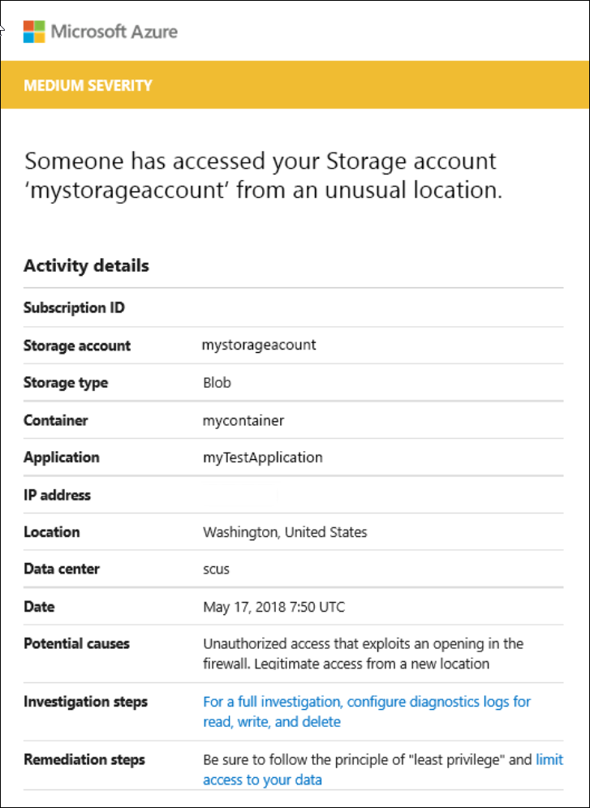
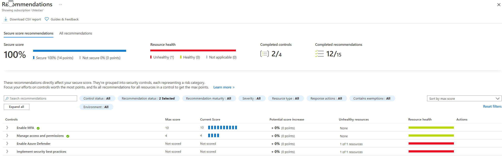

Microsoft Defender for Storage provides an extra layer of security intelligence that detects unusual and potentially harmful attempts to access or exploit storage accounts. This layer of protection allows you to address threats without being a security expert or managing security-monitoring systems.

Security alerts are triggered when anomalies in activity occur. These security alerts are integrated with Microsoft Defender for Cloud, and are also sent via email to subscription administrators, with details of suspicious activity and recommendations on how to investigate and remediate threats.

Microsoft Defender for Storage is currently available for Blob storage, Azure Files, and Azure Data Lake Storage Gen2. Account types that support Microsoft Defender for Cloud include general-purpose v2, block blob, and Blob storage accounts. Microsoft Defender for Storage is available in all public clouds and US government clouds, but not in other sovereign or Azure Government cloud regions.

The recommended approach is to enable Microsoft Defender for Storage at the subscription level, which automatically protects all existing and new storage accounts in that subscription. Follow these steps.

1. Launch the Azure portal and go to **Microsoft Defender for Cloud**.

1. Select **Environment settings** and choose the subscription you want to protect.

1. On the **Defender plans** pane, locate **Storage** in the list, set the toggle to **On**, and select **Save**.

> [!NOTE]
> The classic per-transaction Defender for Storage plan is no longer available for new subscriptions as of February 5, 2025. The current plan charges per storage account and includes malware scanning and sensitive data threat detection. Subscription-level enablement may take up to 24 hours to apply across all storage accounts.

## Explore security anomalies

When storage activity anomalies occur, you'll receive an email notification with information about the suspicious security event. Details of the event include:

- Nature of the anomaly
- Storage account name
- Event time
- Storage type
- Potential causes
- Investigation steps
- Remediation steps
- Email also includes details about possible causes and recommended actions to investigate and mitigate the potential threat

    

You can review and manage your current security alerts from Microsoft Defender for Cloud's Security alerts tile. Selecting a specific alert provides details and actions for investigating the current threat and addressing future threats.

