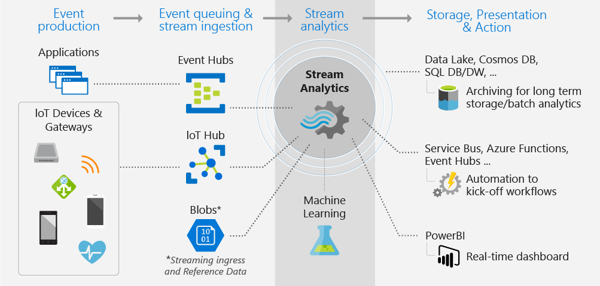
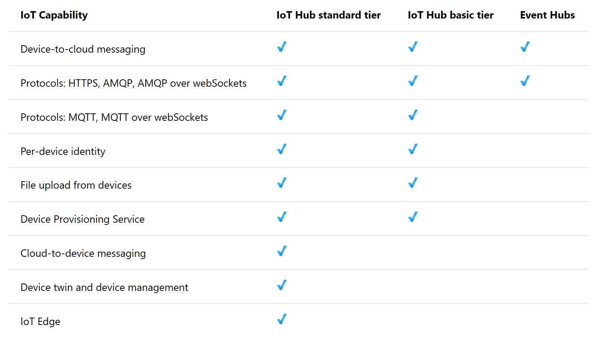

Applications, sensors, monitoring devices, and gateways broadcast continuous event data known as *data streams*. Streaming data is high volume and has a lighter payload than nonstreaming systems. 

Data engineers use Azure Stream Analytics to process streaming data and respond to data anomalies in real time. You can use Stream Analytics for Internet of Things (IoT) monitoring, web logs, remote patient monitoring, and point of sale (POS) systems.

## When to use Stream Analytics

If your organization must respond to data events in real time or analyze large batches of data in a continuous time-bound stream, Stream Analytics is a good solution. Your organization must decide whether to work with streaming data or batch data.

In real time, data is ingested from applications or IoT devices and gateways into an event hub or IoT hub. The event hub or IoT hub then streams the data into Stream Analytics for real-time analysis.

Batch systems process groups of data that are stored in an Azure Blob store. They do this in a single job that runs at a predefined interval. Don't use batch systems for business intelligence systems that can't tolerate the predefined interval. For example, an autonomous vehicle can't wait for a batch system to adjust its driving. Similarly, a fraud-detection system must decline a questionable financial transaction in real time.

## Data ingestion

As a data engineer, set up data ingestion in Stream Analytics by configuring data inputs from first-class integration sources. These sources include Azure Event Hubs, Azure IoT Hub, and Azure Blob storage.

An IoT hub is the cloud gateway that connects IoT devices. IoT hubs gather data to drive business insights and automation. 

Features in Azure IoT Hub enrich the relationship between your devices and your back-end systems. Bidirectional communication capabilities mean that while you receive data from devices, you can also send commands and policies back to devices. Take advantage of this ability, for example, to update properties or invoke device management actions. Azure IoT Hub can also authenticate access between the IoT device and the IoT hub.

Azure Event Hubs provides big-data streaming services. It's designed for high data throughput, allowing customers to send billions of requests per day. Event Hubs uses a partitioned consumer model to scale out your data stream. This service is integrated into the big-data and analytics services of Azure. These include Databricks, Stream Analytics, Azure Data Lake Storage, and HDInsight. Event Hubs provides authentication through a shared key.

You can use Azure Storage to store data before you process it in batches.

## Data processing

To process streaming data, set up Stream Analytics jobs with input and output pipelines. Inputs are provided by Event Hubs, IoT Hubs, or Azure Storage. Stream Analytics can route job output to many storage systems. These systems include Azure Blob, Azure SQL Database, Azure Data Lake Storage, and Azure Cosmos DB.

After storing the data, run batch analytics in Azure HDInsight. Or send the output to a service like Event Hubs for consumption. Or use the Power BI streaming API to send the output to Power BI for real-time visualization.

## Queries

To define job transformations, use a simple, declarative Stream Analytics query language. The language should let you use simple SQL constructs to write complex temporal queries and analytics.

The Stream Analytics query language is consistent with the SQL language. If you're familiar with the SQL language, you can start creating jobs.

## Data security

Stream Analytics handles security at the transport layer between the device and Azure IoT Hub. Streaming data is generally discarded after the windowing operations finish. Event Hubs uses a shared key to secure the data transfer. If you want to store the data, your storage device will provide security.