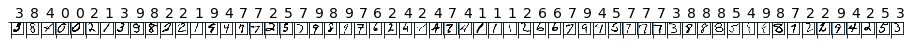

Let's start by getting the sample data we'll use to train our ML models. We'll use Python to retrieve the data.

> [!IMPORTANT]
It is strongly recommended that you use [Azure Notebooks](https://notebooks.azure.com/) as described previously to run the code examples because everything is preconfigured and you get the latest version of Python. 


## Using a local development install

If you are not using Azure Notebook and are running the code example locally, you need to perform the steps below to install the Python scikit-learn package and the Azure ML SDK.

You will process the sample data using [NumPy](http://www.numpy.org/) and [scikit-learn](https://scikit-learn.org/stable/index.html) which are common scientific package for Python. You will also need to install the Azure ML SDK which connects you to the Azure Machine Learning service workspace. 

You can execute the following commands to install the required packages into your Python environment.

```bash
pip install -U scikit-learn azureml-sdk
```

This installs several related packages which are useful in processing data in Python.

## Retrieve the MNIST data

Run the following code in a notebook cell to retrieve the MNIST dataset and save it to a local **data** folder.

```python
import os
import urllib.request

#create a folder for the dataset
os.makedirs('./data', exist_ok = True)

# load dataset to the directory--as you can see, you must load train sets and test sets separately
urllib.request.urlretrieve('http://yann.lecun.com/exdb/mnist/train-images-idx3-ubyte.gz', filename='./data/train-images.gz')
urllib.request.urlretrieve('http://yann.lecun.com/exdb/mnist/train-labels-idx1-ubyte.gz', filename='./data/train-labels.gz')
urllib.request.urlretrieve('http://yann.lecun.com/exdb/mnist/t10k-images-idx3-ubyte.gz', filename='./data/test-images.gz')
urllib.request.urlretrieve('http://yann.lecun.com/exdb/mnist/t10k-labels-idx1-ubyte.gz', filename='./data/test-labels.gz')
```

You will see output similar to this: `('./data/test-labels.gz', <http.client.HTTPMessage object at 0x00000247D0FE6080>)`. A folder named **data** will be created that will have four Gzipped files containing the image and label test and training data.

## Split out the datasets

The next step is to split the data into training and test sets. We'll need a function to load the compressed file and return numpy arrays we can process. Save the following code off to a file named **utils.py**.

```python
import gzip
import numpy as np
import struct

# load compressed MNIST gz files and return numpy arrays
def load_data(filename, label=False):
    with gzip.open(filename) as gz:
        struct.unpack('I', gz.read(4))
        n_items = struct.unpack('>I', gz.read(4))
        if not label:
            n_rows = struct.unpack('>I', gz.read(4))[0]
            n_cols = struct.unpack('>I', gz.read(4))[0]
            res = np.frombuffer(gz.read(n_items[0] * n_rows * n_cols), dtype=np.uint8)
            res = res.reshape(n_items[0], n_rows * n_cols)
        else:
            res = np.frombuffer(gz.read(n_items[0]), dtype=np.uint8)
            res = res.reshape(n_items[0], 1)
    return res

print('Functions defined')
```

With the load_data helper function defined, we can now use it to load the data using the code below. 

```python
# To help the model converge faster, shrink the intensity values (X) from 0-255 to 0-1

X_train = load_data('./data/train-images.gz', False) / 255.0
y_train = load_data('./data/train-labels.gz', True).reshape(-1)

X_test = load_data('./data/test-images.gz', False) / 255.0
y_test = load_data('./data/test-labels.gz', True).reshape(-1)

print('Data loaded')
```

## Display sample images

To verify we've loaded the data, let's display one of the sample images + labels using matplotlib.  This may take a minute or two to run.

```python
import matplotlib.pyplot as plt
import numpy as np

count = 0
sample_size = 30
plt.figure(figsize = (16, 6))
for i in np.random.permutation(X_train.shape[0])[:sample_size]:
    count = count + 1
    plt.subplot(1, sample_size, count)
    plt.axhline('')
    plt.axvline('')
    plt.text(x=10, y=-10, s=y_train[i], fontsize=18)
    plt.imshow(X_train[i].reshape(28, 28), cmap=plt.cm.Greys)
    
plt.show()

print('Done')
```

It should display an image which looks something like this:



The numbers in the top row are the labels, and the handwritten pictures are in the second row.
