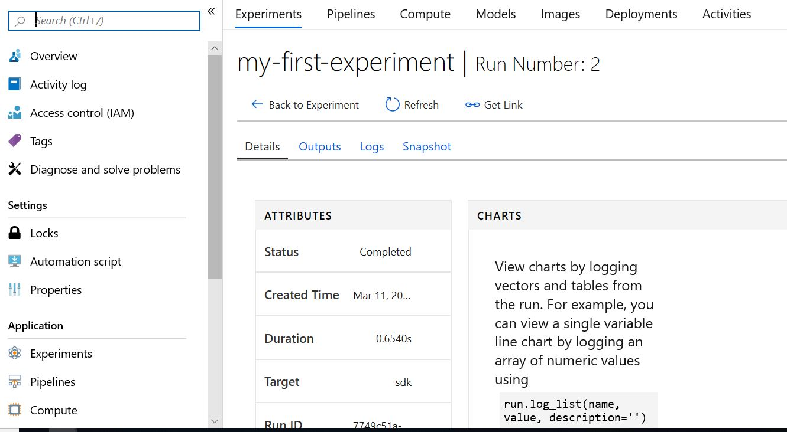

You might notice that, depending on your local machine capacity, it takes a long time to fit models with parameters of different values or to find a value of `k` that returns the best results. In this case, you should try running the model on a remote cluster.

## Run and experiment overview

Before you begin, it's imperative to familiarize yourself with two concepts: run and experiment.

*Run*, within the context of the Azure Machine Learning service, refers to Python code for a specific task; for example, training a model or tuning _hyperparameters_. A run logs metrics and uploads the result to the Azure platform, and it's a more natural way to track jobs in a workspace.

*Experiment* is a term that refers to a composition of a series of runs. In the example, you have one run for the logistic regression model and another for the kNN model, and together they make up an experiment for you to compare results.

## Create an experiment

The first step in creating an experiment is to create a Machine Learning service workspace. We can do this in the Azure portal, or in Python using the Azure ML SDK. To use Python, we will need to supply an Azure _subscription id_. You can find your subscriptions in the Azure portal through the **Subscriptions** item in the left sidebar, or by typing "Subscriptions" into the global search box.


Locate the subscription you want to use and replace the `{azure-subscription-id}` value below with the subscription id value. The SDK will ask you to sign into your Azure account if you are not already signed in.

```python
from azureml.core import Workspace,Experiment,Run

ws = Workspace.create(
            name='AMLSWorkspace',
            subscription_id='{azure-subscription-id}', 
            resource_group='rgAMLSLearnworkspace',
            create_resource_group=True,
            location='eastus2'
)
```

> [!IMPORTANT]
> The `Workspace.create` function returns the created `Workspace` object which we will use as we go along. We are storing it here in the variable `ws`.

With a `Workspace` object, you can create an `Experiment` and a `run` with the Azure ML SDK:

```python
from azureml.core import Experiment
#Create an experiment
experiment = Experiment(workspace = ws, name = "my-first-experiment")

#Create a run
run = experiment.start_logging()
run.log("trial",1)
run.complete()
```


## View the logged results

Once the job has finished, the code below will display some details about the job you just ran. 

```python
from azureml.widgets import RunDetails

RunDetails(run).show()
```

You can view the experiment run in the Azure portal. To print a URL that links to the results for the last run, use the following code:

```python
print(run.get_portal_url())
```

Navigate to the presented URL in a browser window to see the results of the experiment. It should open the Azure portal and display something like the below screenshot.


