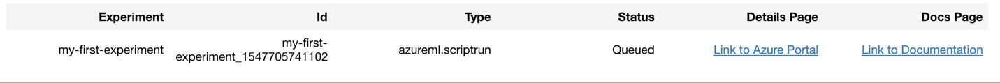
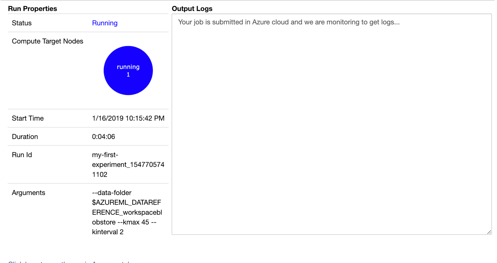
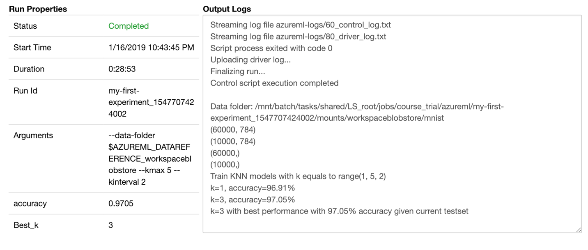

You learned that a *compute target* is the compute resource to run a training script or to host a service deployment. Here you will create an Azure Machine Learning Compute (AmlCompute) as the compute resource. An AmlCompute is a compute target optimized for machine learning workloads that's managed directly by Azure Machine Learning service. You don't need to connect or configure these targets - the system takes care of them for you.

The first step is to create a remote compute target:

```python
from azureml.core.compute import AmlCompute
from azureml.core.compute import ComputeTarget
import os

# Step 1: name the cluster and set the minimal and maximal number of nodes 
compute_name = os.environ.get("AML_COMPUTE_CLUSTER_NAME", "cpucluster")
min_nodes = os.environ.get("AML_COMPUTE_CLUSTER_MIN_NODES", 0)
max_nodes = os.environ.get("AML_COMPUTE_CLUSTER_MAX_NODES", 3)

# Step 2: choose environment variables 
vm_size = os.environ.get("AML_COMPUTE_CLUSTER_SKU", "STANDARD_D2_V2")

provisioning_config = AmlCompute.provisioning_configuration(
    vm_size = vm_size, min_nodes = min_nodes, max_nodes = max_nodes)

# create the cluster
compute_target = ComputeTarget.create(ws, compute_name, provisioning_config)

print('Compute target created')
```

## Retrieve the MNIST data

If you did not already do 'Exercise - Load the data for a simple logistic regression model', you will need to run the code below to get the data for this experiment.  

```python
import os
import urllib.request

#create a folder for the dataset
os.makedirs('./data', exist_ok = True)

# load dataset to the directory--as you can see, you must load train sets and test sets separately
urllib.request.urlretrieve('http://yann.lecun.com/exdb/mnist/train-images-idx3-ubyte.gz', filename='./data/train-images.gz')
urllib.request.urlretrieve('http://yann.lecun.com/exdb/mnist/train-labels-idx1-ubyte.gz', filename='./data/train-labels.gz')
urllib.request.urlretrieve('http://yann.lecun.com/exdb/mnist/t10k-images-idx3-ubyte.gz', filename='./data/test-images.gz')
urllib.request.urlretrieve('http://yann.lecun.com/exdb/mnist/t10k-labels-idx1-ubyte.gz', filename='./data/test-labels.gz')
```

## Load data and create a modeling script

Depending on the location and format of the data source, there are various ways to pipe data into the model. For example, we can use the created `Workspace` object to obtain the default datastore and upload the data into Azure Blob storage.

```python
#upload data by using get_default_datastore()
ds = ws.get_default_datastore()
ds.upload(src_dir='./data', target_path='mnist', overwrite=True, show_progress=True)
```

> [!IMPORTANT]
> If you have more than 300 MB of content or 2000 files in the current notebook folder, you might get the following error:
>
> 
>
> This happens because Azure Machine Learning runs training scripts by copying the entire script folder to the target compute context, and then takes a snapshot. The storage limit for experiment snapshots is 300 MB and/or 2000 files.
>
> There are a number of ways to resolve this issue.  If you don't need all the files and can work within the default space constraints, the easiest solution is to exit the notebook, create a new folder with only what you need, open that folder and create the notebook there. On a local machine, you can stop the Jupyter Notebook service, change to the new folder at a command prompt and restart Jupyter Notebook.  On Azure Notebook, just create a new project and copy what you need to it. Then create your notebook there.  
>
> If you cannot get the data within the constraints, then read through [the documentation](https://docs.microsoft.com/azure/machine-learning/service/how-to-save-write-experiment-files#limits) to explore other options.

Then you create a directory to save your training Python code:

```python
import os

# create the folder
folder_training_script = './trial_model_mnist'
os.makedirs(folder_training_script, exist_ok=True)
```

Finally, let's prepare our model training script (note that in this script, you are defining three parameters):

- The first parameter is for finding the data in the cloud or for the path.
- The other two parameters define the **k** parameter in the **kNN** algorithm.
- `kmax` limits the maximum value of **k**.
- `kinterval` decides the interval between each **k**.

```python
%%writefile $folder_training_script/train.py

import argparse
import os
import numpy as np

from sklearn.neighbors import KNeighborsClassifier
from sklearn.externals import joblib

from azureml.core import Run

import gzip
import struct

# load compressed MNIST gz files and return numpy arrays
def load_data(filename, label=False):
    with gzip.open(filename) as gz:
        struct.unpack('I', gz.read(4))
        n_items = struct.unpack('>I', gz.read(4))
        if not label:
            n_rows = struct.unpack('>I', gz.read(4))[0]
            n_cols = struct.unpack('>I', gz.read(4))[0]
            res = np.frombuffer(gz.read(n_items[0] * n_rows * n_cols), dtype=np.uint8)
            res = res.reshape(n_items[0], n_rows * n_cols)
        else:
            res = np.frombuffer(gz.read(n_items[0]), dtype=np.uint8)
            res = res.reshape(n_items[0], 1)
    return res

# create three parameters, the location of the data files, and the maximun value of k and the interval
parser = argparse.ArgumentParser()
parser.add_argument('--data-folder', type=str, dest='data_folder', help='data folder mounting point')
parser.add_argument('--kmax', type=int, dest='kmax', default=15, help='max k value')
parser.add_argument('--kinterval', type=int, dest='kinterval', default=2, help='k interval')
args = parser.parse_args()

data_folder = os.path.join(args.data_folder, 'mnist')
print('Data folder:', data_folder)

# load the train and test set into numpy arrays
X_train = load_data(os.path.join(data_folder, 'train-images.gz'), False) / 255.0
X_test = load_data(os.path.join(data_folder, 'test-images.gz'), False) / 255.0

#print variable set dimension
print(X_train.shape, X_test.shape, sep = '\n')

y_train = load_data(os.path.join(data_folder, 'train-labels.gz'), True).reshape(-1)
y_test = load_data(os.path.join(data_folder, 'test-labels.gz'), True).reshape(-1)

#print the response variable dimension
print( y_train.shape, y_test.shape, sep = '\n')

# get hold of the current run
run = Run.get_context()

print('Train kNN models with k equals to', range(1,args.kmax,args.kinterval))

# generate a wide range of k and find the best models
# also create a list to store the evaluation result for each value of k
kVals = range(1,args.kmax,args.kinterval)
evaluation = []

# loop over the models with different parameters to find the one with the lowest error rate
for k in kVals:
    model = KNeighborsClassifier(n_neighbors=k)
    model.fit(X_train, y_train)

    # use the test dataset for evaluation and append the result to the evaluation list
    score = model.score(X_test, y_test)
    print("k=%d, accuracy=%.2f%%" % (k, score * 100))
    evaluation.append(score)

# find the value of k with the best performance
i = int(np.argmax(evaluation))
print("k=%d with best performance with %.2f%% accuracy given current testset" % (kVals[i], evaluation[i] * 100))

model = KNeighborsClassifier(n_neighbors=kVals[i])

run.log('Best_k', kVals[i])
run.log('accuracy', evaluation[i])

os.makedirs('outputs', exist_ok=True)

# note that the file saved in the outputs folder automatically uploads into the experiment record
joblib.dump(value=model, filename='outputs/knn_mnist_model.pkl')

print('Training script saved')
```

Notice that the last line of the training script saves the model as a pickle file in the outputs folder of the experiment workspace.  You use this pickle file later to deploy the model.

 An estimator object is used to submit the run. Create your estimator by running the following code to define:

- The name of the estimator object, `est`.
- The directory that contains your scripts. All the files in this directory are uploaded into the cluster nodes for running.
- The compute target. In this case, you use the Azure Machine Learning compute cluster that you created.
- The training script name, **train.py**.
- Parameters that the training script requires.
- Python packages that are necessary for training.

```python
from azureml.train.estimator import Estimator

script_params = {
    '--data-folder': ds.as_mount(),
    '--kmax': 5,
    '--kinterval': 2
}

#import the Scikit-learn package 
est = Estimator(source_directory=folder_training_script,
                script_params=script_params,
                compute_target=compute_target,
                entry_script='train.py',
                conda_packages=['scikit-learn'])
```

## Submit the model, monitor the run, and retrieve the results

We need to create an Experiment to run the model training in.

```python
from azureml.core import Experiment

#Create an experiment
exp = Experiment(workspace = ws, name = "amls-learn-experiment")
print('Experiment created')
```

The last step is running the model. Sign in with your Azure account if prompted to do so.

```python
run = experiment.submit(config=est)
run
```

You can see the running experiment in the portal:



You could use the widgets module from the **azureml** package to monitor your run:

```python
# monitor the run
from azureml.widgets import RunDetails

RunDetails(run).show()
```

The following screenshot depicts the status when remote resources are running.



The following screenshot depicts the status of the completed job. Highlighted in the red box, you can see that you got the same results as you did earlier on the local machine.



After this run finishes, you can print the results. The results were logged because you wrote the code in the training script.

```python
#get the result
print(run.get_metrics())
```
