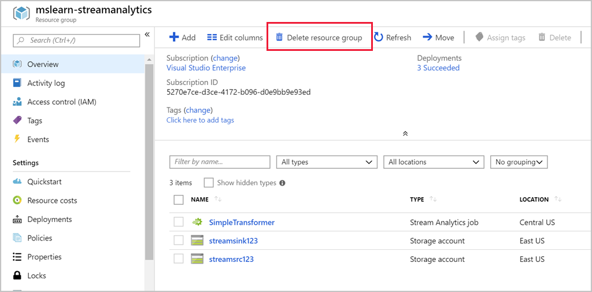

In this unit, we learned how to create an Azure Stream Analytics job, configure an input, write a transformation query, and configure output. We used Azure Storage as our source and destination and created a transformation query to produce some basic results. In addition, we learned how to start a Stream Analytics job and view the job results.

## Cleanup

To avoid incurring unnecessary charges, once you are done, you will want to delete all the resources we created including the two storage accounts and the Azure Stream Analytics job. You can do this individually, but an easier approach is to delete the resource group **mslearn-streamanalytics**. Locate the resource group through the search field, select it, and use the **Delete resource group** button. 

Since this deletes a whole set of resources together, Azure will prompt you to be sure you really want to do this.

## Learn more

Here are some resources where you can learn more about creating Stream Analytics jobs and queries.

[Supported Output Sinks for Azure Streaming Analytics](https://docs.microsoft.com/azure/stream-analytics/stream-analytics-define-outputs)
[Stream Analytics Query Language Reference](https://docs.microsoft.com/stream-analytics-query/stream-analytics-query-language-reference)