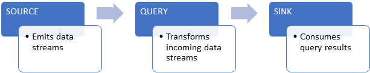

In Azure Stream Analytics, a _job_ is a unit of execution. A Stream Analytics job pipeline consists of three parts:

* An **input** that provides the source of the data stream.
* A **transformation query** that acts on the input. For example, a transformation query could aggregate the data.
* An **output** that identifies the destination of the transformed data.

The Stream Analytics pipeline provides a transformed data flow from input to output, as the following diagram shows.

