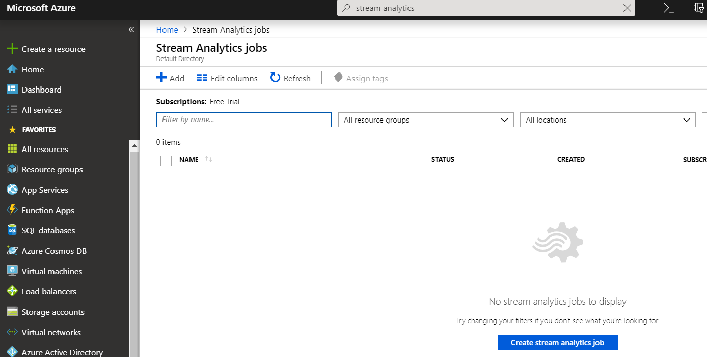
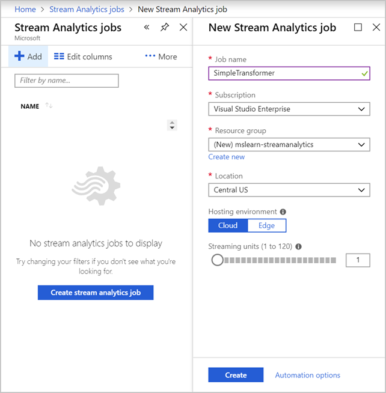
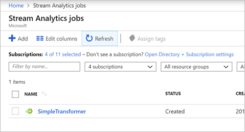

Let's start by creating a new Azure Stream Analytics job in the Azure portal.

> [!NOTE]
> This exercise is optional. If you don't have an Azure account or prefer not to do the exercise in your account, you can just read through the instructions. This overview will help you understand the steps to create a Stream Analytics job.

1. Open the [Azure portal](https://portal.azure.com?azure-portal=true) and sign in to your account.

1. Select **More services**, and then select **All services**.

1. In the search box, enter **Stream Analytics**, and select **Stream Analytics jobs** from the results.

1. On the **Stream Analytics jobs** page, select **+ New**.

    

    The **New Stream Analytics job** page appears.

1. Enter a **Job name**, such as **SimpleTransformer**.

1. In the **Resource group** field, select **Create new**, and enter **mslearn-streamanalytics**. Select **OK**.

1. Note the **Location** setting. Ideally, you should create your job in the same location as any storage accounts you use as a source or destination.

1. Ensure **Cloud** is selected for the **Hosting environment**.

1. Set the **Streaming units** to **1** to minimize the cost for this test.

1. Select **Create** to create the new job.

    

1. After a few moments, select **Refresh** to see your new Stream Analytics job.

    

Now that we have a Stream Analytics job, we're ready to set up the job to serve a streaming workload. We'll start with the input.