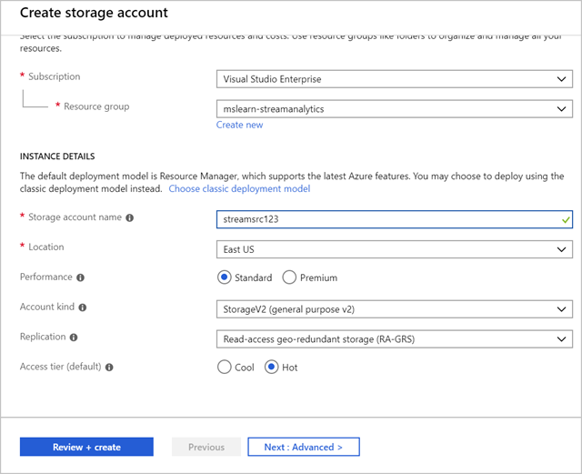
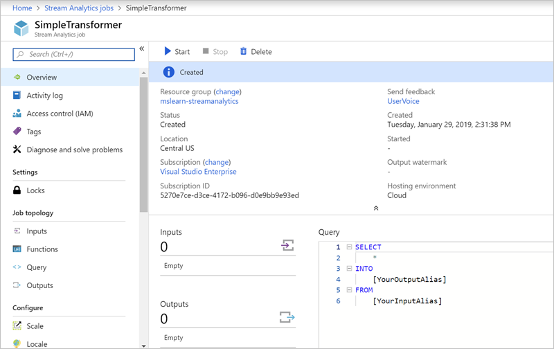
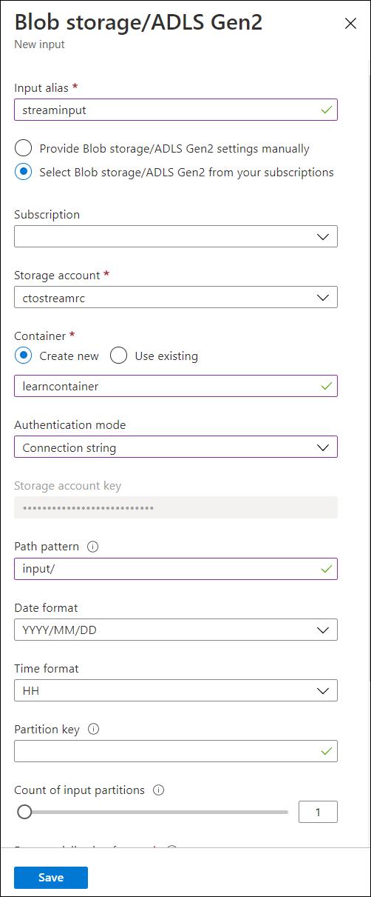

An Azure Stream Analytics job supports three input types:

> [!div class="mx-tableFixed"]
> | Input type | Use case |
> |------------|----------|
> | **Azure Event Hub** | Azure Event Hub consumes live streaming data from applications with low latency and high throughput. |
> | **Azure IoT Hub**   | Azure IoT Hub consumes live streaming events from IoT devices. This service enables bi-directional communication scenarios where commands can be sent back to IoT devices to trigger specific actions based on analyzing streams they send to the service. |
> | **Azure Blob Storage** | Azure Blob Storage is used as the input source to consume files persisted in blob storage. |

## Create the input source

Let's use an Azure Blob store as the input. Recall that Azure Blob Storage has three aspects to it:
- Storage account to provide the globally unique namespace in Azure
- Container which acts like a folder
- Blob itself which is similar to a file in a file system

Let's start by creating an Azure Blob Storage account.

1. Switch back to the [Azure portal](https://portal.azure.com?azure-portal=true).

1. Select **All services** in the top left corner.

1. Enter "**storage**" in the search field, and select **Storage accounts** from the results.

1. Select **+ New** to create a new Azure Storage account.

1. On the **Basics** tab, from the **Resource group** dropdown, select the new **mslearn-streamanalytics** resource group.

1. Set the **Storage account name** to a unique name. Enter the prefix "streamsrc" with your initials or a numeric value. This value has to be unique across all Azure storage accounts, so you might have to try a few combinations to find one that works for you. The portal will place a green checkmark next to the name if it's valid.

1. Check the **Location**. Set it to the same location as the job to avoid having to pay to transfer data between regions.

1. Leave the rest of the fields as default values.

    

1. Select **Review + create**.

1. After the request has been validated, select **Create** to submit the deployment request.

Wait for a few moments for the deployment to complete. After the message "Your deployment is complete" appears, go to the next step.

## Connect the input source to the Stream Analytics job

Next, let's connect our Stream Analytics job to our new Blob Storage account.

1. In the Azure portal, select **All services** in the left sidebar.

1. In the search box, enter **Stream Analytics**. Select the **Stream Analytics jobs** from the results.

1. In the list of jobs, select the Stream Analytics job you created earlier (**SimpleTransformer**). The overview page for your job appears.

    

1. Under **Job topology**, select **Inputs**.

1. Select **Add stream input**, and select **Blob storage/ADLS Gen2** from the dropdown. The **Blob storage/ADLS Gen2** panel appears.

1. Enter **streaminput** in **Input alias** field. This is a friendly name you use to identify the input.

1. Select the **Storage account** you created previously from the dropdown. Recall it starts with **streamsrc**.

1. Select **Create New** for the **Container** field, and give it a unique name, such as **learncontainer**.

1. Select **Connection string** from the dropdown for **Authentication mode**.

1. Enter **input/** for **Path pattern**.

1. Leave the rest of the fields with the current default values.

    

1. Select **Save** to associate the input.