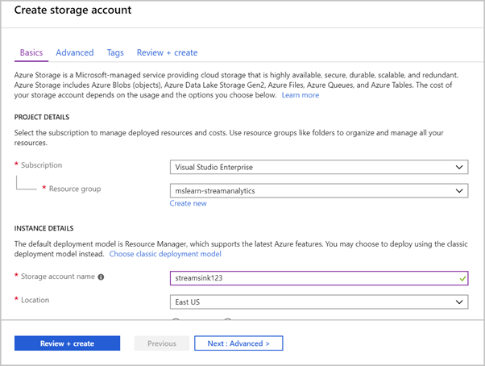

Stream Analytics jobs support various output sinks, such as Azure Blob storage, SQL Database, and Event Hubs. The documentation lists all output types. 

In this exercise, we'll use Blob storage as the output sink for our Stream Analytics job.

> [!NOTE]
> This exercise is optional. If you don't have an Azure account or prefer not to do the exercise in your account, just read through the instructions so you understand the steps involved in creating an output sink for a Stream Analytics job.

These steps are similar to the ones you followed to create the input. Start by creating a second Blob storage account to hold the output.

1. In the [Azure portal](https://portal.azure.com?azure-portal=true), create a new storage account, just like you did in the previous exercise.
1. On the **Basics** tab, select your new **mslearn-streamanalytics** resource group.
1. For the account name, use the prefix **streamsink**, and add a numeric suffix. You might need to try a few combinations to find a unique name in Azure.
1. Use default values for all other fields.

    

1. Select **Review + create**.
1. After the request is validated, select **Create** to run the deployment step.

Wait until a message indicates that the deployment is complete. Then continue to the next step.

## Connect an output sink to a Stream Analytics job

Next, connect the storage account as the destination for the Stream Analytics job.

1. On the left, select **All services**.
1. In the search box, type **Stream Analytics** and select **Stream Analytics job** from the results.
1. Select the Stream Analytics job you created.
1. Under **Job topology**, select **Outputs**.
1. Select **Add**, and from the list select **Blob storage**.
1. In the **Output alias** field, type **streamoutput**. This is your own name for the output.
1. Select the **streamsink** storage account you created in the previous section.

> [!NOTE]
> If your account doesn't appear in the list, try refreshing it by closing the Azure portal, closing the browser, and then opening the Azure portal again.

1. Under **Container**, select **Create new**. Give the container a unique name, such as **learn-container**.
1. Under **Path pattern**, enter **output/**.
1. Leave the default values in the rest of the fields.
1. Select **Save**.
