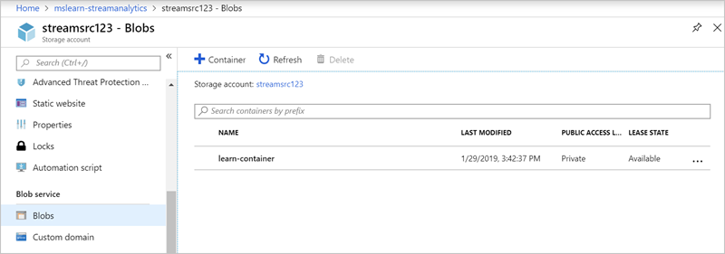
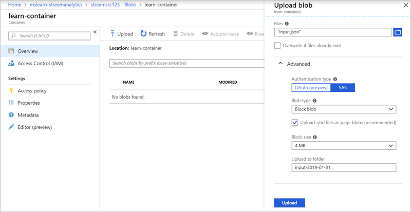
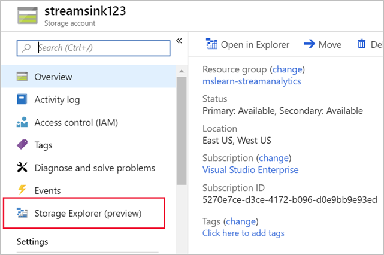
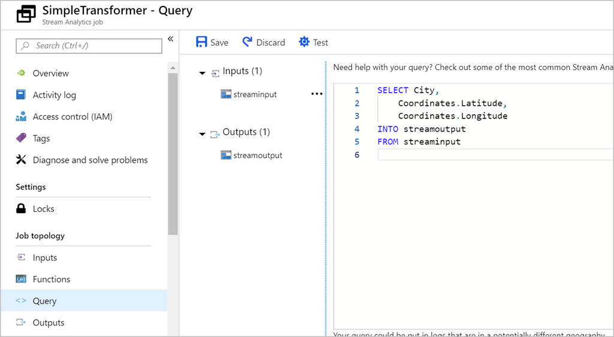

An Azure Stream Analytics query transforms an input data stream and produces an output. Queries are written in a language like SQL that's a subset of the Transact-SQL (T-SQL) language. 

In this exercise, we'll transform the input data in a simple way to demonstrate the transformation-query capabilities that Stream Analytics exposes.

> [!NOTE]
> This exercise is optional. If you don't have an Azure account or prefer not to do the exercise in your account, just read through the instructions so you understand how to set up an input file and change the transformation query in a Stream Analytics job.

Let's imagine you need to pull elements out of some census data. In this case, you want the coordinates of each city in the census data. You'll use a simple JSON file as your input. Run a transformation query to pull coordinates out of the data, and then write the results to a new file in your Blob storage.

## Create the sample input file

Start by creating a simple input file named **input.json** on your local computer. The file has these contents.

```json
{
    "City" : "Reykjavik",
    "Coordinates" :
    {
        "Latitude": 64,
        "Longitude": 21
    },
    "Census" :
    {
        "Population" : 125000,
        "Municipality" : "Reykjavík",
        "Region" : "Höfuðborgarsvæðið"
    }
}
```

## Upload the input file

Next, upload the JSON file to a Blob storage container.

1. Open the [Azure portal](https://portal.azure.com?azure-portal=true).

1. Go to your source Blob storage account (**streamsrc**).

    > [!TIP]
    > To find resources by name, use the Search field at the top of the Azure portal. To find related resources, use your resource group.

1. Select the **streamsource** storage account you created earlier.

1. Under **Blob service**, select **Containers**.

    

1. Select the **learn-container** container you created. It should be empty.

1. Select **Upload**. The **Upload blob** panel appears. Next to the **Files** text box, select the folder icon, and then select the JSON file.

1. Expand the **Advanced** options if they're not expanded already.

1. In the **Upload to folder** field, enter **input/[YYYY-MM-DD]**. Here, _YYYY-MM-DD_ is the current date and needs to be entered using the data format you noted in the exercise "Configure the Azure Stream Analytics job input".

1. Leave the default values in the other fields.

1. Select **Upload**.

    

After the file is uploaded, you should see the **input** folder in the container. Select it to explore the blob hierarchy and see the data.

## Set up the output Blob storage container

Next, set up the destination for the transformed data:

1. Go to your destination Blob storage account (**streamsink**).

1. From the choices on the overview page, select **Storage Explorer (preview)**.

    

1. On the right, go to **BLOB CONTAINERS**.

1. Select the container you created.

1. From the menu above the container details, select **New Folder**. If you don't see this option, open the **More** list to find it. The **Create New Virtual Directory** panel appears.

1. For the folder **Name**, enter **output**, and then select **OK**. Here, you're creating a placeholder. Azure won't show the folder until you add a file to it.

## Write the transformation query

Now you're ready to write your transformation query. You'll need to pull the coordinates from the input data and write them to the output. You'll do that by using a `SELECT` statement. Find the query options online or by using the link in this module's summary.

1. Use the search field to find your Stream Analytics job in the Azure portal. Its name is **SimpleTransfomer**.

1. Under **Job topology**, select **Query**.

1. In the **Query** pane, add this query:

    ```sql
    SELECT City,
        Coordinates.Latitude,
        Coordinates.Longitude
    INTO streamoutput
    FROM streaminput
    ```

    

1. Select **Save**.

## Test the query

Before you run a job, it's a good idea to test the query to make sure it does what you want. In the Azure portal, go to your Stream Analytics job. Under **Job topology**, select **Query** > **Test**. To start the test, just upload sample data for the query.
