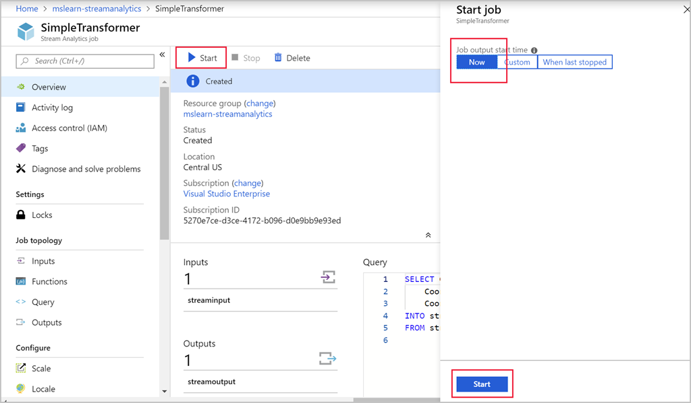

Now that you've created and set up a job, run it to produce an output.

Perform these steps in the Azure portal.

1. On your job menu, select **Overview** to go back to the main overview page.

1. From the menu at the top of the page, select **Start**.

1. Select **Now** > **Start**.

    

The job should transition to the **Starting** state. After a few seconds, it will move to the **Running** state. The job will run for a few minutes, and then finish in the **Completed** state. You can watch these transitions on the job's **Overview** page.

    