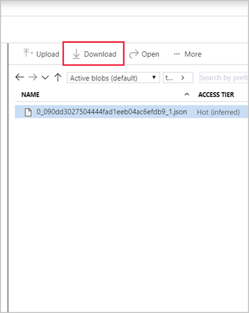

After a Stream Analytics job is completed, you can view the results in the Azure portal. On the job's **Overview** pane, you see the status information, the location, and resource group where the service is provisioned, and the subscription details. Here, you can also confirm when the service was created and started.

To see the job's results, perform the following steps.

1. In the Azure portal, go to your output storage account (**streamsink**).

1. Select **Storage Explorer (preview)**.

1. On the right, under **BLOB CONTAINERS**, open your container (**learn-container**).

1. Go to the **output** folder, and select **Download**.

    

When you open the file, you should see something like this.

    ```json
    {
        "city" : "Reykjavik",
        "latitude" : 64,
        "longitude" : 21
    }
    ```