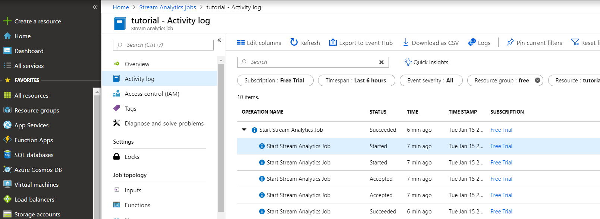
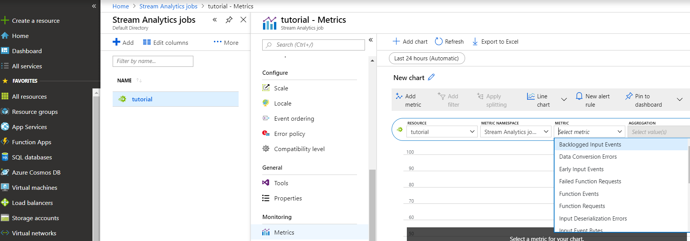
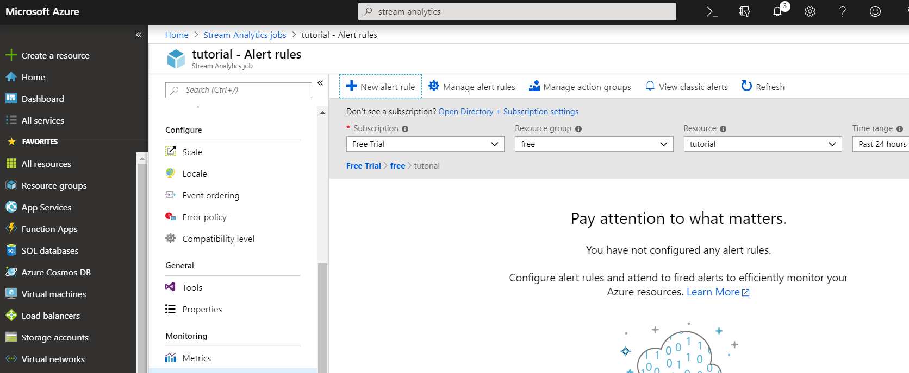
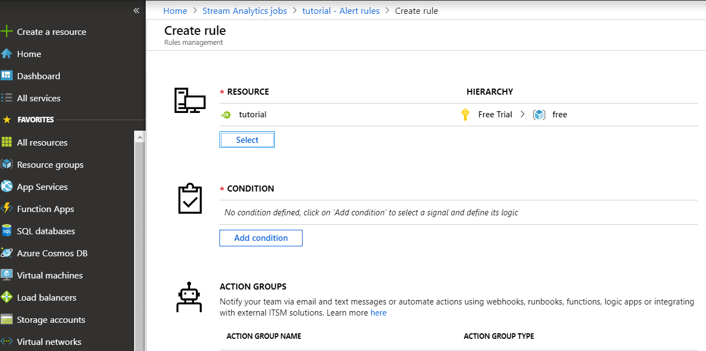
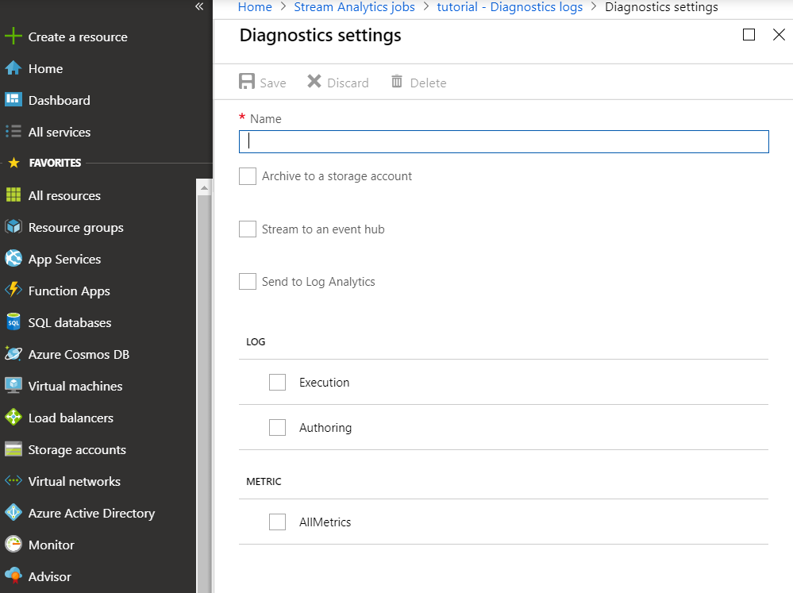

Monitoring is a key part of any mission-critical workload. It helps to proactively detect and prevent issues that might otherwise cause application or service downtime. 

You can monitor Azure Stream Analytics jobs by using several tools:

* An activity log for each running job
* Real-time dashboards that show service and application health trends
* Alerts on issues in applications or services
* Diagnostic logs

## Activity logs

The Stream Analytics activity log provides details about each job you run. This low-level troubleshooting tool can help you identify issues with data sources, outputs, or transformation queries.

Each job you create has an activity log. In the log, expand each job, and then select an event to see details in the JSON file.

## Dashboards

Dashboards show key health metrics for your Stream Analytics jobs. To view a live dashboard, go to the Azure portal, select your Stream Analytics job, and under **Monitoring**, select **Metrics**.

## Alerts

To proactively detect issues, you can set up Stream Analytics to fire alerts based on various metrics and thresholds. To set up alerts in the Azure portal, in your Stream Analytics job, under **Monitoring**, select **Alert rules** > **New alert rule**.

As you're setting up your rules, you can choose to send alerts by email, SMS, or voicemail. You can also use alerts to trigger workflows.

## Diagnostic logs

Diagnostic logging is a key part of operational infrastructure. Use diagnostic logs to help find root-cause issues in production deployments. You can conveniently deliver diagnostic logs to various sinks or destinations for root-cause analysis.

Stream Analytics diagnostics is turned off by default. In the Azure portal, you can turn it on when you need it. In the Stream Analytics job, under **Monitoring**, select **Diagnostic logs**.

You can persist diagnostics settings in an Azure Storage account or send them to Azure Event Hubs or Azure Log Analytics. Generate diagnostics logs for job execution or job authoring.

