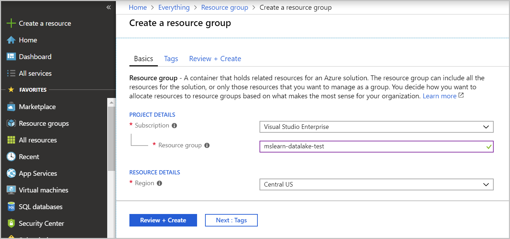
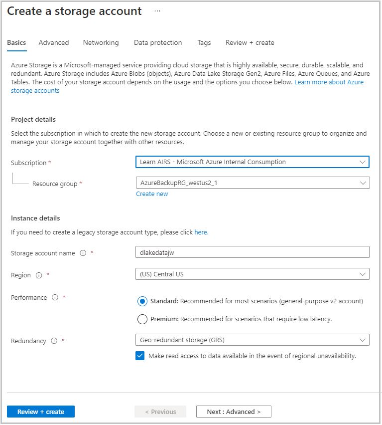
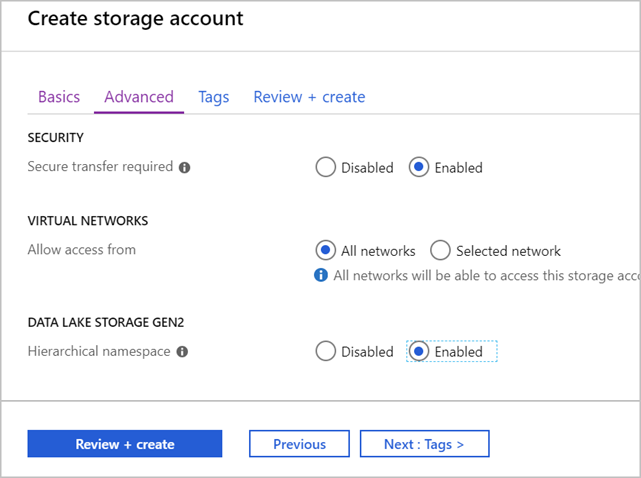

Before you can upload or transfer data into a data lake, you need to create one. Using the Azure portal, you can provision an Azure Data Lake Storage Gen2 store within minutes.

> [!NOTE]
> If you don't have an Azure account or prefer not to do this exercise in your account, just read through the exercise to understand how to create a Data Lake Storage Gen2 store.

## Create a resource group

Create a new resource group to hold the data lake storage. You'll use the resource group to administer related services and applications together. A resource group will also make resource cleanup easier when you finish this module. 

To create a resource group in the Azure portal, follow these steps:

1. Sign in to the [Azure portal](https://portal.azure.com?azure-portal=true).
1. On the left, select **Create a resource**.
1. In the search box, type **Resource** and select **Resource group** from the results.
1. Select **Create** to add a new resource group.
1. On the **Basics** tab, select the subscription you want to work in.
1. Name the resource group **mslearn-datalake-test**.
1. Choose the region (location) for the resource group. Typically, you'll want a location that's close to you or to the data you'll work with.

    

1. Select **Review + Create** > **Create**.

After you quickly create your resource group, you can pin it to your dashboard to make it easy to find later.

## Create a Data Lake Storage Gen2 account

You'll create a Data Lake Storage Gen2 account the same way you create an Azure Blob store, but with one setting difference. To create the data lake, follow these steps:

1. On the left side of the Azure portal, select **Create a resource**.
1. Select **Storage** > **Storage account**.
1. Select your **Subscription** and the **Resource group** you created earlier (**mslearn-datalake-test**).
1. Enter a name for your storage account. The name must be unique across all of Azure. You might have to try a few variations to find a unique name. Try using the prefix "dlakedata" with some numbers. A green check mark indicates you've entered a valid name.
1. For the location, select **Central US**.
1. Make sure the **Account kind** is **StorageV2 (general-purpose V2)**. Leave the defaults for the rest of the values.

    

1. Select **Next: Advanced**.
1. In the **Data Lake Storage Gen2 (preview)** section, next to **Hierarchical namespace**, select **Enabled**.
1. Select **Review + Create** to create the storage account.

    

1. After the creation details are validated, select **Create** to start the deployment.

When you receive a message that indicates your deployment is complete, select **Go to resource** to confirm the deployment.
