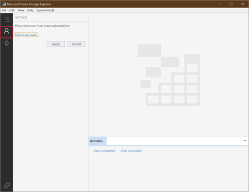
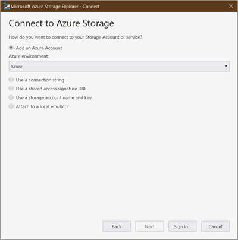
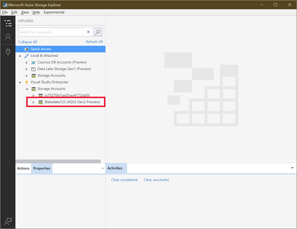
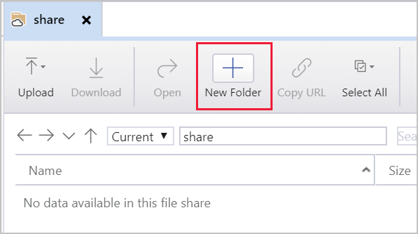
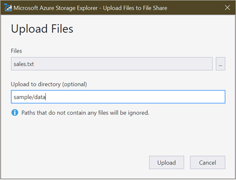

To do ad hoc data transfers into an Azure Data Lake store, use Azure Storage Explorer.

Storage Explorer is a free application for Windows, macOS, and Linux. This Azure app is designed to manage unstructured data such as tables, blobs, queues, and files. It also supports data in Azure Cosmos DB and Azure Data Lake Storage Gen2. That's why we'll use it in this exercise.

> [!NOTE]
> If you don't have an Azure account or prefer not to do this exercise in your account, just read through the exercise to understand how to install and use Storage Explorer.

## Use Storage Explorer

Begin by downloading and installing [Storage Explorer](<https://azure.microsoft.com/features/storage-explorer>). You can use Storage Explorer to do several operations against data in your Azure Storage account and data lake:

- Upload files or folders from your local computer into Azure Storage.
- Download cloud-based data to your local computer.
- Copy or move files and folders around in the storage account.
- Delete data from the storage account.

This module explores some of these capabilities.

## Connect Storage Explorer to your Azure account

To get started using Storage Explorer, first add your Azure account:

1. In Storage Explorer, on the left, select the Account button.

    

1. You can connect your storage account in multiple ways: 
   - Sign in with your Azure account to access all of your subscriptions.
   - Use a connection string to access a specific Azure Storage account.
   - Use a storage account name and access key.

     

1. After you sign in, select the subscriptions you want to work with. Make sure to select the subscription in which you created the Azure Storage account.

The app shows a list of storage areas you can work with from your subscriptions. Your Azure Storage account should appear on the list.



## Create a file system in Storage Explorer

Because blobs are always uploaded into folders, you can organize groups of blobs much like you organize files on your computer.

In Data Lake Storage Gen2, you start by creating a _file system_. This defines the Blob storage container that will hold your data lake. You create folders and files within this dedicated area.

1. In Storage Explorer, expand your subscription, and then expand your storage accounts.

1. Expand the storage account that you created earlier, and select **Blob Containers**.

1. Right-click **Blob Containers** and select **Create Blob Container**.

1. Under **Blob Containers**, enter **salesdata**.

1. After the container is created, select **salesdata**.

## Create a folder in a storage container

A folder helps provide a hierarchical structure for your data. You can create multiple levels in the account. Just ensure that main folders exist before you create subfolders.

1. On the menu at the top of Storage Explorer, select **New Folder**.

    

1. Name the folder **sample**. Then select **OK** to create the directory. If you get a message that asks if you want to refresh your view, select **Yes**.

1. Double-click the new folder. This action traverses into the folder, which should be empty.

1. Create another folder named **data**.

## Create a sample text file

You'll need data to work with, so create a sample text file on your computer named **sales.txt**. Then paste the following text into the file:

```text
#salaries Details
#Company Information
#Fields : Date company employee Salaries
01-01-2019  c1   e1 1000
01-01-2019  c2   e2 2000
01-01-2019  c1   e3 4000
01-01-2019  c2   e4 2000
01-01-2019  c1   e5 5000
01-01-2019  c3   e6 7000
```

You'll upload this data file in various ways. Keep in mind that this is a _simple_ example. Typically, you'll populate your data lake with much larger data samples from a variety of sources.

## Upload a file

You can upload files and folders from your local machine to directories in your file share right from Storage Explorer.

1. In Storage Explorer, double-click the **data** folder.

1. On menu at the top of the window, select **Upload**. From the Upload menu, you can upload a folder or a file.

1. Select **Upload Files**.

1. Select the **sales.txt** file you created earlier.

1. In the **Upload Files** dialog box, ensure that the destination directory is **sample/data**. Then select **Upload**.

    

When you finish, the file appears on the list.

## Download a file

To download a copy of a file from your file share, right-click the file, and then select **Download**. Choose where to put the file on your local machine, and then select **Save**. The download progress appears in the **Activities** pane at the bottom of the window.