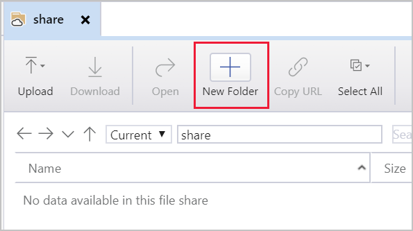
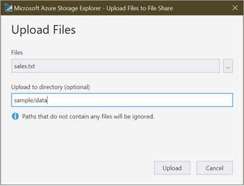

To do one-off data transfers into an Azure Data Lake store, use Azure Storage Explorer.

Storage Explorer is a free standalone application for Windows, macOS, and Linux that lets you manage Azure Storage data including blobs, queues, tables, file shares, and Azure Data Lake Storage Gen2. That's why we use it in this exercise.

> [!NOTE]
> Storage Explorer 1.42.0 and later requires a **.NET 10 runtime** that matches the architecture of your Storage Explorer installation. The installer adds .NET 10 if it isn't already present, but it's your responsibility to keep your .NET install up to date. You can download the latest runtime from the [.NET 10 download page](https://dotnet.microsoft.com/download/dotnet/10.0).

> [!NOTE]
> If you don't have an Azure account or prefer not to do this exercise in your account, just read through the exercise to understand how to install and use Storage Explorer.

## Use Storage Explorer

Begin by downloading and installing [Storage Explorer](<https://azure.microsoft.com/features/storage-explorer>). You can use Storage Explorer to do several operations against data in your Azure Storage account and data lake:

- Upload files or folders from your local computer into Azure Storage.
- Download cloud-based data to your local computer.
- Copy or move files and folders around in the storage account.
- Delete data from the storage account.

This module explores some of these capabilities.

## Connect Storage Explorer to your Azure account

To get started using Storage Explorer, sign in with your Azure account:

1. In Storage Explorer, select **View** > **Account Management**, or select the **Manage Accounts** button in the left toolbar.

1. In the **ACCOUNT MANAGEMENT** panel, select **Add an account...**. The **Connect to Azure Storage** dialog opens.

1. In the **Select Resource** panel, select **Subscription**.

1. In the **Select Azure Environment** panel, select your Azure environment (for example, **Azure**), and then select **Next**.

1. Storage Explorer opens a browser page for you to sign in. Sign in with your Azure account.

1. After you sign in, your account and its subscriptions appear under **ACCOUNT MANAGEMENT**. Select the subscription in which you created the Azure Storage account, and then select **Apply**.

Storage Explorer loads the **Explorer** tab and shows all storage accounts associated with your selected subscriptions. Your Azure Storage account appears in the list.

## Create a file system in Storage Explorer

Because blobs are always uploaded into folders, you can organize groups of blobs much like you organize files on your computer.

In Data Lake Storage Gen2, you start by creating a _file system_. This defines the Blob storage container that holds your data lake. You create folders and files within this dedicated area.

1. In Storage Explorer, expand your subscription, and then expand your storage accounts.

1. Expand the storage account that you created earlier, and select **Blob Containers**.

1. Right-click **Blob Containers** and select **Create Blob Container**.

1. Under **Blob Containers**, enter `salesdata`.

1. After the container is created, select `salesdata`.

## Create a folder in a storage container

A folder helps provide a hierarchical structure for your data. You can create multiple levels in the account. Just ensure that main folders exist before you create subfolders.

1. On the menu at the top of Storage Explorer, select **New Folder**.

    

1. Name the folder **sample**. Then select **OK** to create the directory. If you get a message that asks if you want to refresh your view, select **Yes**.

1. Double-click the new folder. This action traverses into the folder, which should be empty.

1. Create another folder named **data**.

## Create a sample text file

You'll need data to work with, so create a sample text file on your computer named **sales.txt**. Then paste the following text into the file:

```text
#salaries Details
#Company Information
#Fields : Date company employee Salaries
01-01-2019  c1   e1 1000
01-01-2019  c2   e2 2000
01-01-2019  c1   e3 4000
01-01-2019  c2   e4 2000
01-01-2019  c1   e5 5000
01-01-2019  c3   e6 7000
```

You'll upload this data file in various ways. Keep in mind that this is a _simple_ example. Typically, you'll populate your data lake with much larger data samples from a variety of sources.

## Upload a file

You can upload files and folders from your local machine to directories in your file share right from Storage Explorer.

1. In Storage Explorer, double-click the **data** folder.

1. On menu at the top of the window, select **Upload**. From the Upload menu, you can upload a folder or a file.

1. Select **Upload Files**.

1. Select the **sales.txt** file you created earlier.

1. In the **Upload Files** dialog box, ensure that the destination directory is **sample/data**. Then select **Upload**.

    

When you finish, the file appears on the list.

## Download a file

To download a copy of a file from your file share, right-click the file, and then select **Download**. Choose where to put the file on your local machine, and then select **Save**. The download progress appears in the **Activities** pane at the bottom of the window.