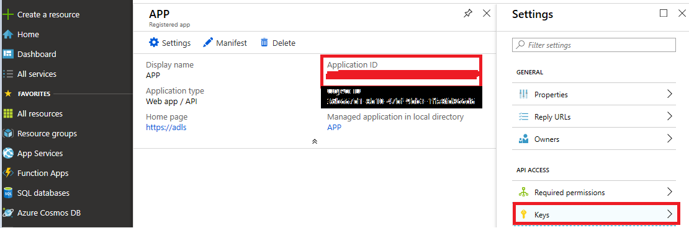
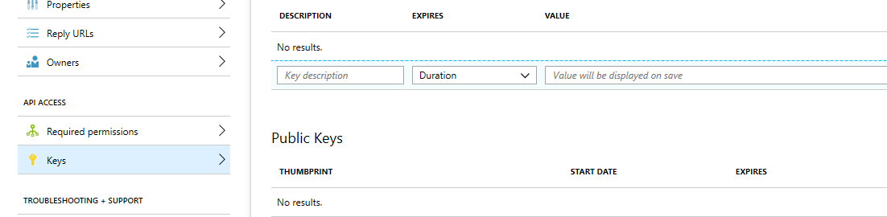
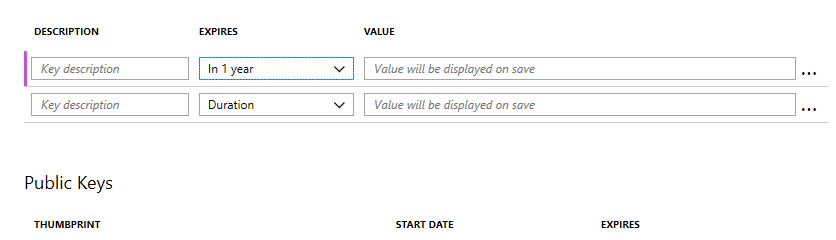
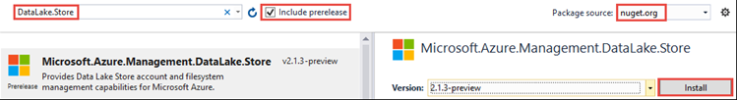
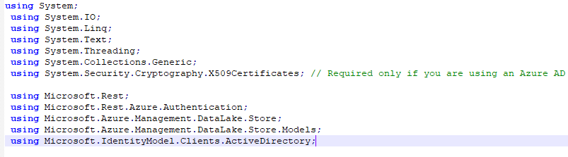
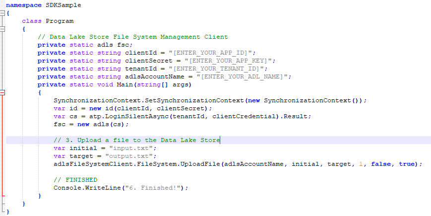

In Azure Data Lake Storage you can upload data by using REST APIs. Use any programming language that supports building and sending HTTP-based messages. In this exercise, you'll try this out using a simple .NET Core app with C#.

> [!NOTE]
> If you don't have an Azure account, don't want to install .NET Core, or prefer not to do this exercise in your account, just read through the exercise to understand how to invoke the REST API services.

## Register the application

The first step in using the REST API is to register the application. Azure uses Active Directory to provide fine-grained access control for all API access.

1. Sign in to the [Azure portal](https://portal.azure.com?azure-portal=true).
1. On the left, select **Azure Active Directory**. If you don't see this service in your favorites, use the search bar at the top of window to find it.
1. Go to the **App registrations** section.
1. Select **New application registration**.

    > [!NOTE]
    > If you're using the new UI for this example, you might see slightly different terminology. For example, the **New application registration** button might be called **New registration** instead. 

1. In the **New Application** blade, fill in the following details:
   - **Name**: Enter a name for your application (for example, **data-uploader**).
   - **Application type**: Select **Web app / API**.
   - **Sign-on URL**: Enter a local sign-on URL using your own domain suffix (e.g. \http://sample.contoso.com). This value identifies the app. You can change it later if you need to.
1. Select **Create** to create the app registration.
1. On the **Registered app** blade, next to **Application ID**, copy the key and paste it in Notepad.
1. Open the **Settings** blade, and go to **Owner**. Make a note of the owner account in Notepad. You can change this owner account to a preferred service account for the registered application.
1. On the **Settings** blade, go to **Keys**. 

    

1. In the **Key description** field, create a key by typing **DUKey**.

    

1. Under **Expires**, set the duration to **In 1 year**, and then select **Save**.

    

1. Copy the key value into Notepad. 

    >[!IMPORTANT] 
    > After you leave this blade, you can't retrieve the key value.**

1. Close the **Application Registration** blade. 

## Grant permissions in Data Lake Storage

Now that you've registered the app, use Azure Storage Explorer to give it permissions to the Data Lake Storage REST API. You do this by assigning permissions to the owner account of the registered application.

1. Sign in to Storage Explorer. Here you can select the subscriptions you want to work with. Make sure to select the one where you created the Azure Storage account.

    The app shows a list of the storage areas you can work with from your subscriptions. You should see your Azure Storage account on the list.

    

1. Expand your subscription and then expand the data lake storage account to view the **salesdata** file system.

1. Right-click **salesdata** and select **Manage Access**.

1. In the **Manage Access** dialog box, under **Add user or group**, type or search for the owner account, and then select **Add**. The name will appear under users or groups.

1. Ensure that the owner account is selected under **user or group**, and then under the section for **Permissions for: owner account name**, select the check box in the **Access** row for the **Read**, **Write** and **Execute** permission, and then select **Save**.

1. Confirmation that the permissions are set successfully with the message **Successfully saved permissions for 'salesdata/'** in the Activity window in Azure Storage Explorer.

## Create a .NET Core app

TBD

1. Open Visual Studio and create a console application.
1. From the **File** menu, select **New** > **Project**.
1. From **New Project**, type or select the following values:

    | Property | Value  |
    | -------- | ------ |
    | Category | Templates/Visual C#/Windows |
    | Template | Console Application |
    | Name | CreateADLApplication |

1. Select **OK** to create the project.
1. Add the NuGet packages to your project.
    1. Right-click the project name in the Solution Explorer and select **Manage NuGet Packages**.
    2. In the **NuGet Package Manager** tab, make sure that **Package source** is set to **nuget.org** and that **Include prerelease** check box is selected.
    3. Search for and install the following NuGet packages:

Add these two NuGet packages to the project:

- Microsoft.Azure.Management.DataLake.Store v2.4.2
- Microsoft.Rest.ClientRuntime.Azure.Authentication v2.3.7

Before you start coding, you should collect the required data from the Azure resources. You need details from the Azure Active Directory Register Application for authentication. This shoul dbe stored in a Notepad document as directed.

## Create a code sample

Check for the sample Code Screenshot below in the code mentioned below, provide the client id, tenant id and the required details from the Azure portal.

Declare the variables and provide the values for placeholders. Also, make sure the local path and file name you provide exist on the computer.

