Azure Data Factory is a cloud-based data integration service that creates workflows in the cloud. These workflows orchestrate batch data movement and transformations. Use Data Factory to create and schedule workflows (called _pipelines_) to ingest data from various data stores. The data can then be processed and transformed with services like these:

- Azure HDInsight 
- Spark
- Azure Data Lake
- Azure Machine Learning

Data Factory can orchestrate many data tasks. In this exercise, you'll use it to copy data from Azure Data Lake Storage Gen1 to Data Lake Storage Gen2. 

> [!NOTE]
> If you don't have an Azure account or prefer not to do this exercise in your account, just read through the exercise to understand how to use Data Factory to copy data into a data lake.

## Create a data factory

The first step is to provision a data factory in the Azure portal.

1. Sign in to the [Azure portal](https://portal.azure.com?azure-portal=true).

1. On the left sidebar, select **+ Create Resource** > **Analytics** > **Data Factory**.

    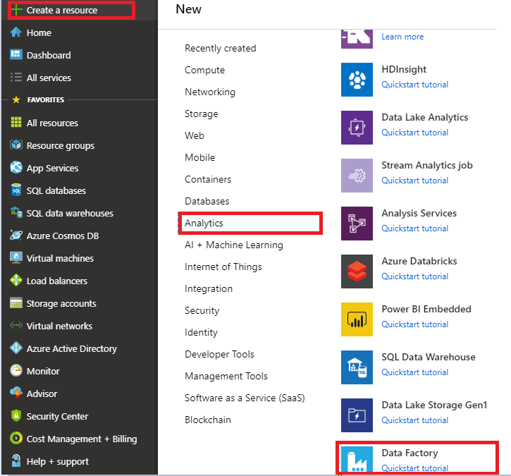

1. On the **New data factory** page, provide values for each of the required fields:
    - **Subscription**: The subscription in which the ADF instance is created
    - **Resource group**: The resource group where the ADF instance will reside
    - **Region**: The datacenter location in which the instance is stored
    - **Name**: The name of the Azure Data Factory instance
    - **Version**: select V2 for the latest features

      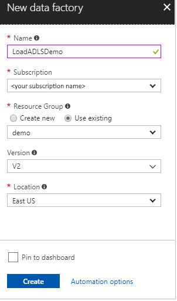

1. Click on the **Git configuration** tab, and choose to set it up later. 

1. Select **Create**.

Now go to the newly created data factory. You should see the **Data factory** home page.

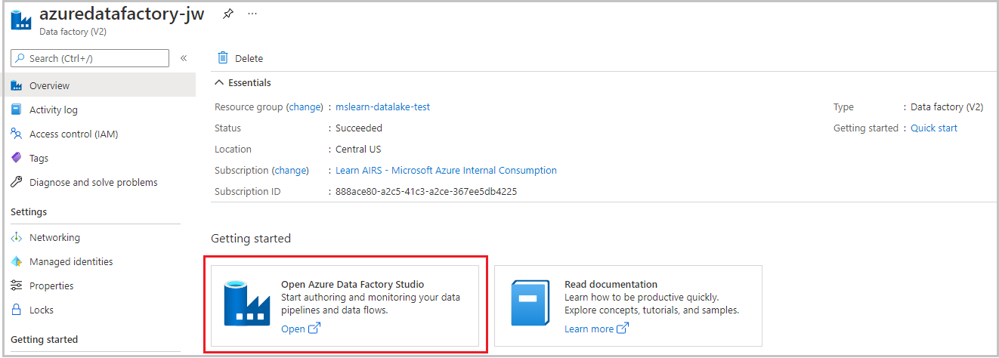

> [!IMPORTANT]
> You will need a Data Lake Storage Gen1 account that contains data. If you don't have this, follow the steps in the next sections.

## Create a Data Lake Storage Gen1 account

1. On the left, select **Create a new resource**.
1. On the **New** pane, select **Storage** > **Data Lake Storage Gen1**.
1. In the **Name** box, type **dlsgen1XXX**, but replace _XXX_ with numbers that you choose. A green check mark indicates that the name is unique.
1. In the **Subscription** list, select your subscription.
1. In the **Resource Group** list, select **mslearn-datalake-test**.
1. Select a location. Typically, you'll want to select a region near where the data will be consumed. For this example, select a location near you.
1. Select **Create**.

## Create a sample text file

You'll need some sample data to work with, so create a text file on your local computer. Name the file **salesUK.txt**. Then paste the following text into the file:

```text
#salaries Details
#Company Information
#Fields : Date company employee Salaries
01-02-2019  d1   f1 8000
01-02-2019  d2   f2 9000
01-02-2019  d1   f3 2000
01-02-2019  d2   f4 3000
01-02-2019  d1   f5 4000
01-02-2019  d3   f6 5000
```

You'll upload this data file in various ways. Keep in mind that this is a _simple_ example. Typically, you'll populate your data lake with much larger data samples from a variety of sources.

## Upload a file into a Data Lake Storage Gen1 account

1. In the Azure portal, search for the Data Lake Storage Gen1 service you created (**dlsgen1XXX**).
1. On the **Overview** pane, select **Data Explorer**.
1. On the **Data Explorer** pane, select the **Upload** button.
1. On the **Upload file** pane, select the browse icon, go to the folder, and select **salesUK.txt**. Then select **Add selected files**. You'll know the file is uploaded when the **Status** column displays **Completed**.
1. Close the **Upload files** pane.

## Set permissions for the Data Lake Storage Gen1 account

Set permissions to allow the data factory to access the data in your Data Lake Store Gen1 account.

1. In the Azure portal, search for your Data Lake Storage Gen1 service named **dlsgen1XXX**.
1. On the **Overview** pane, select **Access control (IAM)**.
1. On the **Access control (IAM)** pane, in the **Add Role Assignment** box, select **Add**.
1. On the **Add Role Assignment** pane, for the **Role**, select **Owner**.
1. Under **Select**, enter your data factory name.
1. Select **Save**.
1. Close the **Access control (IAM)** pane.

## Load data into the Data Lake Storage Gen2 account

1. In the Azure portal, go to your data factory. You'll see the **Data factory** home page.

1. Select **Author & Monitor** to open the Data Integration application in a separate tab.


    

1. Select **Copy Data** to open the Copy Data tool.

    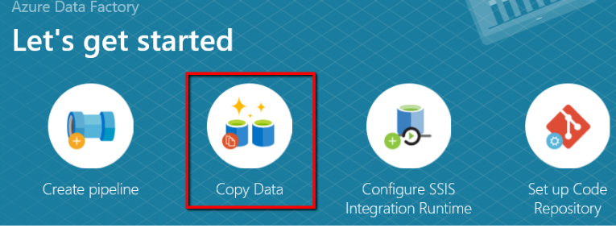

1. On the **Properties** page, under **Task name**, specify **CopyFromADLSGen1ToGen2**. Then set the task cadence to **Run once now**, and select **Next**.

    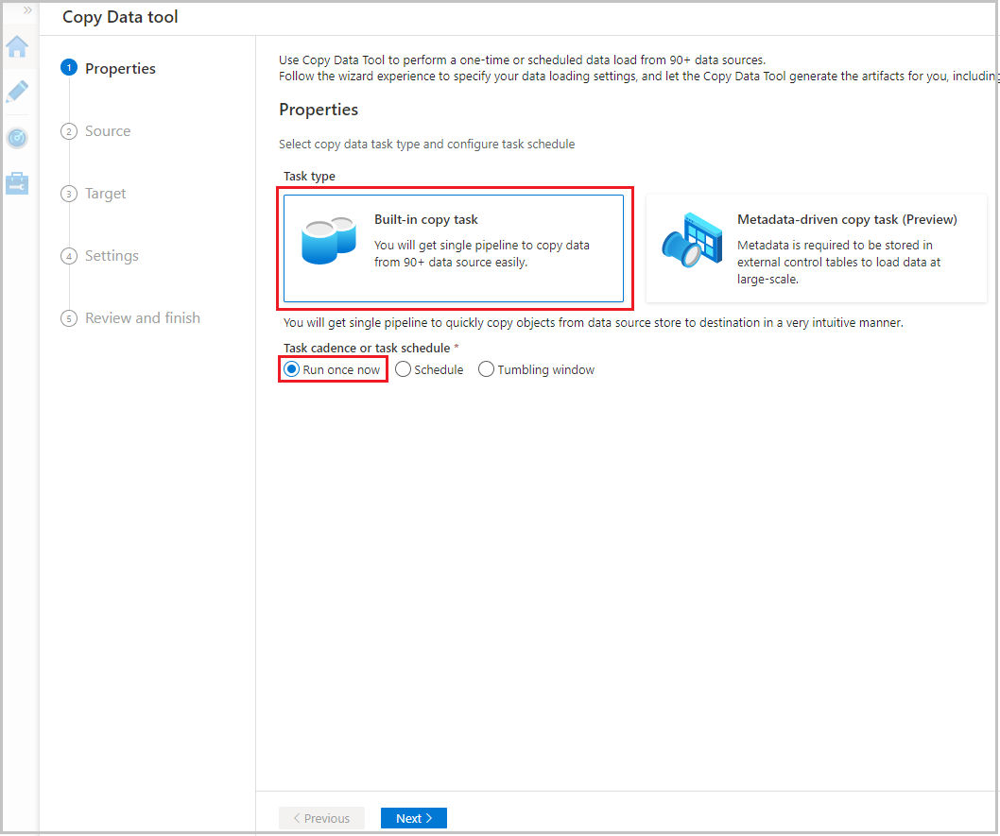

1. On the **Source data store** page, select **Create new connection**.

    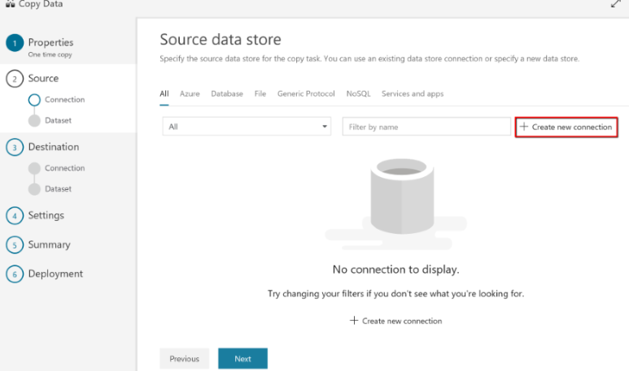

1. In the connector gallery, select **Azure Data Lake Storage Gen1** > **Continue**.

    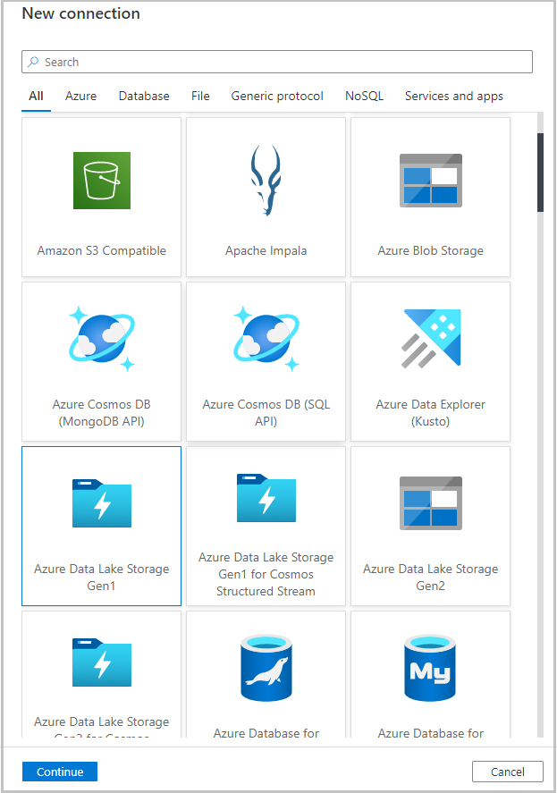

1. On the **Specify Azure Data Lake Storage Gen1 connection** page:
    - Under **Data Lake Store account name**, select your account name.
    - Under **Tenant**, specify or validate the tenant.
    - To validate the settings, select **Test connection** > **Finish**.
    - When you see that the new connection is created, select **Next**.

    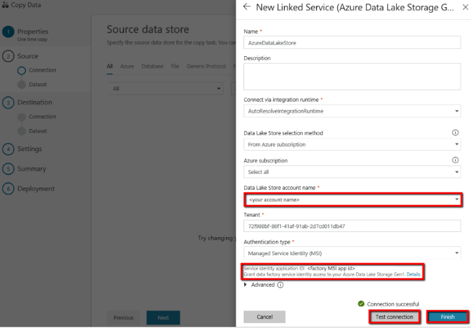

1. On the **Choose the input file or folder** page, go to the folder and file that you want to copy over. Select the folder or file, and then select **Choose**.

    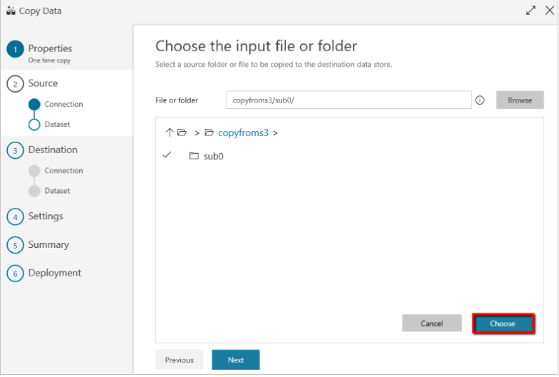

1. Specify the copy behavior by selecting **Copy files recursively** and **Binary Copy**. Then select **Next**.

    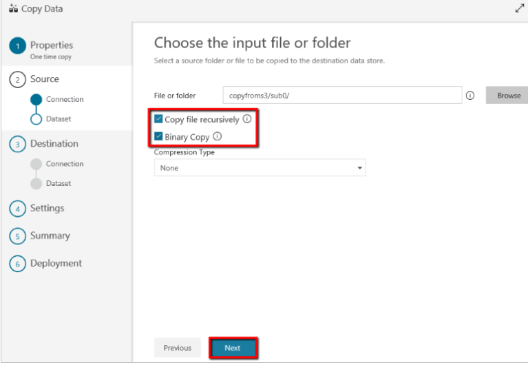

1. On the **Destination data store** page, select **Create new connection** > **Azure Data Lake Storage Gen2 (Preview)** > **Continue**.

    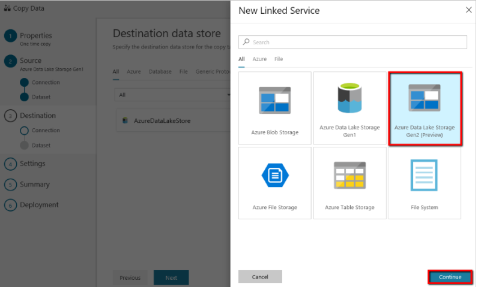

1. On the **Specify Azure Data Lake Storage Gen2 connection** page:
    - In the **Storage account name** list, select your Data Lake Storage Gen2 account, this will automatically populate the access key.
    - To create the connection, select **Finish** > **Next**.

1. On the **Choose the output file or folder** page, next to **Folder path**, enter **copyfromadlsgen1**. Then select **Next**.

    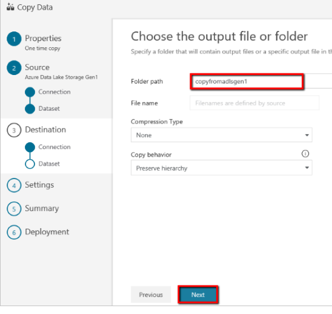

1. On the **Settings** page, select **Next** to use the default settings.
1. Review the settings on the **Summary** page, and select **Next**.

    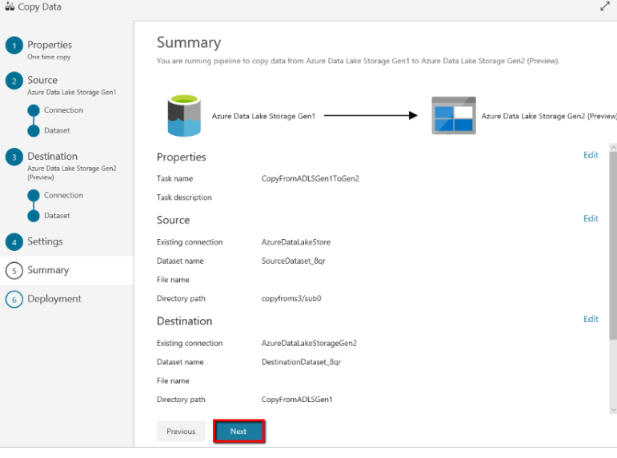

1. To monitor the pipeline, on the deployment page, select **Monitor**.

    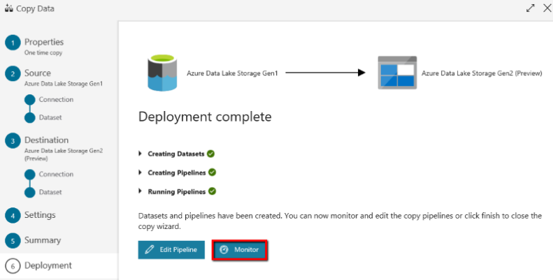

    You can monitor details like how much data is copied from the source to the sink, data throughput, execution steps and their duration, and configurations.

    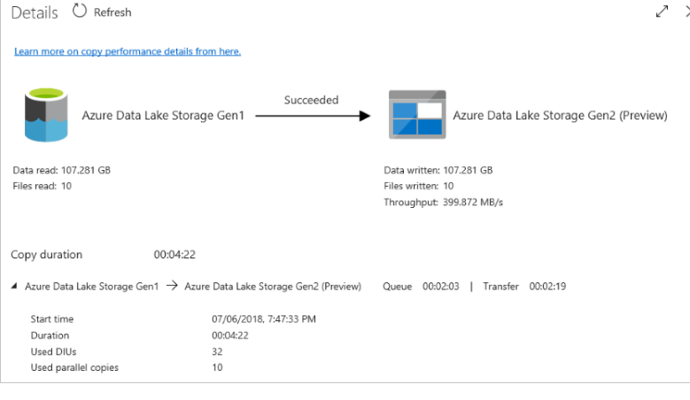

After the transfer is complete, you can use Azure Storage Explorer to verify that the data has been copied into your Data Lake Storage Gen2 account.
