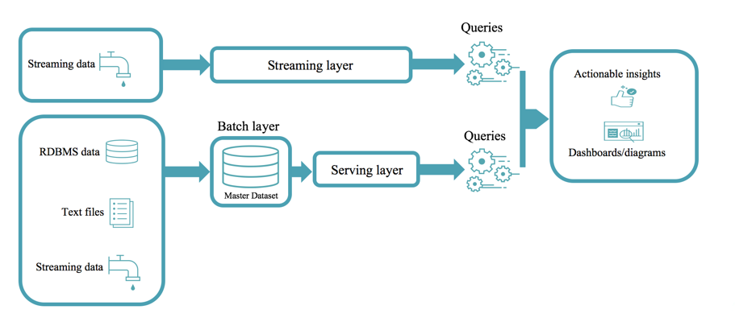

Databricks Delta is a transactional storage layer designed specifically to work with Apache Spark and Databricks File System (DBFS). At the core of Databricks Delta is an optimized Spark table. It stores your data as Apache Parquet files in DBFS and maintains a transaction log that efficiently tracks changes to the table.

## The challenge with data lakes

A data lake is a storage repository that inexpensively stores a vast amount of raw data, both current and historical, in native formats such as XML, JSON, CSV, and Parquet. It may contain operational relational databases with live transactional data.

To extract meaningful information from a data lake, you must solve problems such as:

- Schema enforcement when new tables are introduced.
- Table repairs when any new data is inserted into the data lake.
- Frequent refreshes of metadata.
- Bottlenecks of small file sizes for distributed computations.
- Difficulty sorting data by an index if data is spread across many files and partitioned.

## The solution: Databricks Delta

Databricks Delta is a Spark table with built-in reliability and performance optimizations.

You can read and write data that's stored in Databricks Delta by using Apache Spark SQL batch and streaming APIs. These are the same familiar APIs that you use to work with Hive tables or DBFS directories. Databricks Delta provides the following functionality:

- **ACID transactions**: Multiple writers can simultaneously modify a dataset and see consistent views.
- **DELETE, UPDATE, and UPSERT operations**: Writers can modify a dataset without interfering with jobs that read the dataset.
- **Automatic file management**: Data access speeds up because data is organized into large files that can be read efficiently.
- **Statistics and data skipping**: Reads are 10 to 100 times faster because statistics are tracked about the data in each file. This tracking lets Delta avoid reading irrelevant information.

## Databricks Delta architecture vs. the Lambda Architecture

### Lambda Architecture

The Lambda Architecture is a big-data processing architecture that combines both batch and real-time processing methods. It features an append-only, immutable data source that serves as the system of record. Time-stamped events are appended to existing events, and nothing is overwritten. Data is implicitly ordered by time of arrival.

Notice that there are really two pipelines here: one batch and one streaming. Hence the name Lambda Architecture.

It's difficult to combine processing of batch and real-time data, as this diagram shows:

### Databricks Delta architecture

The Databricks Delta architecture is a vast improvement upon the traditional Lambda Architecture.

Text files, RDBMS data, and streaming data are collected into a *raw table*, also known as a *bronze table* at Databricks. A raw table is then parsed into *query tables*, also known as *silver tables* at Databricks. Query tables may be joined with dimension tables.

*Summary tables*, also known as *gold tables* at Databricks, are business-level aggregates. They're often used for reporting, dashboards, and aggregations such as daily active website users.

The final outputs are actionable insights, dashboards, and reports of business metrics.

