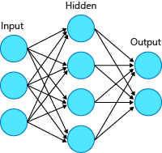

Azure Databricks provides capabilities to build deep-learning algorithms that can be used to solve complex problems. Artificial neural networks make it possible to build such types of algorithms.

## What are artificial neural networks?

Artificial neural networks are simpler representations of the complex and dense neural networks of a human brain. The network is a computing system that's made up of several simple and interconnected elements, or *artificial neurons*, that process complex data inputs with human-like precision.

## What is an artificial neuron?

An artificial neuron is a mathematical function conceived as a model of a biological neuron. The artificial neuron receives one or more inputs (*features* X0, X1, X2, ...). It sums them with different *weights* (W0, W1, W2, ...) and then uses this sum as an argument for a nonlinear function (f, also called an *activation function*).

X0 typically equals to 1, and it's called the *bias* input. The weights of each of the neurons are determined when we train the neural network. Initially, these weights are randomly assigned.

## Common use cases for deep learning

Here are some of the use cases for deep-learning techniques:

- **Speech recognition:** Deep-learning solutions are used in several speech-recognition programs where a machine produces results based on speech commands. Examples include Microsoft's Cortana or Amazon's Alexa.

- **Image recognition:** Several platforms use image-recognition programs to identify and analyze images and pictures. For example, Facebook's facial-recognition feature uses deep-learning programs to identify the faces in a picture and then gives tagging suggestions.

- **Health predictions:** Several medical organizations use deep-learning tools to analyze large and complex datasets to make health-related predictions. These predictions help pharmaceutical companies work toward innovative new methods and medications to address problems.

- **Security:** Deep learning is widely used by large companies to mitigate cybersecurity threats. Deep-learning techniques are efficient in detecting cyberattacks and alerting organizations to take preventive measures against them.

## Azure Databricks deep-learning solutions

- **Machine-learning pipelines:** A machine-learning pipeline provides an open-source high-level deep-learning API framework that enables lower-level deep-learning libraries by using the Spark MLlib Pipelines API. This API framework currently supports TensorFlow and Keras with the TensorFlow back-end.

- **TensorFlow:** Azure Databricks uses TensorFlow libraries to provide high-level numerical computation. You can install and integrate TensorFlow libraries with Azure Databricks to generate high-performing deep-learning models. TensorFlow can run on a single node or on a distributed one.

- **Distributed deep learning:** The Horovod framework, supported by Azure Databricks, enables complex-model training by allowing you to train your neural networks on multiple machines simultaneously.

- **Integrated libraries:** Azure Databricks supports integration with several other high-level deep-learning frameworks (such as, MXNet, Keras, and PyTorch) that allow you to train your high-performing neural networks.