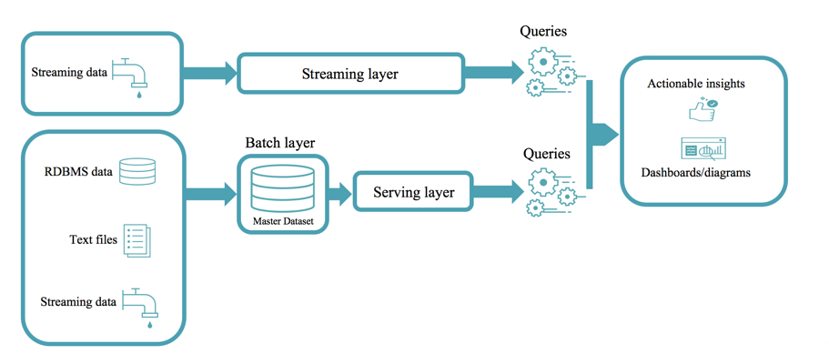
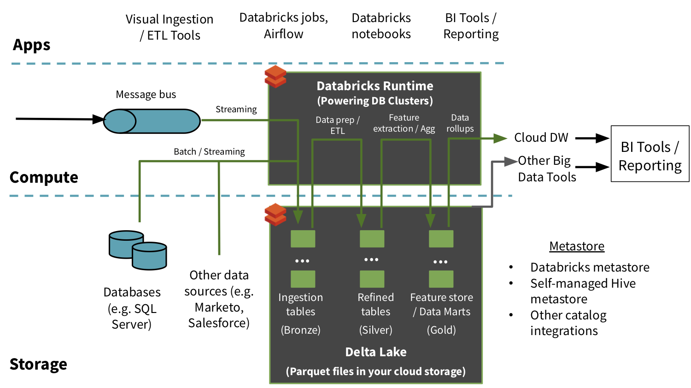

This module introduces using Delta Lakes as an optimization layer on top of blob storage to ensure reliability, ACID compliance and low latency within unified Streaming + Batch data pipelines.

We will discuss this relative to a traditional Lambda architecture.

An example of a Delta Lake Architecture might be as shown in the diagram above.

* Many **devices** generate data across different ingestion paths.
* Streaming data can be ingested from **IOT Hub** or **Event Hub**.
* Batch data can be ingested by **Azure Data Factory** or **Azure Databricks**.
* Extracted, Transformed data is loaded into a **Delta Lake**.

## Lambda architecture

When working with large data sets, it can take a long time to run the sort of queries that clients need. These queries can't be performed in real time, and often require algorithms such as [MapReduce](https://en.wikipedia.org/wiki/MapReduce) that operate in parallel across the entire data set. The results are then stored separately from the raw data and used for querying.

One drawback to this approach is that it introduces latency. If processing takes a few hours, a query may return results that are several hours old. Ideally, you would like to get some results in real time (perhaps with some loss of accuracy), and combine these results with the results from the batch analytics.

The **lambda architecture** is a big data processing architecture that addresses this problem by combining both batch- and real-time processing methods. It features an append-only immutable data source that serves as system of record. Timestamped events are appended to existing events (nothing is overwritten). Data is implicitly ordered by time of arrival.

Notice how there are really two pipelines here, one batch and one streaming, hence the name *lambda* architecture.

It is difficult to combine processing of batch and real-time data as is evidenced by the diagram below:

## Delta Lake architecture

The Delta Lake Architecture is a vast improvement upon the traditional Lambda architecture. At each stage, we enrich our data through a unified pipeline that allows us to combine batch and streaming workflows through a shared filestore with ACID-compliant transactions.

**Bronze** tables contain raw data ingested from various sources (JSON files, RDBMS data,  IoT data, etc.).

**Silver** tables will provide a more refined view of our data. We can join fields from various bronze tables to enrich streaming records, or update account statuses based on recent activity.

**Gold** tables provide business level aggregates often used for reporting and dashboarding. This would include aggregations such as daily active website users, weekly sales per store, or gross revenue per quarter by department.

The end outputs are actionable insights, dashboards, and reports of business metrics.

By considering our business logic at all steps of the extract-transform-load (ETL) pipeline, we can ensure that storage and compute costs are optimized by reducing unnecessary duplication of data and limiting ad hoc querying against full historic data.

Each stage can be configured as a batch or streaming job, and ACID transactions ensure that we succeed or fail completely.
