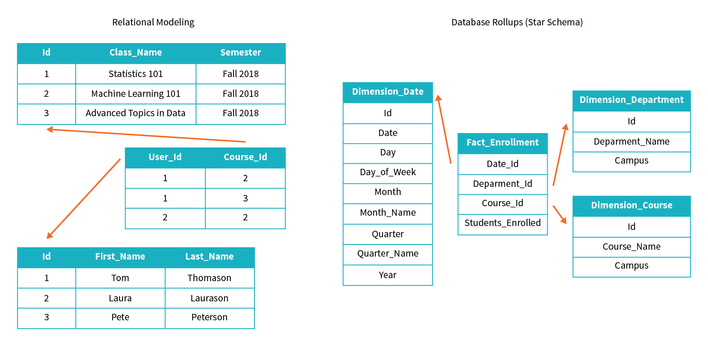

The goal of transformation in Extract Transform Load (ETL) is to transform raw data to populate a data model. The most common models are relational models and snowflake (or star) schemas, though other models such as query-first modeling also exist.

Transforming data can range in complexity from simply parsing relevant fields to handling null values without affecting downstream operations and applying complex conditional logic. Common transformations include:

- Normalizing values
- Imputing null or missing data
- Deduplicating data
- Performing database rollups
- Exploding arrays
- Pivoting DataFrames

If the structure of your raw data is of more complex nature, or you are required to prepare your data for advanced and complex analytical requirements, the basic transformation techniques may not serve the purpose. Then you need to apply some advanced data transformation methods to clean and prepare your data.

In this module, we'll focus on some of these advanced techniques supported by Azure Databricks.

## Learning objectives

In this module, you will:

- Perform basic and complex custom transformations with user-defined functions
- Clean data
- Manage tables