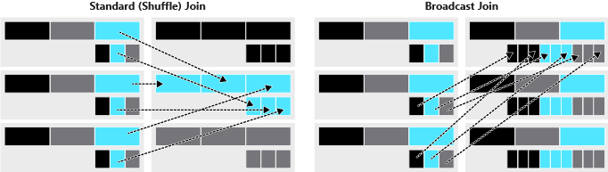

Advanced extract, transform, load (ETL) processes include data transformation by using custom and advanced user-defined functions (UDFs), managing complex tables, and loading data into multiple databases simultaneously.

## Custom and complex transformations with UDFs

The highly optimized built-in functions in Spark provide a wide array of functionality, covering most data transformation use cases. However, there may be a scenario when you need to define logic that is specific to your use case or when you need to encapsulate that solution for reuse. UDFs are helpful in such cases. Use UDFs when there's no clear way to accomplish a task by using built-in functions.

UDFs provide custom, generalizable code that you can apply to ETL workloads when the built-in functions in Spark aren't sufficient. UDFs can't return multiple columns. However, they take multiple column inputs, and they return complex named types that are easily accessible. This approach is especially helpful in ETL workloads that need to clean complex and challenging data structures.

## Joins and lookup tables

A common use case in ETL jobs joins new data to lookup tables or to historical data. Traditional databases join tables by pairing values on a specific column.

A standard (or shuffle) join moves all the data on the cluster for each table to a specific node on the cluster. A standard join uses considerable computation to perform row-wise comparisons and to transfer data across a network, which is often the biggest performance bottleneck of distributed systems.

A broadcast join fixes this situation when one dataframe is sufficiently small. A broadcast join duplicates the smaller dataframe on each node of the cluster, which avoids the cost of shuffling the bigger dataframe.

## Writing to multiple databases

Loading your transformed data to multiple target databases can be a time-consuming activity and can have an impact on your database connection. Spark makes this job easier because there are several variables that help optimize performance. These variables relate to how data is organized on the cluster.

Use partitions to get better performance from your database connections. A partition is a portion of your total data set. The data set is divided into many of these portions so that Spark can distribute your work across a cluster.

The other concept needed to understand computation in Spark is a slot (also known as a core). A slot is a resource that is available for the execution of computation in parallel. A partition refers to the distribution of data and a slot refers to the distribution of computation.

## Table management

When loading data back to the target database, you might want to optimize your data storage by using managed and unmanaged tables.

A managed table is a table that manages both the actual data and the metadata. In this case, a `DROP TABLE` command removes both the metadata for the table and the data itself.

Unmanaged tables manage the metadata from a table, while the actual data is managed separately and is often backed by a blob store such as Azure Blob storage. Dropping an unmanaged table drops only the metadata that is associated with the table while the data remains in place.

