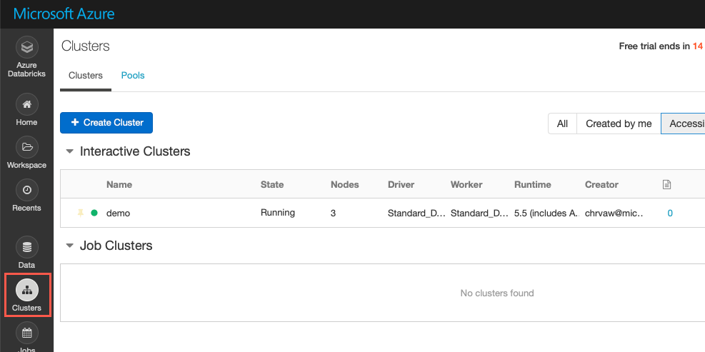
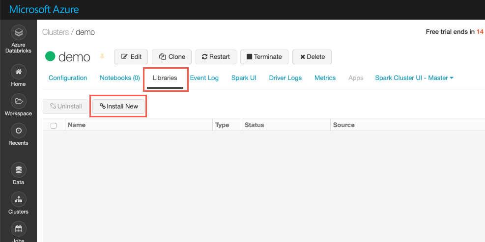
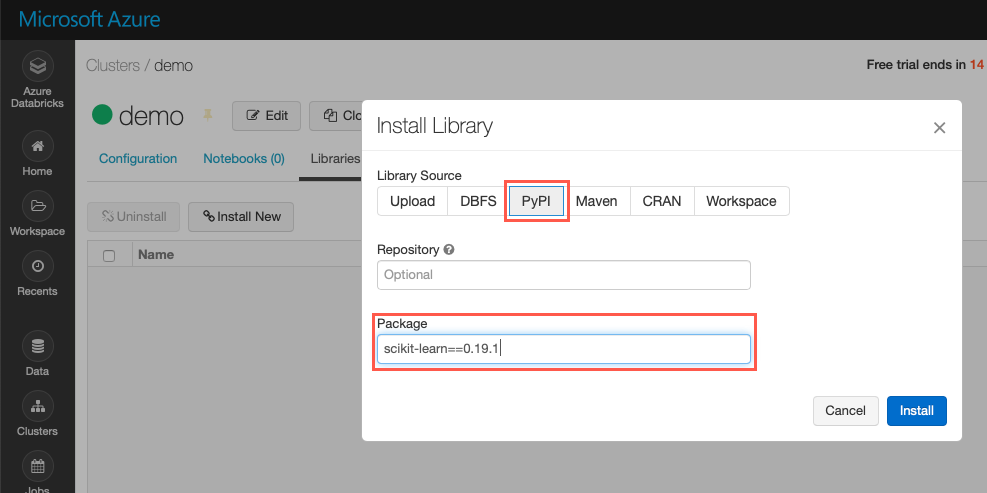
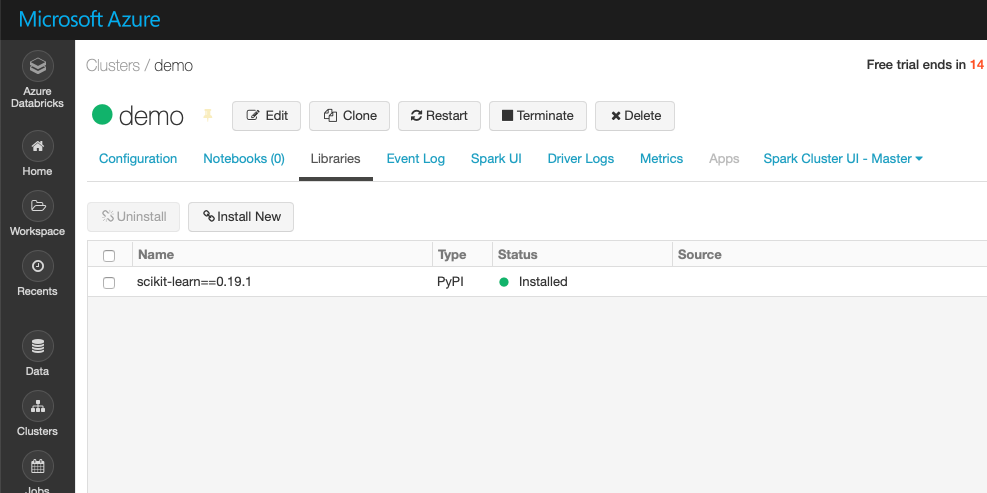

You've learned about the various techniques supported by Azure Databricks to train and evaluate a machine-learning model. Now let's use some of these techniques to create and train our model by using a sample dataset. We'll use Databricks notebooks for training and evaluating the model.

Clone the lab archives that provide sample notebooks with detailed steps for basic and advanced regression and classification.

> [!NOTE]
> To complete the following procedures, you must have already deployed your Azure Databricks workspace in your Azure portal.

## Clone the Databricks archive

1. From the Azure portal, go to your Databricks workspace and select **Launch workspace**.
1. In the left pane, select **Workspace**, select **Users**, and then select your username (the entry with the house icon).
1. In the pane that appears, select the downward-pointing chevron next to your name, and then select **Import**.

    

1. In the **Import Notebooks** pane, select **URL**, and paste in the following URL:

    ```
    https://github.com/MicrosoftDocs/mslearn-model-training-selection-evaluation/blob/master/DBC/03-model-training-selection-evaluation.dbc?raw=true
    ```

1. Select **Import**.

1. A folder named after the archive should appear (03 Model Training, Selection, and Evaluation). Select that folder. The folder contains one or more notebooks that you'll use in completing this lab.

## Configure the Databricks cluster with the scikit-learn library

The notebook uses the *scikit-learn: Machine Learning in Python* library. You need to make sure that the cluster you're using has the library installed otherwise some of the commands in the notebook will fail to execute.

1. In the left pane, select **Cluster**.

    

1. Select your cluster and then select the Libraries tab. This tab gives you the option to uninstall or install a new library. Click the **Install New** button.

     

1. In the dialog presented, select the **PyPI** Library Source and enter the library name and the version number of the library. Enter **scikit-learn==0.19.1** as the Package name to install *scikit-learn version 0.19.1*. Click **Install** to install the specified library.

    

1. The library and version number will now show as one of the install libraries on your cluster once the library is installed.

    

## Complete the following notebooks

- **01 Model Training Selection Evaluation**: This notebook explains how to prepare your dataset. You'll import a sample dataset and use some basic functions to clean the data.
- **02 Basic Regression with Azure Databricks**: This notebook contains techniques for basic regression. You'll use the dataset you imported in the first notebook and do basic regression on it.
- **03 Classification with Azure Databricks**: This notebook details how to resolve classification problems. You'll use the scenarios from the sample dataset with different classification models.
- **04 Advanced Regression with Azure Databricks**: In this notebook, you'll go through some advanced regression techniques and use them to further train and evaluate your machine-learning model.
