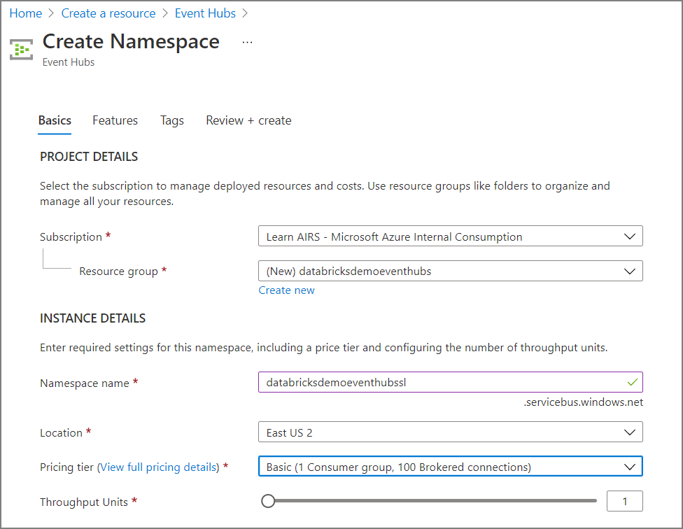
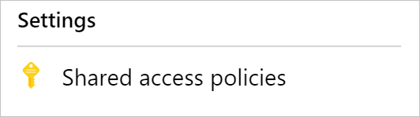

The first step toward using Spark Structured Streaming is setting up Azure Event Hubs in your Azure subscription.

## Create an Event Hubs namespace

1. In the Azure portal, select **+ Create a resource**. Enter **event hubs** into the **Search the Marketplace** box, select **Event Hubs** from the results, and then select **Create**.

    

1. In the **Create Namespace** blade, enter the following information:

   - **Name**: Enter a unique name, such as **databricksdemoeventhubs**. Uniqueness will be indicated by a green check mark.
   - **Pricing tier**: Select **Basic**.
   - **Subscription**: Select the subscription group you're using for this module.
   - **Resource group**: Choose your module resource group.
   - **Location**: Select the location you're using for this module.
   
   Select **Create**.

   

## Create an event hub

1. After your Event Hubs namespace is provisioned, browse to it and add a new event hub by selecting the **+ Event Hub** button on the toolbar.
 
   

1. On the **Create Event Hub** blade, enter:

   - **Name**: Enter **databricks-demo-eventhub**.
   - **Partition Count**: Enter **2**.
    
   Select **Create**.

   

## Create a shared access policy

1. From the left menu in your Event Hubs namespace, select **Event Hubs**, and then select **databricks-demo-eventhubs** from the list.

   

1. On the blade for your event hub, select **Shared access policies** under **Settings** in the left menu.

   

1. Select the **Add** button on the toolbar.

   

1. On the **Add SAS Policy** blade, enter the following information:

   - **Policy name**: Enter **both**.
   - **Manage**: Leave unselected.
   - **Send**: Select this box.
   - **Listen**: Select this box.
    
   Select **Create**.

   

## Capture the connection string's primary key for the shared access policy

1. After you create your shared access policy, select it from the list of shared access policies. Then copy the connection string's primary key by selecting the copy button.

   

1. Save the copied primary key to Notepad.exe or another text editor for later reference.