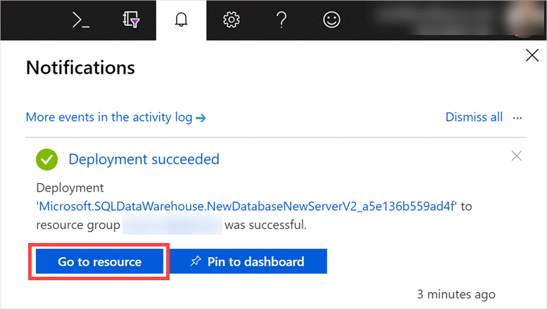
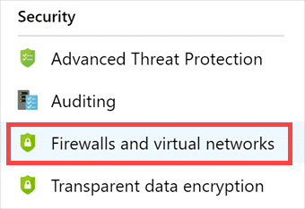
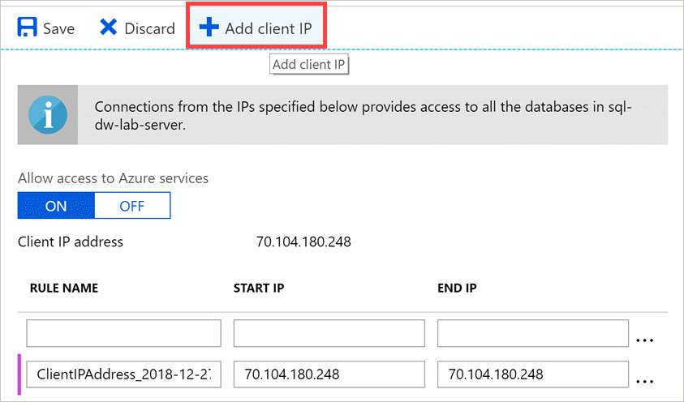

You understand that using Azure Databricks to connect to your Azure Synapse Analytics instance is the best way forward. Now you want to try to establish this connection on a sample database so you completely understand all the required steps. In this module, you'll work through the procedures for end-to-end connectivity.

Let's start by setting up the environment. Setup includes provisioning a sample Azure Synapse Analytics instance, creating Azure Data Studio connections, and setting up resources.

## Set up Azure Synapse Analytics

1. In the [Azure portal](https://portal.azure.com), select **Create a resource**, enter **Azure Synapse Analytics** in the **Search the Marketplace** box, select **Azure Synapse Analytics** in the results, and then select **Create**.

1. On the **Create Synapse workspace** pane, enter the following information.

    | Setting | Value |
    | --- | --- |
    | On the **Basics** tab, under **Project details** section: |
    | Subscription | Concierge Subscription |
    | Resource group | <rgn>[sandbox resource group name]</rgn> |
    | Under **Workspace details** section: |
    | Workspace name | Enter a unique name. (Make sure you see a green check mark.)  |
    | Region | Select the location you're using for resources in this module. |
    | Account name | Select **Create New** under the dropdown to open the **Data Lake Storage Gen2 account** dialog and enter the following: Enter a unique name. (Make sure you see a green check mark.) |
    | File system name | Select **Create New** under the dropdown to open the **Data Lake Storage Gen2 account** dialog and enter the following: Enter a unique name. (Make sure you see a green check mark.) |

1. Select **Next : Security**, and enter the following:

    | Setting | Value |
    | --- | --- |
    | On the **Security** tab, under **SQL administrator credentials** section: |
    | Admin username |Enter a unique name. (Make sure you see a green check mark.) |
    | Password | Enter a valid password, and then confirm the password. |

    > [!Note]
    > Remember the user name and password for SQL Server. You'll need them.

1. Select **Review + create**.

## Add your client IP address

To connect to your database, add your computer's IP address to the SQL Server instance associated with Azure Synapse Analytics.

1. After the Azure Synapse Analytics instance is provisioned, open it by selecting **Go to resource** under notifications in Azure.

    

1. At the top of the **Overview** pane, select the **Server name** link to go to the associated SQL Server instance.

    

1. Select **Firewalls and virtual networks** in the menu on the left.

    

1. On the **Firewalls and virtual networks** pane, select **Add client IP**. This will add your detected IP address to the allowed IP addresses list. The client IP needs to be added so you can connect to Azure Synapse Analytics from your computer. Select **Save**.

   

## Download and install Azure Data Studio

[Azure Data Studio](https://docs.microsoft.com/sql/azure-data-studio/what-is?view=sql-server-2017) is a cross-platform database tool that you can run on Windows, macOS, and Linux. You'll use it to connect to SQL Data Warehouse and Azure SQL Database.

1. [Install Azure Data Studio for your operating system.](https://docs.microsoft.com/sql/azure-data-studio/download?view=sql-server-2017)

1. Start Azure Data Studio.

## Create connections in Azure Data Studio

When you connect to your data warehouse, you need to connect through the logical SQL Server instance that you created when you provisioned Azure Synapse Analytics earlier.

1. Go to the Azure portal, and select your Azure Synapse Analytics from the resource group that you created for this module.

1. Find the full name of the logical SQL Server instance at the top of the **Overview** pane, as you did in step 2 of the "Add your client IP address" section. Remember this name.

    

1. Go back to Azure Data Studio.

    Now you need to add a new connection. This option will display by default the first time you run Azure Data Studio. Enter the required information in the Connection window, as described in the following steps.

      

1. In Azure Data Studio, enter the **Server** name identified in step 2 of the previous procedure.

1. For the **Authentication type**, select **SQL Login**.

1. Enter the user name and password that you entered in the "Set up SQL Data Warehouse" section. Select **Remember password**.

   > [!NOTE]
   > If you're prompted to add your IP address to the SQL Server firewall, add your Azure account in the **Create new firewall rule** dialog box, and then select the option to add your client IP.

    

1. In the **Database** box, select the SQL Data Warehouse database that you created in the "Set up SQL Data Warehouse" section.

1. Select **Connect** at the bottom of the window to connect to SQL Data Warehouse.

Now you need to create a connection to the **master** database on the same server.

1. Select **Servers** in the menu on the left.

1. Select the **New Connection** icon at the top of the pane.

    

1. Repeat steps 1 through 3 of the preceding procedure. You should see the Azure Synapse Analytics connection you created earlier listed under Recent history. If you select this connection, the **Server** and **User name** boxes will automatically populate.

1. In the **Database** box, select the **master** database.

1. Select **Connect** at the bottom of the window to connect to SQL Data Warehouse master database.

   

## Install and set up PowerShell Core and the Azure PowerShell module

Now, you'll check whether you have a version of the AzureRM module that meets requirements. You'll install it if you need to. You have to complete this step to continue with this module.

If you don't have PowerShell Core version 6.1.1 or later installed on your computer (Windows, macOS, or Linux), follow the [installation instructions here](https://docs.microsoft.com/powershell/scripting/install/installing-powershell?view=powershell-6) for your platform.

Azure PowerShell works with PowerShell 5.*x* on Windows 7 or later and with PowerShell 6.*x* (PowerShell Core) on any platform.
To check which version of PowerShell you have on your computer, run this command.

```powershell
$PSVersionTable.PSVersion
```

If you have an outdated version or need to install PowerShell, see [Installing various versions of PowerShell](https://docs.microsoft.com/powershell/scripting/install/installing-powershell). You can find links to installation information for your platform on that page.

If you're using PowerShell 5.*x* on Windows, you also need to have .NET Framework 4.7.2 installed. For instructions
for updating or installing .NET Framework, see the [.NET Framework installation guide](https://docs.microsoft.com/dotnet/framework/install).

### Install Azure PowerShell

1. Open PowerShell from the **Start** menu with elevated privileges. (**Run as administrator** on Windows. Run with superuser privileges on macOS or Linux.)

1. Install Azure PowerShell.

   ```powershell
   Install-Module -Name Az -AllowClobber
   ```

   If you don't have access to administrator privileges, you can install for the current user by adding the `-Scope` argument.

   ```powershell
   Install-Module -Name Az -AllowClobber -Scope CurrentUser
   ```

By default, the PowerShell gallery isn't configured as a trusted repository for PowerShellGet. The first time you use the PSGallery, you'll see this prompt.

```output
Untrusted repository

you're installing the modules from an untrusted repository. If you trust this repository, change
its InstallationPolicy value by running the Set-PSRepository cmdlet.

Are you sure you want to install the modules from 'PSGallery'?
[Y] Yes  [A] Yes to All  [N] No  [L] No to All  [S] Suspend  [?] Help (default is "N"):
```

Enter **A** to select `Yes to All`.

## Set up additional resources

Now, you'll set up some additional Azure resources that you'll need to complete this module. You'll run a PowerShell script that creates these resources:

- **Azure storage account:** Stores datasets required for this module.

- **Azure Database:** Used as a source data store in the module. Azure Data Factory is used to transfer data from this database to Azure Synapse Analytics.

### Run the PowerShell script

The PowerShell script will create additional resources, and copy files into a new storage account that's needed for this module. The Azure storage account will also be used as the intermediary for the exchange of data between Azure Synapse Analytics and Azure Databricks. The following image shows the PowerShell console and a procedure that describes the steps that you need to take when you run the script. Each step in the procedure is highlighted in the image for easy reference.


1. Download the [PowerShell script](https://github.com/MicrosoftDocs/mslearn-understanding-the-sql-dw-connector-with-azure-databricks/blob/master/script/labOneClickDeployment.ps1?raw=true). Note the download location. Go to the location of the script in your PowerShell window. To run the script, run this command.

   ```powershell
   .\labOneClickDeployment.ps1
   ```

1. When the script starts running, you'll be prompted to provide Azure account credentials by going to <https://microsoft.com/devicelogin> in a web browser, and entering the supplied code.

    

1. After you sign in, you'll be prompted to select the Azure subscription that you want to use from a list of all linked subscriptions. Enter the row number of the subscription that you're using for this module.

1. You'll be prompted to provide the name of the resource group. Enter the resource group that you want to use for this module. After you complete this step, a storage account will be provisioned with two containers (`labdata` and `dwtemp`) and files will be copied to them from a public storage account.

1. Enter the name of the SQL Server instance that you created earlier, and then enter the password for the **dwlab** user account when prompted. This will create a new Azure SQL Database instance on that server by importing an existing **retaildb** database. This will take some time.

1. You'll see a console output that says **\*\*COPY THESE VALUES\*\***. Copy the **New storage account name** and **New storage account key** values and save them for later. You'll use these values when you copy files to Azure Synapse Analytics by using PolyBase, and when you mount the storage account in Azure Databricks later in the module.