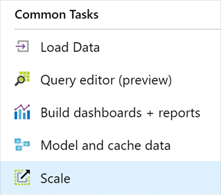

Azure Synapse Analytics lets you easily scale, pause, and resume your data warehouse. The architecture of Azure Synapse Analytics separates storage and compute, enabling you to scale them independently.

Billing for compute and storage is separate. If you don't need to use your data warehouse for a while, you can save compute costs by pausing compute. You can scale out or scale back compute by adjusting the data warehouse units setting for your data warehouse. Loading and query performance can increase linearly as you add more data warehouse units.

## Scale Azure Synapse Analytics in the Azure portal

To perform a scale operation, Azure Synapse Analytics first ends all incoming queries and then rolls back transactions to ensure a consistent state. Scaling occurs only after the transaction rollback is complete. For a scale operation, the system detaches the storage layer from the Compute nodes, adds Compute nodes, and then reattaches the storage layer to the Compute layer.

Each data warehouse is stored as 60 distributions, which are evenly distributed to the Compute nodes. Adding more Compute nodes adds more compute power. As the number of Compute nodes increases, the number of distributions per Compute node decreases, providing more compute power for your queries. Similarly, decreasing data warehouse units reduces the number of Compute nodes, which reduces the compute resources for queries.

To scale your SQL Data Warehouse instance, take these steps:

1. Go to your data warehouse in the Azure portal.

1. In the top menu bar, select **Scale**.

    

1. On the **Scale** pane, move the slider left or right to change the DWU setting.

    

1. Select **Save** to change performance units. A confirmation message appears. Select **Yes** to confirm, or **No** to cancel.

## Pause and resume Azure Synapse Analytics in the Azure portal

You can pause your data warehouse if you don't need to use it for a while. This can help you save money because you'll pay only for the compute that you need.

1. Go to your data warehouse in the [Azure portal](https://portal.azure.com/), and select **Overview**. Notice that the **Status** is **Online**.

1. To suspend compute and memory resources, select **Pause**. When the confirmation message appears, select **Yes** to confirm, or **No** to cancel.

    

1. To resume Azure Synapse Analytics, go to your data warehouse in the [Azure portal](https://portal.azure.com/), and select **Overview**. Notice that the **Status** is **Paused**.

1. To resume the database, select **Resume**. When the confirmation message appears, select **Yes** to confirm, or **No** to cancel.

    

## Restore a data warehouse

You can also restore a database. The steps you take depend on whether the data warehouse is active/paused, or has been deleted.

### Restore an active or paused database in the Azure portal

1. Go to your data warehouse in the [Azure portal](https://portal.azure.com/).

1. At the top of the data warehouse **Overview** pane, select **Restore**.

    

1. In the **Restore Point Type** box, select **Automatic Restore Points**. This restore point type will allow you to select restore points that are automatically created every 8 hours.

1. Specify a new **Database name**.

1. Select the latest restore point by selecting the date and time.

1. Select the destination **Server** and **Performance level**. By default, the database's current server and performance level are selected.

    

1. Alternatively, select **User-Defined Restore Points** as the **Restore Point Type**. You can then select the **Restore points** option to view the available user-defined restore points.

    

1. Select **OK** at the bottom of pane.

1. The database restore process will begin. You can use notifications to monitor the process.

### Restore a deleted database in the Azure portal

1. Go to your data warehouse in the [Azure portal](https://portal.azure.com/). Select the SQL Server instance associated with your data warehouse by selecting it in the **Overview** pane. You'll be redirected to the SQL Server instance on which the database should be restored.

1. In the nav pane of SQL Server, select **Deleted databases** in the menu on the left under the **Settings** subsection.

    

1. Select the database that you want to restore.

    

1. On the **Restore** pane, enter the new name of the database to be restored.

    

1. Select **Ok** at the bottom of pane.