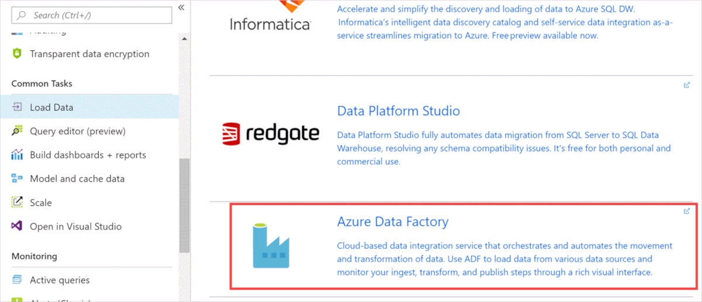
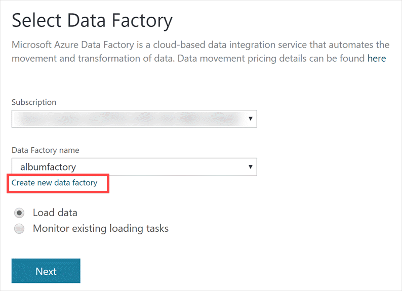
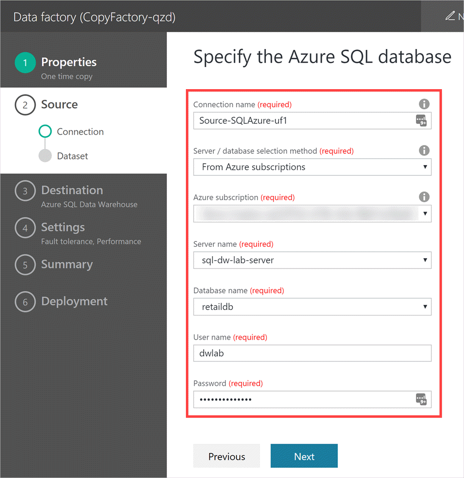

In this unit, you'll learn how to use Azure Data Factory to load data into Azure Synapse Analytics.

[Azure Data Factory](https://docs.microsoft.com/azure/data-factory/introduction) is a cloud-based data integration service. It lets you create data-driven workflows in the cloud for orchestrating and automating data movement and data transformation. Data Factory supports various data sources. For this exercise, we'll use Azure SQL Database as the data source.

The steps in this unit show you how to load data from a table in Azure SQL Database to a table in Azure Synapse Analytics.

## Access the data warehouse

1. Sign in to the [Azure portal](https://portal.azure.com/).

1. Locate the Azure Synapse Analytics instance that you created earlier and select it to open it.

    

## Open Data Factory

1. In the menu on the left side of the data warehouse, select **Load Data** under **Common Tasks**.

    

1. On the **Load Data** pane, select **Azure Data Factory**.

    

## Create a data factory

1. On the **Select Data Factory** page, select the **Create new data factory** link to create a new instance.

    

1. In the **New Data Factory** window, enter the following values, and then select **Create** at the bottom of the window.

    - _Data Factory name_: Enter a name for the data factory, or use the default name.
    - _Subscription_: Select the subscription that you used to create the resources for this module.
    - _Select resource group_: Select the resource group that you created for this module.
    - _Select region_: Select an appropriate region for the deployment of the data factory.

    

1. Wait until the data factory is created, and you're returned to the **Select Data Factory** window.

1. On the **Select Data Factory** window, select **Load data**, and then select **Next**.

    

## Configure data factory properties

On the data factory configuration page, you'll provide details for the source and destination databases.

- On the **Properties** tab, enter the following values, and then select **Next** to move to the next tab.

    - _Task name_: Enter a name for the task, or use the default value.
    - _Task description_: Provide a description for the task, if you want. This field is optional.
    - _Task cadence or Task Schedule_: Select **Run once now**.
    - _Expiration time_: Keep the default value.

    

## Select the source

1. On **Source** tab, select **Azure SQL Database** as the source, and then select **Next**.

    

1. On the **Specify the Azure SQL database** page, enter the following values to set up the source database, and then select **Next**.

    - _Connection name_: Enter a name for the Azure SQL Database connection, or use the default name.
    - _Server / database selection method_: Select **From Azure subscriptions**.
    - _Azure subscription_: Select the Azure subscription that you used to create the resources for this module.
    - _Server name_: Select the name of the SQL Server instance that you created earlier.
    - _Database name_: Select database **retaildb**.
    - _User name_: Enter **dwlab**. This is the user name that you entered when you created the SQL Server instance.
    - _Password_: Enter the password that you entered when you created the SQL Server instance.

    

1. On the **Dataset** tab, you'll select the tables that you want to copy. Select the **\[dbo\].\[AnalyzeCampaigns\]** table from the **Existing Tables** list, and then select **Next**.

    

## Select the destination

On the **Destination** tab, you'll provide details about the Azure Synapse Analytics instance.

1. Enter the following values, and then select **Next**.

    - _Connection name_: Enter a name for the connection to Azure Synapse Analytics, or use the default name.
    - _Server / database selection method_: Select **From Azure subscriptions**.
    - _Azure subscription_: Select the Azure subscription that you used to create the resources in this module.
    - _Server name_: Select the name of the SQL Server instance that you created earlier in this module.
    - _Database name_: Select the Azure Synapse Analytics instance that you created in earlier in this module.
    - _User name_: Enter **dwlab**. This is the user name that you entered when you created the SQL Server instance.
    - _Password_: Enter the password that you entered when you created the SQL Server instance.

    

1. On **Table mapping** tab, you'll set the mapping between the source and destination tables. You can map the source table to an existing destination table, or you can create a new destination table. For this exercise, we'll create a new destination table, and load data into it. *Keep the default mapping* as shown in the following image. Select **Next** to continue.

    The table `[dbo].[AnalyzeCampaigns]` will be created in the new Azure Synapse Analytics.

    

1. On the **Schema mapping** tab, you'll set the mapping between the source and destination columns.

    Because we're creating new a destination table in Azure Synapse Analytics, the destination table will be created with the source schema.

    You can specify whether a column in the source table is included in the destination table by selecting the box under **Include this column**. Make sure all columns are selected, and then select **Next**.

    

## Configure settings

On the **Settings** tab, you'll specify actions to take if there are incompatible rows between the source and the destination. You'll also provide details for the storage account that's required for staging.

1. Under **Fault tolerance settings**, in the **Actions** box, select **Abort copy activity on first incompatible row**.

1. Under **Performance settings**, enter these values:

    - _Use staging account_: Select **New connection**.
    - _Connection name_: Enter a name for the connection, or use the default.
    - _Account selection method_: Select **From Azure subscriptions**.
    - _Azure subscription_: Select the Azure subscription that you used to create the resources for this module.
    - _Storage account name_: Select the name of the storage account that you created in the resource group created for this module. You created this storage account by running the PowerShell script.

    

1. Select **Next** to move to the next tab.

## Verify the details

The **Summary** tab summarizes all the details that you've entered. You can also change the values on this tab.

Select the **Runtime Region** that corresponds to the region of the resources you've created for this module. This will help ensure that transferred data stays in the same region to reduce costs and transfer lag.

You can change the values in each section by selecting the **Edit** link for the section.

If all details are correct, select **Next** to start deployment.

   

## Monitor deployment

The **Deployment** tab provides the status of various deployment activities. You'll see the status update for each of the configured steps for the new pipeline as it deploys.

   

1. After validation passes, select the **Monitor** link at the top of the page. The data factory pipeline monitoring page for the onetime pipeline that you created will appear.

    

1. Wait until the data factory pipeline status becomes **Ready**.

    

## Verify copy activity

We can verify the copy activity by checking whether the table was created in SQL Data Warehouse.

1. Access Azure Synapse Analytics in Azure Data Studio.

1. Expand the Azure Synapse Analytics node under **Servers** to connect, and then expand the **Tables** node. You'll see the new **dbo.AnalyzeCampaigns** table.

1. Right-click the **dbo.AnalyzeCampaigns** table, and select **Select Top 1000**.

    

1. The new query window will automatically execute the SELECT statement. You should see results from the new table.

    

      Alternatively, you can run this query in a new query window.

    ```sql
       SELECT * FROM [dbo].[AnalyzeCampaigns]
    ```
