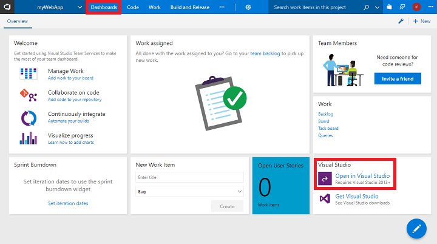

To get started with CI/CD and to manage the code commit process, build definitions, and release definitions, create a project in Team Services.

> [!NOTE]
> For this tutorial, you can use a free account to create a basic ASP.NET web app and CI/CD pipeline. If you don't already have a Team Services account, [create one](http://go.microsoft.com/fwlink/?LinkId=307137).

1. Open your Team Services dashboard in a web browser, and then select **New project**.
2. Enter *myWebApp* for the **Project name**. Leave all other default values, including the *Git* version control and the *Agile* work item process. Then, select **Create**.
3. After your project is created, select the **Initialize with a README or gitignore** check box, and then select **Initialize**.
4. Inside your new project, select the **Dashboards** hub, and then select **Open in Visual Studio**:

    

Congratulations! You have created your first Team Services project!