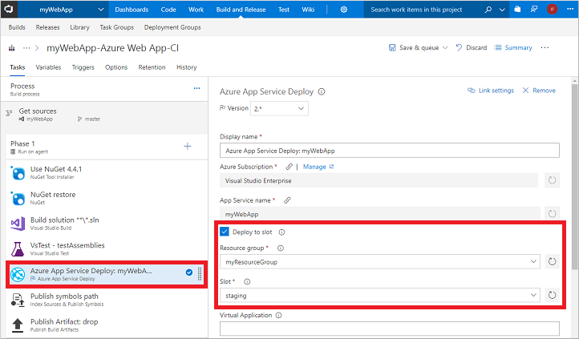

To use your web app staging slot, update the build definition in the Team Services project:

1. In your Team Services project browser, select the **Build and Release** hub, and then select **Builds**.
2. Choose your build definition, such as *myWebApp-Azure Web App-CI*, and then select **Edit**.
3. In the left pane of your build definition, select **Azure App Service Deploy: myWebApp**.
4. Select the **Deploy to slot** check box. Then, select your resource group from the drop-down list, such as *myResourceGroup*.
5. In the **Slot** drop-down menu, select your web app staging slot, such as *staging*:

    

6. To save the updated build definition, select **Save & queue**, and then select **Save**. Enter a comment, such as *Updating to use staging slot*, and then select **Save**.