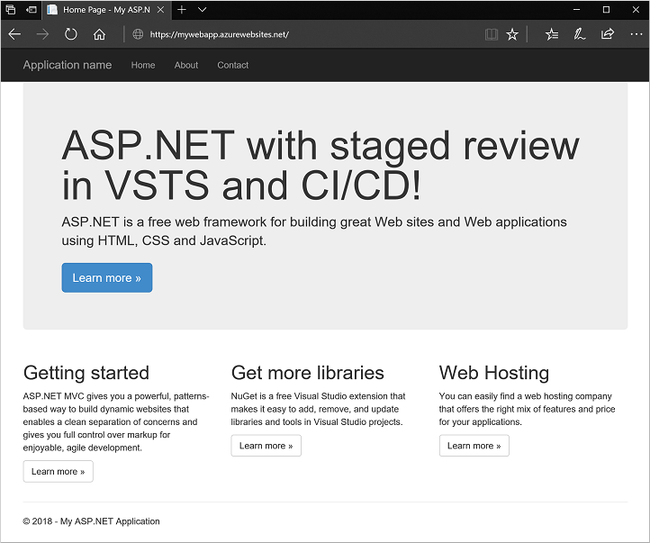

After you review your app on staging, you can swap the web app deployments to make your site live in production. To keep an audit trail in the CI/CD process, you can update your Team Services project to use approval rules. For this tutorial, manually swap the staging slot and production:

1. In the Azure portal for your Web App staging slot, select **Swap**.
2. For **Source**, select your staging slot, such as *staging*.
3. For **Destination**, select *production*, and then select **OK**.
4. It takes a few seconds for the web app deployment slots to swap. When the swap is finished, refresh your production website in a browser:

    

Congratulations! You've successfully deployed a web app to a staging site by using Team Services and CI/CD!