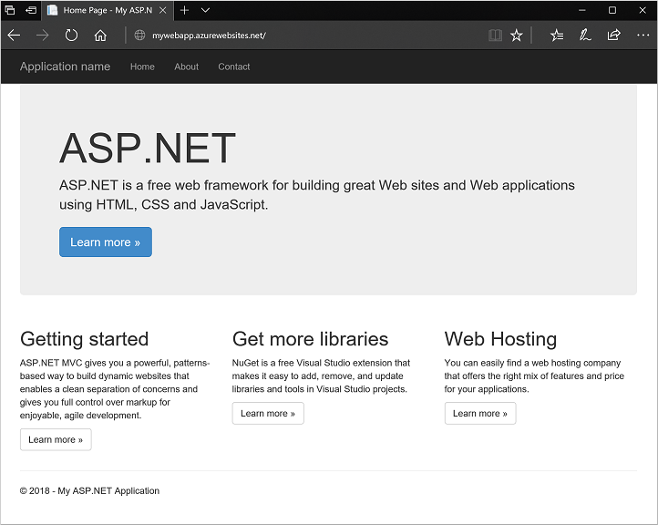

## Lab exercise 2 - Create a ASP.NET app and manually deploy to Azure Web App

You manage your code commits in the **Team Explorer** window. Create a local copy of your new project, then create an ASP.NET web application as follows:

1. Select **Clone** to create a local git repo of your Team Services project:

    

2. Under **Solutions**, select **New**:

    

3. Select **Web** templates, and then choose the **ASP.NET Web Application** template.
    1. Enter a name for your application, such as *myWebApp*, and uncheck the box for **Create directory for solution**.
    2. If the option is available, uncheck the box to **Add Application Insights to project**. Application Insights requires you to authorize your web application with Azure Application Insights. To keep it simple in this tutorial, skip this process.
    3. Select **OK**.

4. Choose **MVC** from the template list.
    1. Select **Change Authentication**, choose **No Authentication**, then select **OK**.
    2. Select **OK** to create your solution.

### Manually publish to Azure Web apps

To first show the manual process to right-click publish to Azure Web Apps, complete the following steps. This process is not recommended for production workloads where you should typically use a review control process or CI/CD pipeline. You continue to build this CI/CD pipeline in the rest of this learning scenario.

1. Select the **Solution Explorer**.
2. Right-click your solution, such as *myWebApp*, and choose **Publish**.
3. Choose **Microsoft Azure App Service** as the publish target.
4. If needed, select your *Subscription* from the drop-down menu, then choose to create **New** App Service.
5. Enter a name, such as *myWebApp*. Select your subscription from the drop-down menu, then choose to create a **New** resource group.
6. Enter a name for your resource group, such as *myResourceGroup*, then choose to create a **New** *App Service Plan*.
7. Choose a **Location**, such as *East US*, then a **Size**, such as *S1 Standard*.
8. When ready, select **Create**.
9. Once the App Service has been created, the connection information is automatically populated in the *Publish Web* dialog wizard. To publish your ASP.NET application to Azure Web Apps, select **Publish**.
10. When the publish process is complete, the site automatically opens in your default web browser. Leave this web site open in your browser:

    