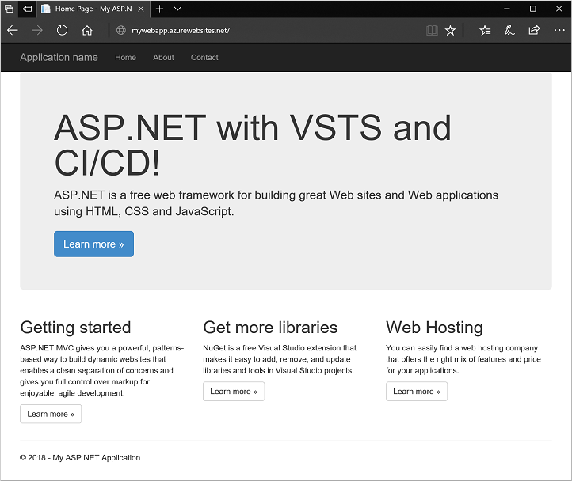

## Lab exercise 4 - Deploy app to Azure with VSTS CI/CD pipeline

Edit your app, then commit and push your changes to VSTS as follows:

1. In Visual Studio, open the **Solution Explorer** window.
2. Navigate to and open *myWebApp | Views | Home | Index.cshtml*
3. Edit line 6 to read:

    `<h1>ASP.NET with VSTS and CI/CD!</h1>`

4. Save the file.
5. Open the **Team Explorer** window, select the *myWebApp* project, then choose **Changes**.
6. Enter a commit message, such as *Testing CI/CD pipeline*, then choose **Commit All and Sync** from the drop-down menu.
7. In Team Services workspace, a new build is triggered from the code commit.
    - Choose **Build & Release**, then select **Builds**.
    - Choose your build definition, then select the **Queued & running** build to watch as the build progresses.
8. To see your changes applied once the build has successfully completed, refresh your web site in a browser:

    